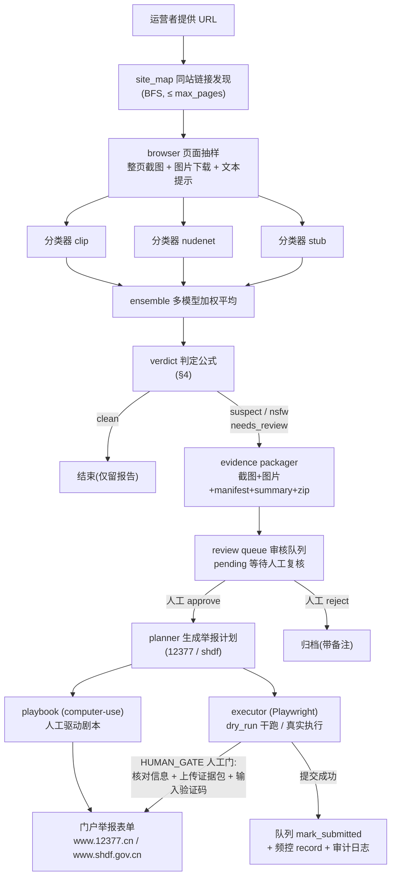

# NetSentinel(净网哨兵)

对运营者提供的 URL 做网页抽样 + 图像识别,判定疑似色情站点,生成证据包;经**人工确认**后,用浏览器 / computer-use 自动化把举报信息填写到官方举报表单。

- 举报渠道一:www.12377.cn —— 中央网信办违法和不良信息举报中心
- 举报渠道二:www.shdf.gov.cn —— 全国"扫黄打非"工作小组办公室

## 项目定位

NetSentinel 是**辅助人工的"初筛 + 半自动举报"工具,不是无人值守机器人**:

- 判定只有 `clean / suspect / nsfw` 三档,**非 clean 一律进入人工复核队列**;即使判为 `nsfw`(高置信),也必须经人工确认(approve)后才允许提交。
- 填表自动化在 `HUMAN_GATE`(人工门)步骤暂停:**验证码与最终提交按钮永远留给人工**,系统绝不自动识别或绕过验证码。
- 安全默认:`allow_network=false`(除 `127.0.0.1`/`localhost` 外禁止真实联网)、`dry_run_default=true`(干跑,不真正驱动浏览器提交);一切"真实动作"都需运营者显式开启。
- 强制提交频控:两次提交最小间隔(默认 60s)与每日最大提交数(默认 5)不可绕过。

## 功能特性

- **URL 抽样**:同 host BFS 发现站内链接(≤ `max_pages` 页),Playwright 整页截图 + 图片下载 + 文本关键词提示;未安装 Playwright 时自动退化为仅抓 HTML 解析图片链接。
- **图像识别**:可插拔分类器 `stub`(离线规则,开发/测试专用)/ `nudenet` / `clip`(可选 extra,惰性导入,缺失时给出安装提示);多模型按图加权平均集成(`ensemble`)。
- **判定与复核**:契约化的三档判定公式(聚合分 + 达标图计数,见 `CONTRACTS.md` §4);`suspect / nsfw` 自动生成证据包并进入 sqlite 审核队列(状态机 `pending → approved/rejected → submitted`)。
- **证据包**:截图 + 图片 + `manifest.json`(报告全文 + 含 sha256 的文件清单)+ `summary.md`(中文摘要,含 Top10 图片分值表),zipfile 打包,可直接作为举报附件。
- **半自动举报**:声明式 `SubmissionPlan`(同一份计划可由 Playwright 执行器驱动,也可导出为 computer-use 剧本人工驱动);表单填写完成后在 `HUMAN_GATE` 暂停,等待人工核对、上传附件、输入验证码。
- **安全内建**:强制人工门(不可配置关闭)、提交频控、JSONL 审计日志(`data/audit.jsonl`)、默认禁网、默认干跑。

## 架构



> 判定公式与数据结构详见 [docs/ARCHITECTURE.md](docs/ARCHITECTURE.md);完整使用说明见 [docs/USAGE.md](docs/USAGE.md)。

## 安装

要求 Python 3.10+。

```bash
# 基础 + 浏览器 + nudenet 视觉 + 开发/测试
python -m pip install -e ".[browser,vision,dev]"

# Playwright 浏览器内核
python -m playwright install chromium

# 可选:CLIP 视觉模型 extra(transformers + torch,体积较大)
python -m pip install -e ".[clip]"
```

说明:

- `browser` 提供 Playwright(页面截图与表单执行);不装也能跑 `scan`,但 `capture_page` 会退化为仅抓 HTML、无截图。
- `vision` 提供 NudeNet;`clip` 提供 CLIP 分类器。二者均惰性导入,未安装时抛出带安装提示的 ImportError,可先用 `stub` 离线开发。
- 仅剩基础依赖(PyYAML)时,`stub` 分类器与全部 CLI 仍可用。

## 快速开始

```bash
# 1) 复制配置模板,按需修改
cp config.example.yaml config.yaml
#    编辑 config.yaml:将 allow_network 改为 true(默认 false,
#    除 127.0.0.1/localhost 外禁止真实联网;这是安全默认,请显式开启)

# 2) 扫描目标站点(抽样 + 识别 + 判定)
netsentinel scan --url "https://待核查站点.example/" --config config.yaml
#    判定为 suspect/nsfw 时:自动生成证据包并入审核队列,终端给出队列 id

# 3) 人工复核(先看证据包里的截图与 Top10 图片分值表,再决定)
netsentinel queue list
netsentinel queue approve --id 1

# 4) 提交举报(先干跑看步骤,再真实执行)
netsentinel submit --id 1 --portal 12377 --dry-run
netsentinel submit --id 1 --portal shdf --exec
#    真实执行时会在 HUMAN_GATE 暂停:
#    人工核对表单 → 上传证据包 zip → 输入验证码 → 确认继续 → 自动点击提交
```

> 完整 CLI 参数、队列工作流、证据包结构与常见问题见 [docs/USAGE.md](docs/USAGE.md)。

## 安全与合规(五条红线)

以下红线内建于代码与测试,违反即为缺陷(详见 [docs/ETHICS.md](docs/ETHICS.md)):

1. **绝不自动识别/绕过验证码** —— 计划中验证码环节只能是 `HUMAN_GATE` 步骤,停下来等人工输入。
2. **真实提交前必须人工确认** —— `human_gate_required=True` 不可配置关闭;NSFW 判定同样必须经人工复核。
3. **开发与测试期间绝不访问真实门户** —— 不访问 www.12377.cn / www.shdf.gov.cn 真实站点,只用本地 mock(127.0.0.1)或 dry_run。
4. **默认禁网** —— `allow_network=False` 为默认值,除 `127.0.0.1` / `localhost` 外产品代码不得发起真实网络请求;开启外网须运营者显式修改配置。
5. **提交频控强制生效** —— `submit_min_interval_s`(默认 60s,配置下限 30s)与 `submit_max_per_day`(默认 5,范围 1–20)由 `RateLimiter` 强制执行。

## 目录结构

```
netsentinel/                 # Python 包(契约:contracts.py,禁改)
  config.py  logging_util.py # 配置加载/校验、日志与 JSONL 审计
  crawler/                   # fetcher(HTTP 抓取)browser(抽样)site_map(链接发现)
  vision/                    # classifier_base/stub/nudenet/clip/ensemble
  decision/                  # verdict(判定公式)review_queue(sqlite 审核队列)
  evidence/                  # packager(证据包)
  submit/                    # form_models/portals/executor/rate_limit/playbook_gen
  pipeline/                  # orchestrator(编排收口)
  __main__.py                # CLI:scan / queue / submit
tests/                       # 单元 + mock 门户 + 端到端(stub)
  mock_portals/              # 本地 12377/shdf mock 页面与 serve.py
  fixtures/                  # mini_form.html、demo_site/
drivers/driver.mjs           # computer-use 驱动
docs/                        # USAGE / ETHICS / ARCHITECTURE 等文档
scripts/                     # make_png.py、demo_stub_scan.py
config.example.yaml          # 配置模板(键与 Config 字段一一对应)
CONTRACTS.md                 # 团队契约 v1(接口与流程规范,禁改)
```

## 文档

- [docs/USAGE.md](docs/USAGE.md) —— CLI 完整参考、审核队列工作流、证据包结构、配置项逐条说明、常见问题
- [docs/ETHICS.md](docs/ETHICS.md) —— 使用红线与法律提示(必读)
- [docs/ARCHITECTURE.md](docs/ARCHITECTURE.md) —— 数据流时序、模块职责表、契约机制、并行开发与测试策略

## 路线图

- **真实门户选择器核验**:上线前对 www.12377.cn / www.shdf.gov.cn 的真实表单结构做人工核验,确认/修订 `SELECTORS` 与步骤序列(当前选择器以本地 mock 表单对齐,门户入口地址见 `portal_12377_base` / `portal_shdf_base`)。
- **模型升级**:扩充 ensemble 成员、优化阈值(`nsfw_threshold` / `prob_count_line` / `min_nsw_images`)以进一步降低误报,补充误报/漏报评估。
- **报表**:基于 `data/audit.jsonl` 审计日志输出扫描/复核/提交统计报表。

## 许可与责任

本工具仅用于合法的违法不良信息举报辅助。使用者须遵守 [docs/ETHICS.md](docs/ETHICS.md) 的全部红线;对每一条举报的真实性,由**人工核实并最终确认的操作者本人**负责。
