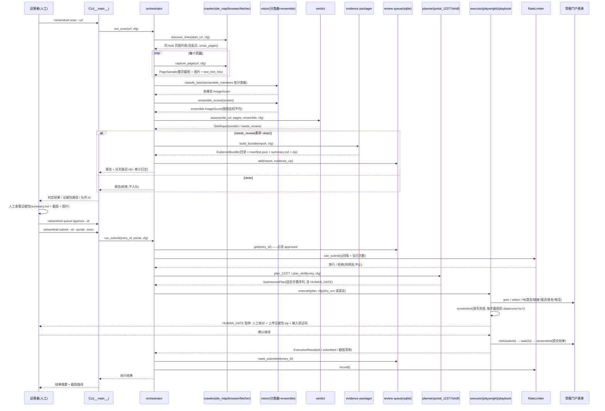
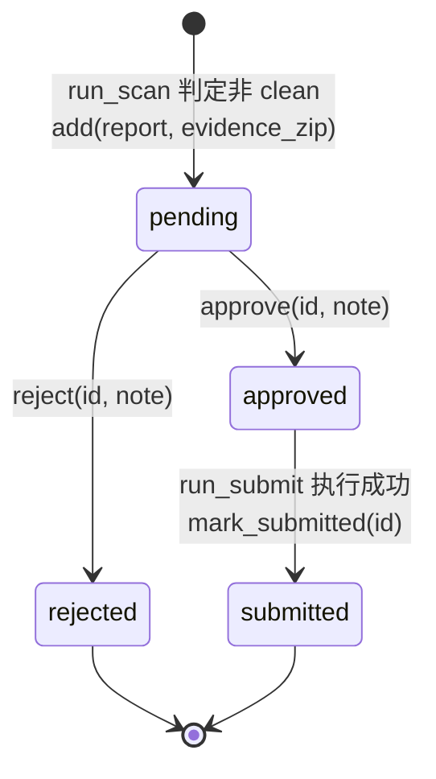

# NetSentinel 架构说明(ARCHITECTURE)

本文面向开发者与评审者,说明 NetSentinel 的数据流、模块职责、契约机制、20 代理并行开发方式与测试策略。一切以 `CONTRACTS.md`(接口与流程规范,禁改)与 `netsentinel/contracts.py`(数据结构,禁改)为准;本文不引入契约之外的任何行为承诺。

## 1. 总览

系统分四个阶段,人工环节贯穿其中:

1. **抽样(crawl)**:`site_map` 同 host BFS 发现页面 → `browser` 逐页截图、下载图片、文本提示;
2. **识别(vision)**:各分类器(`stub`/`nudenet`/`clip`)对每图打分 → `ensemble` 加权平均;
3. **判定与复核(decision/evidence)**:`verdict` 按 §4 公式三档判定 → 非 clean 生成证据包并入 sqlite 审核队列 → **人工 approve/reject**;
4. **提交(submit)**:planner 生成声明式 `SubmissionPlan` → executor(Playwright)以 dry_run/真实两种模式执行,或由 playbook 交给 computer-use 人工驱动 → **HUMAN_GATE 人工核对+传附件+输验证码** → 提交、频控记账、审计。

### 1.1 数据流时序



文字要点:

- 编排收口在 `pipeline/orchestrator`:对兄弟模块一律**函数内惰性导入**,缺失时抛中文 RuntimeError 指明缺哪个模块(并行开发容错)。
- `capture_page` 的 Playwright 为惰性导入:无 playwright 时退化为仅抓 HTML 解析图片链接(`` 与 `data-src`,urljoin 绝对化、去重、取前 `max_images_per_page` 张下载),`screenshot_path` 留空。
- 附件 zip 不自动上传(v1 由 HUMAN_GATE 人工完成);执行异常被捕获,记录 `stopped_at` 与 `ok=False`,不静默失败。

## 2. 模块职责表(按 CONTRACTS §1/§2)

| 模块 / 文件 | 负责人 | 职责 | 关键 API |
| --- | --- | --- | --- |
| `netsentinel/contracts.py` | 项目负责人 | 共享数据契约(禁改) | 数据类与枚举,见 §3.1 |
| `config.py` `logging_util.py` | A01 | 配置加载/校验/保存;日志初始化与 JSONL 审计 | `load_config(path=None)`、`save_config(cfg, path)`;`setup_logging(cfg, verbose)`;`JsonlAuditLogger(path).log_event(event, **fields)` |
| `crawler/fetcher.py` | A02 | HTTP 抓取与图片下载(网络开关、UA、限额) | `fetch_page(url, cfg) -> (status, html, final_url)`;`download_images(urls, source_page, dest_dir, cfg)`;`NetworkDisabledError` |
| `crawler/browser.py` | A03 | 页面抽样(截图/图片/文本提示) | `capture_page(url, cfg, *, fetch_page=None, download=None) -> PageSample` |
| `crawler/site_map.py` | A04 | 同 host BFS 链接发现 | `discover_links(start_url, cfg, fetch_page=None) -> list[str]` |
| `vision/classifier_base.py` `vision/stub_classifier.py` | A05 | 分类器抽象、注册表与离线 stub | `NsfwClassifier`(ABC)、`register_classifier`、`get_classifier`;stub 注册 `"stub"` |
| `vision/nudenet_adapter.py` | A06 | NudeNet 适配(EXPOSED_* 高权) | 实现 `NsfwClassifier`,注册 `"nudenet"` |
| `vision/hf_clip_adapter.py` | A07 | CLIP 适配(`nateraw/nsfw-image-classification`) | 实现 `NsfwClassifier`,注册 `"clip"` |
| `vision/ensemble.py` | A08 | 多模型评分集成 | `ensemble_scores(scores, weights=None) -> list[ImageScore]` |
| `decision/verdict.py` | A09 | 判定公式唯一实现 | `assess(site_url, pages, ensemble, cfg) -> SiteReport` |
| `decision/review_queue.py` | A10 | sqlite 审核队列 + queue CLI | `ReviewQueue(db_path)`:`add/list/get/approve/reject/mark_submitted`;`main(argv)` |
| `evidence/packager.py` | A11 | 证据包构建 | `build_bundle(report, cfg) -> EvidenceBundle` |
| `submit/form_models.py` | A12 | 选择器常量、payload 与计划生成 | `SELECTORS`;`build_payload(...)`;`build_plan(payload, cfg, entry_url=None)` |
| `submit/portal_12377.py` | A13 | 12377 计划生成(category=色情低俗信息)+ `docs/portal_12377_notes.md` | `plan_12377(entry_like, cfg, entry_url=None, **payload_kw)` |
| `submit/portal_shdf.py` | A14 | shdf 计划生成(category=淫秽色情类)+ `docs/portal_shdf_notes.md` | `plan_shdf(...)` |
| `submit/executor_playwright.py` | A15 | Playwright 执行器 + `tests/fixtures/mini_form.html` | `execute(plan, cfg, *, auto_confirm=False, dry_run=None, headless=True, out_dir=None) -> ExecutionResult` |
| `tests/mock_portals/`(`12377_mock.html` `shdf_mock.html` `serve.py`)+ `test_mock_portal_flow.py` | A16 | 本地 mock 门户与贯通测试 | 仅 127.0.0.1 服务;选择器与 `SELECTORS` 对齐 |
| `submit/playbook_gen.py` `drivers/driver.mjs` `docs/computer-use-integration.md` + `test_playbook_gen.py` | A17 | computer-use 剧本生成与驱动 | 由 `SubmissionPlan` 生成人工可驱动剧本(Step 含 `text` 供人类可读) |
| `submit/rate_limit.py` `pipeline/orchestrator.py` `__main__.py` + `test_orchestrator.py` `test_rate_limit.py` | A18 | 提交频控、流水线编排收口、CLI 入口 | `RateLimiter(state_path)`:`can_submit/record`;`run_scan`、`run_submit`;argparse `scan/queue/submit` |
| `test_e2e_stub.py` `fixtures/demo_site/` `scripts/make_png.py` `scripts/demo_stub_scan.py` | A19 | stub 端到端贯通测试与离线演示 | 全链路 demo(离线、禁网) |
| `README.md` `docs/USAGE.md` `docs/ETHICS.md` `docs/ARCHITECTURE.md` | A20 | 面向用户与开发者的全部文档 | 即本四份文档 |
| `config.example.yaml` `pyproject.toml` `.gitignore` `tests/conftest.py` | 项目负责人 | 配置模板、构建定义、测试基座(禁改) | —— |

## 3. 契约机制解释

### 3.1 `contracts.py` 数据类(唯一事实源)

| 数据类 / 枚举 | 用途 | 关键字段 |
| --- | --- | --- |
| `Verdict(str, Enum)` | 站点判定三档 | `clean` / `suspect` / `nsfw` |
| `Portal(str, Enum)` | 举报渠道 | `12377` / `shdf` |
| `ImageEvidence` | 落盘后的一张受检图片 | `path / url / source_page / sha256 / width / height` |
| `ImageScore` | 单模型对单图的评分 | `image / model / scores / nsfw_prob`;`as_dict()` |
| `PageSample` | 单页抽样结果 | `url / screenshot_path / image_evidences / text_hint_hits` |
| `SiteReport` | 站点级判定报告 | `site_url / pages / image_scores / agg_nsw_prob / nsw_image_count / verdict / needs_review / created_at`;`as_dict()` |
| `EvidenceBundle` | 证据包定位 | `site_url / dir_path / manifest_path / zip_path` |
| `StepAction(str, Enum)` | 步骤动作类型 | `goto/click/fill/select/wait/screenshot/human_gate` |
| `Step` | 单步自动化动作 | `action / label / selector / text / value / timeout_s / meta` |
| `SubmissionPayload` | 一次举报的全部填写信息 | `portal / site_url / category / description / evidence_zip / reporter_name / reporter_phone`;`validate()` 返回中文错误列表(空即可提交) |
| `SubmissionPlan` | 声明式步骤计划 | `portal / entry_url / payload / steps`;同一计划可供 playwright 执行器或 computer-use 驱动 |
| `ExecutionResult` | 计划执行结果 | `ok / portal / screenshots / stopped_at / submitted / notes` |
| `Config` | 全局配置(默认值即安全值) | 判定阈值 / 抓取预算 / 分类器 / 提交安全 / 门户入口 / 路径,见 [USAGE.md §4](USAGE.md) |

`SubmissionPayload.validate()` 的四条硬校验:`site_url` 须 http(s) 开头;`description` 至少 30 字;`evidence_zip` 不得为空(必须附证据);`category` 非空。

### 3.2 `SELECTORS`(举报表单选择器契约)

本地 mock 与两个 portal planner 共同遵守同一份选择器表(planner 用常量 `SELECTORS`,mock 用相同 id):

```python
SELECTORS = {
    "url":     "#report-url",
    "type":    "#report-type",
    "desc":    "#report-desc",
    "name":    "#report-name",
    "phone":   "#report-phone",
    "file":    "#report-file",
    "captcha": "#report-captcha",   # 验证码 —— 只允许人工输入
    "submit":  "#report-submit",
}
```

标准步骤序列由 `build_plan` 生成、顺序固定:

```
goto(entry_url) → wait(1s) → select(type=category) → fill(url) → fill(desc)
→ fill(name) → fill(phone) → screenshot(填写完成)
→ HUMAN_GATE(人工核对信息、上传证据包 zip 并输入验证码)
→ click(submit) → wait(2s) → screenshot(提交结果)
```

`Step` 同时携带 `selector`(浏览器执行器用)与 `text`(人类可读目标,computer-use 场景用),因此同一份计划可在两种驱动之间复用。附件 zip 不自动上传(v1 由人工门完成),mock 表单仍需含 `#report-file` 节点。

### 3.3 判定公式(CONTRACTS §4,`assess` 的唯一实现依据)

```
candidates = [s for s in ensemble if s.image.width >= cfg.min_image_px
                                   or s.image.height >= cfg.min_image_px]
agg        = max((s.nsfw_prob for s in candidates), default=0.0)
nsw_count  = sum(1 for s in candidates if s.nsfw_prob >= cfg.prob_count_line)
verdict    = NSFW    if agg >= cfg.nsfw_threshold and nsw_count >= cfg.min_nsw_images
            else SUSPECT if agg >= cfg.review_threshold
            else CLEAN
needs_review = (verdict != CLEAN)   # NSFW 同样必须人工确认后才允许提交
```

要点:先剔除小图(图标)→ 聚合分取候选图最大值(而非均值,避免大量正常图稀释)→ NSFW 需"单图高置信 + 达标图计数"双条件 → **非 clean 全部 `needs_review`,机器判定不豁免人工**。

### 3.4 审核队列状态机



`run_submit` 前置校验条目必须 `approved`;提交成功才迁移到 `submitted` 并记账频控。每一次状态迁移均落审计日志(`data/audit.jsonl`,JSONL,自动带时间戳)。

## 4. 20 代理并行开发说明

项目由 20 个代理(A01–A20)+ 项目负责人并行开发,协同规则(契约 §1/§2/§5):

- **契约先行**:`contracts.py` 与 `CONTRACTS.md` 由项目负责人预先完成并禁改;所有模块签名、数据结构、判定公式、选择器、步骤序列以契约为唯一依据,代理不得自行变更接口。
- **文件互斥**:每个代理只能写自己名下的文件(见 §2 表),跨模块改动一律通过契约提案、由项目负责人裁定,避免合并冲突与接口漂移。
- **importorskip 容错**:并行开发中兄弟模块可能尚未就位,测试用 `pytest.importorskip("netsentinel.xxx")` 跳过而非失败;可选三方依赖(playwright、nudenet、transformers)同样 importorskip,测试注入 fake detector/pipeline,**不下载模型**。
- **惰性导入**:运行期同样容错——三方库与兄弟模块一律函数内惰性导入,缺失时抛带安装提示的 ImportError(三方库)或中文 RuntimeError 指明缺哪个模块(兄弟模块);orchestrator 因此可以在模块不全的环境中降级启动。
- **集成由负责人收口**:跨模块流水线(`run_scan` / `run_submit`)与 CLI(`__main__.py`)由 A18 统一收口,其余代理只交付被编排调用的纯函数/类;端到端验证由 A16(mock 门户贯通)与 A19(stub 端到端)承担,项目负责人负责整体联调。

## 5. 测试策略分层

| 层级 | 内容 | 关键约束 |
| --- | --- | --- |
| **单元测试**(A01–A15、A17、A18 各自) | 每模块独立测试:配置校验、抓取/禁网、抽样、stub 规则、适配器(fake detector/pipeline)、ensemble 分组加权、判定公式、队列 CRUD、证据包、payload/plan、执行器、频控、剧本生成 | 离线;只写 `tmp_path`(或项目 data/ 下并清理);兄弟模块 importorskip;需要 chromium 的用例 importorskip("playwright") 且启动失败即 skip |
| **贯通(mock)** | A16 `test_mock_portal_flow.py`:本地 mock 门户(127.0.0.1,选择器与 `SELECTORS` 对齐)跑通 plan→execute;A15 `mini_form.html` 最小表单夹具 | 本地服务只允许 127.0.0.1;**绝不出现访问 www.12377.cn / www.shdf.gov.cn 的测试或代码路径** |
| **端到端(dry_run / stub)** | A19 `test_e2e_stub.py` + `fixtures/demo_site/`:stub 分类器全链路 scan→queue;`scripts/demo_stub_scan.py` 离线演示 | 保持 `allow_network=false`;提交路径用 dry_run(不启浏览器,逐 Step 记 notes)验证步骤序列与 HUMAN_GATE 行为 |

补充规则(契约 §5):pytest 根目录运行,`python -m pytest tests/... -q`,完成前自测全绿(允许 skip);真实门户相关行为只能以 dry_run 或本地 mock 验证。

## 6. 相关文档

- [USAGE.md](USAGE.md) —— CLI 参考、队列工作流、证据包、配置与 FAQ
- [ETHICS.md](ETHICS.md) —— 使用红线与法律提示
- [../CONTRACTS.md](../CONTRACTS.md) 与 [../netsentinel/contracts.py](../netsentinel/contracts.py) —— 契约原文(冲突时以契约为准)
