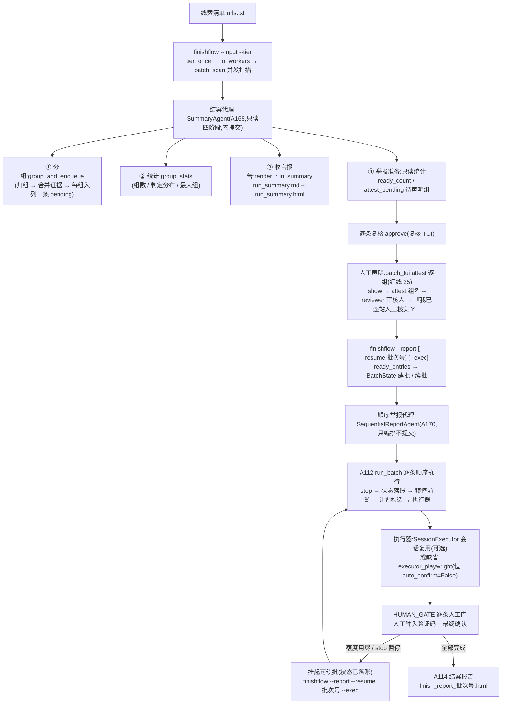

# NetSentinel 结案代理权威指南(FINISH_AGENT)

> 适用版本:V9(A163–A182)。本文是"批量跑完之后的收官阶段"权威指南:两个结案代理的定位、红线 36、全流程命令、时序图、进度回调与断点续报、与 V6 batchflow 的关系。所有行为以 `CONTRACTS-V9.md` 与实际代码为准:`netsentinel/agent/summary_agent.py`、`netsentinel/agent/sequential_report.py`、`netsentinel/finishflow.py`、`netsentinel/report/run_summary.py`;各命令旗标以 `--help` 实际输出为准。

---

## 0. 一句话定位:两个"单独的代理"

V9 收官阶段有**两个各自独立、职责互斥**的代理,合起来覆盖"扫描跑完 → 举报闭环"的中间地带:

| | 结案代理 SummaryAgent | 顺序举报代理 SequentialReportAgent |
| --- | --- | --- |
| 编号 / 文件 | A168 · `agent/summary_agent.py` | A170(并入 A174 编号)· `agent/sequential_report.py` |
| 一句话 | 批量跑完后的**分类汇总与举报准备** | 收官阶段的批量举报**编排器** |
| 能做 | 四阶段全部只读统计:分类(复用 A108 `group_and_enqueue`)→ 汇总统计(A117 `group_stats`)→ 收官报告(A172 `render_run_summary` 双件套)→ 举报准备(列出就绪条数与待声明组) | 把"已声明组"的条目一次交给 A112 `run_batch` **顺序逐条**执行;可选复用 V7 `SessionExecutor` 浏览器会话;结束后经 A114 渲染结案报告 |
| 不能做(红线 36) | **零提交路径**:不编排举报执行链、不写声明、不改条目状态;库文件不存在时连库都不建 | **对每条举报没有自主决定权**:不传 `auto_confirm`(其函数缺省即 `False`);不建批、不声明、不触碰 A110 复核队列;频控全部沿用 V6 链 |
| 输入 | `batch_scan` 返回的 `{"reports": {url: SiteReport}, "summary": {...}}` + `cfg` | 已声明组的就绪条目列表(每条含 `entry_id` / `group_name` / `portal`)+ `cfg` |
| 输出 | `SummaryOutcome{groups, report_md, report_html, ready_count, attest_pending, workers, tier, next_steps}` | `{"result": run_batch 摘要, "report_path": 路径或 None, "submitted": 提交成功条数}` |

两个代理都是"**代理**,不是**决策者**":机器负责扫、归、统计、排队、复用会话;**声明、验证码、最终确认永远由人完成**。真正的提交永远要经过"逐组声明(A111 batch_tui)→ 逐条人工门(A112 执行器 HUMAN_GATE)"的人工链路。

两个代理都由收官 CLI `finishflow`(A169,`python -m netsentinel.finishflow`)串联:`--input` 走结案代理,`--report` 走顺序举报代理。

---

## 1. 红线 36 全文与代码落点

### 1.1 红线全文(摘自 CONTRACTS-V9 §0,全文引用)

> 36. **结案代理无自主提交权**:SummaryAgent 只做分类汇总与举报**准备**(列待声明组);SequentialReportAgent 只编排 run_batch——逐组人工声明、每条 HUMAN_GATE、频控全部沿用 V6 链;代理源码不得出现 auto_confirm=True 或绕过 attest 的路径。

配套语境:V9 三条新红线中的第 35 条(压榨边界:高档并发不放宽礼貌间隔与举报频控)与第 26 条(批量模式频控不得放宽)在收官阶段同样全程生效;本文聚焦第 36 条。

### 1.2 代码落点(实现 + 源码断言测试)

红线 36 不是靠自觉,而是**源码断言测试**守卫的——专项测试直接扫描两个代理模块的源码文本,出现违例 token 即失败:

| 红线要求 | 代码实现落点 | 源码断言测试(`tests/test_redline_v9.py`,A181) |
| --- | --- | --- |
| SummaryAgent 零提交路径 | `summary_agent.py` 不编排任何执行链;四个阶段全部只读统计 | `test_redline36_summary_agent_source_has_no_submit_paths`:源码全文不得出现 `run_batch` / `executor_playwright` / `plan_12377` / `auto_confirm` 任一 token(`tests/test_v9_e2e.py` 同样断言 summary_agent 源码无 run_batch/executor 调用) |
| SummaryAgent 不代写声明 | 举报准备阶段只**只读**调用 `BatchReview.is_attested(group)` 查询声明状态;`cfg.db_path` 库文件不存在时直接返回零(不建目录/不建库/不建表) | `test_redline36_summary_agent_no_attest_write_paths`:源码不得出现 `set_attested` / `attest_group` / `add_attestation` / `mark_attested` / `write_attest` / `auto_attest` 等代写标识(只读的 `is_attested` 允许) |
| SequentialReportAgent 恒人工门 | 调用 `run_batch` 时**不传** `auto_confirm`(其函数缺省即 `False`);`_bind_session` 把会话执行器包装成执行器形状时**刻意不转发** `auto_confirm`,只透传 `dry_run` | `test_redline36_sequential_report_no_auto_confirm_true`:正则 `auto_confirm\s*=\s*True` 不得命中(允许 `auto_confirm=False` 字样或缺省不传) |
| SequentialReportAgent 不建批、不声明 | `batch_id` / `state` 由调用方(finishflow 经 A113 `BatchState.bound(batch_id)`)绑定;模块不创建批次、不写声明、不触碰 A110 复核队列 | `test_redline36_sequential_report_no_attest_bypass`:同上代写声明 token 扫描 |
| 真实提交的门在 CLI 收口 | `finishflow.run_report` **默认干跑**(`dry_run=None` 取 `cfg.dry_run_default`,默认 True);真实执行必须显式 `--exec`;`--exec` 仅 `--report` 模式有效且与 `--dry-run` 互斥;源码不存在任何 `auto_confirm=True` 或绕过 attest 的路径 | `tests/test_finishflow.py` 行为断言;`run_batch` 内部恒 `executor(plan, cfg, auto_confirm=False, dry_run=...)`(红线 24 链路原样) |
| 报告固定声明句 | `report/run_summary.py` 常量 `CONCLUSION` 在收官报告结论段逐字渲染:"本汇总由结案代理生成;任何举报须经逐组人工声明与逐条人工门完成,代理无自主提交权。"(HTML 中红字加重);`summary_agent.py` 的 `REDLINE_NOTE` 同口径 | `tests/test_run_summary.py` 断言固定文案存在 |
| 中文指引前置 | `summary_agent.py` 常量 `NEXT_STEPS` 固定三步(batch_tui 逐组声明 → `--report` 先干跑 → 每条仍须逐条人工门);任何降级提示中文前置其上 | `tests/test_summary_agent.py` 断言 |

---

## 2. 全流程命令序列(五步)

从一批线索到结案报告,顺序固定如下。每条命令后括注实际发生的事(均为已实现行为)。

### 第 1 步:收官流程——批量扫描 + 分类汇总(恒不提交)

```bash
python -m netsentinel.finishflow --input urls.txt --tier high
```

- `--input` 支持 `.txt` / `.csv` / `.yaml` / `.yml` 清单(A107 `load_bulk` 加载与归一;空清单直接返回);`--tier low|mid|high` 覆盖 `cfg.concurrency_tier`(经 `dataclasses.replace` 生成**新** Config,礼貌间隔 `fetch_delay_s` 等字段原样保留——红线 35);`--config` 可指定配置文件。
- 内部依次:A165 `tier_once`(档位一次性初始化)→ A164 `io_workers`(三档公式算 worker 数)→ A108 `batch_scan` 并发扫描(worker 数经 `pool_runner` 包装透传给 A58 `run_pool`)→ A168 `SummaryAgent().run`(四阶段汇总)。
- 终端打印**中文收官汇总**:站点数 / 扫描成功(指纹未变跳过)/ 失败 / 案件组数 / 待声明组 / 就绪条目 / 并发档位(worker 数),以及"下一步"三步指引。
- 产物:`data/run_summary.md` 与 `data/run_summary.html`(A172 `render_run_summary` 渲染的收官汇总报告,公文风、离线、零外部依赖;渲染器缺席时降级写最小 Markdown 汇总)。
- `--input` 与 `--report` 互斥;收官流程**恒不提交**(红线 36)。

### 第 2 步:逐组人工声明(红线 25,只能在 TUI 人工完成)

```bash
python -m netsentinel.cli.batch_tui
```

TUI 命令集(输入 `help` 可见):

| 命令 | 作用 |
| --- | --- |
| `groups` | 分组总览(组名 / 条数 / 判定徽章 / agg 最大 / 已声明 ✓✗) |
| `show <组名>` | 组内逐条明细(站点 / 判定 / agg / 证据包路径),请人工核验内容 |
| `attest <组名> --reviewer <审核人>` | 批量确认声明:先 `show`,再答**「我已逐站人工核实(Y/N)」**,仅 Y/y 落声明;N、空回车、乱码、EOF 一律取消 |
| `ready` | 待批量清单(A110 `ready_entries`;**未声明组整组排除**) |
| `queue-batch [--portal 12377\|shdf]` | 批量队列预览:只 dry_run 演练并打印真实命令文本,绝不执行 |

说明:第 1 步归组入列的条目状态为 `pending`,通常先在复核 TUI(`python -m netsentinel.cli.review_tui`)逐条确认为 `approved`,再逐组声明——收官汇总里的 `attest_pending`(待声明组)统计的正是"**已批准但未声明**"的组名。声明落 SQLite `attestations` 表并可写 JSONL 审计(组名 / 条数 / 审核人);A110 校验审核人非空、声明文本必含"人工核实"四字。

### 第 3 步:举报准备——先干跑核对(默认干跑)

```bash
python -m netsentinel.finishflow --report                    # 首次:按就绪清单新建批次,记下打印的批次号
python -m netsentinel.finishflow --report --resume 批次号     # 之后:沿用同一批次(仍是干跑)
```

- 内部:A110 `ready_entries` 取就绪条目 → A113 `BatchState` 建批 / 续批(详见 §4.2)→ A170 `SequentialReportAgent().run(items, cfg, dry_run=True, state=st.bound(批次号))` 编排 A112 `run_batch`。
- 干跑不启动浏览器(执行器 dry_run 分支,纯标准库),用于核对批次内容、门户分派与计划构造。
- 结束打印收官举报摘要(干跑演练 / 批次号 / 条目总数 / 提交成功 / 失败 / 批次报告路径;挂起或暂停时附"可续批"命令)。

### 第 4 步:真实执行——显式 `--exec`,逐条人工门

```bash
python -m netsentinel.finishflow --report --resume 批次号 --exec
```

- `--exec` 仅 `--report` 模式有效、与 `--dry-run` 互斥;CLI 会先打印"真实执行模式:……每条仍需人工输入验证码并最终确认(红线 36,无任何自动确认)"。
- `run_batch` 对**每一条**依次执行:① `stop()` 检查(为真即暂停返回)→ ② 状态落 `running` → ③ 频控前置(`RateLimiter.can_submit`,间隔取 `max(batch_item_interval_s, submit_min_interval_s)`、每日上限 `submit_max_per_day`,不通过**整体挂起**可续批,不 sleep 死等)→ ④ 计划构造(按 `portal` 分派 12377 / shdf 计划器)→ ⑤ 执行器 `executor(plan, cfg, auto_confirm=False, dry_run=False)` → ⑥ 成功则状态 `submitted` + 频控记账 + 审计留痕 → ⑦ 单条异常只记失败继续下一条 → ⑧ 条间等待 `batch_item_interval_s`。
- 执行器:缺省 `executor_playwright.execute`;`cfg.browser_session_reuse` 为真时由顺序举报代理惰性构造 V7 `SessionExecutor`——**一次浏览器会话**逐条 `new_page()` 执行,摊薄每计划一次的浏览器冷启动(`auto_confirm` 缺省即 False,人工门语义零漂移)。
- **每条举报都要人在场**:执行器 HUMAN_GATE 步骤等待人工输入验证码并做最终确认;干跑连浏览器都不启动。

### 第 5 步:核对结案报告

```
data/finish_report_{批次号}.html
```

举报执行结束后,顺序举报代理经 A114 `render_batch_report` 把批次摘要渲染到 `cfg.data_dir/finish_report_{batch_id}.html`(文件名模板 `finish_report_{}.html`);渲染失败只降级告警,不影响批量结果。注意区分两份报告:`run_summary.md/.html` 是**整轮扫描**的收官汇总(第 1 步产物);`finish_report_{批次号}.html` 是**某个举报批次**的结案报告(第 4 步产物)。

---

## 3. 流程图(收官全链路)



---

## 4. 进度回调 on_item 与断点续报

### 4.1 逐条进度回调 `on_item`

`SequentialReportAgent.run(..., on_item=...)` 提供逐条进度钩子,签名 `on_item(index, total, item)`:

- **触发时机**:每条**实际进入执行前**(1 起序)。实现方式是把 `on_item` 包装进两个门户计划器(`_wrap_planner` 覆盖 `plan_12377` / `plan_shdf`)——`run_batch` 在 stop 检查与频控前置**之后**才调计划器,因此:
- **被 stop 暂停、被频控挂起而跳过的条目不会触发回调**;计数按实际进入执行的顺序递增,与门户无关;
- **回调自身异常只告警吞没**(`_safe_on_item`),进度钩子绝不中断举报链;
- `on_item=None`(缺省)不启用,也不向 `run_batch` 传计划器包装(纯净透传)。

用法(模块 docstring 示例):

```python
out = agent.run(items, dry_run=True, state=st.bound(bid),
                on_item=lambda i, n, item: print(f"{i}/{n} {item}"),
                batch_id=bid)
```

注:`on_item` 是程序化调用顺序举报代理时的进度接口(终端进度条、日志留痕等);`finishflow` CLI 目前不注入它,执行进度由执行器逐条打印。

### 4.2 断点续报

**挂起的两个来源**(均不丢已完成结果):

1. **频控**:某条提交前 `can_submit()` 不通过(间隔未到 / 每日额度用尽)→ 该条记 `rate_limited`,**整体挂起返回**,不 sleep 死等(红线 26);
2. **暂停**:`stop()` 回调为真(Ctrl-C 由调用方转接)→ `paused=True`,已完成结果保留。

**状态落账**:`run_batch` 经 `state=BatchState.bound(批次号)` 把每条状态写入 SQLite(`running` / `submitted` / `failed` / `skipped` / `rate_limited` / `pending`)。

**续报命令**:

```bash
python -m netsentinel.finishflow --report --resume 批次号 --exec
```

续报时的回收与合并规则(均为已实现行为):

- `BatchState.resume(批次号)` 回收**未竟条目**:`pending`、`rate_limited`,以及 `running`(进程中断视为未竟)重新入列;`submitted` / `failed` / `skipped` 为终态**不回收**(已提交的绝不重复提交);按 `entry_id` 升序;
- 续批行与就绪清单**按 `entry_id` 合并**,用就绪条目补齐 `portal` / `site_url` / `evidence_zip` 等执行细节;`portal` 双缺时补缺省门户 `"12377"`(`PORTAL_DEFAULT`);
- 批次无未完条目但就绪清单非空 → 按清单**新建批次**(note 留痕 `[finishflow] 就绪清单新建批次`);两者皆空 → 零值返回,不新建批次、不执行任何动作;
- 摘要打印在 `rate_limited` 或 `paused` 时会直接给出上面的可续批命令。

---

## 5. 与 V6 batchflow 的关系

契约 §3 明确:**"`finishflow` 作为批量跑完的收官入口(独立 CLI,不改 batchflow)"**——V6 的 `python -m netsentinel.batchflow`(A119)原样保留、仍可用。

| | finishflow(V9 收官入口) | batchflow(V6 批量总流程) |
| --- | --- | --- |
| 定位 | 批量跑完后的**收官**入口:汇总、报告、举报准备一站串起来 | 批量案件流水线五段:筛选 → 归组 → 声明 → 批量 → 续批 |
| 模式 | `--input`(收官流程,恒不提交)/ `--report`(举报准备,默认干跑,`--exec` 才真实) | `--input`(run_flow:筛选+归组,永不提交)/ `--resume 批次号 [--exec]`(resume_batch:批量+续批) |
| V9 新增能力 | 并发档位(`tier_once` / `io_workers`,`--tier` 覆盖);结案代理收官汇总(中文汇总表 + `run_summary.md/.html`);顺序举报代理编排(可选 `SessionExecutor` 会话复用);`finish_report_{批次号}.html` 结案报告 | 无(冻结不动) |

**两条入口共用同一条人工链与同一批底层模块**:A107 清单加载、A108 扫描与归组、A110 就绪清单与声明台账、A112 `run_batch`、A113 `BatchState`;红线 24(逐条人工门)/ 25(逐组声明)/ 26(频控不放宽)在两条入口同样生效;落同一个复核队列库(`cfg.db_path`)与同一个频控台账(`data/rate_limit.json`),数据互通。

选择建议:新的批量收官走 `finishflow`(汇总、报告、续报指引一站齐);已有的 V6 脚本与操作习惯继续用 `batchflow`,不受影响。注意一个差别:batchflow 的 `resume_batch` 只跑批量不渲染结案报告,`finish_report_{批次号}.html` 是 finishflow 链路(经顺序举报代理)才产出的。

---

## 6. FAQ

**问:汇总都做完了,为什么不顺势自动提交?**
答:红线 36 明令"结案代理无自主提交权"。SummaryAgent 的四个阶段全部是只读统计,源码里不存在任何提交路径——专项测试(`tests/test_redline_v9.py`)对模块源码逐 token 断言不出现 `run_batch` / `executor_playwright` / `plan_12377` / `auto_confirm`。它只把 `ready_count`(已声明已批准条数)与 `attest_pending`(待声明组)列出来,并在 `next_steps` 里给出人工两步指引。举报必须经"逐组声明 → 逐条人工门"完成。

**问:声明在哪做?代理能替我声明吗?**
答:只能由运营者在批量复核 TUI 人工完成:`python -m netsentinel.cli.batch_tui` → `show <组名>` 逐条核验证据 → `attest <组名> --reviewer <审核人>` → 亲口回答"我已逐站人工核实(Y/N)",仅 Y/y 落声明(入 SQLite `attestations` 表并可写 JSONL 审计,含组名 / 条数 / 审核人)。两个代理都不代写声明——源码断言不存在任何代写 / 绕过 attest 的路径;未声明的组会被 `ready_entries` 整组排除,根本进不了批量队列(除非 `cfg.batch_require_attestation=False` 显式关闭该门)。

**问:都加 `--exec` 了,每条还要人工吗?**
答:**要**。`--exec` 只把干跑切换为真实执行,不会打开任何自动确认:`run_batch` 恒以 `auto_confirm=False` 调用执行器(顺序举报代理调用时干脆不传该参数,缺省即 False),每一条举报都要在执行器 HUMAN_GATE 步骤由人工输入**验证码**并做**最终确认**;频控与每日额度也照常生效(红线 26),`--exec` 不放宽任何间隔。

**问:`run_summary` 和 `finish_report` 有什么区别?**
答:`run_summary.md/.html`(第 1 步产物)是**整轮批量扫描**的收官汇总报告,由结案代理经 A172 渲染,扫描一跑完就有;`finish_report_{批次号}.html`(第 4 步产物)是**某一个举报批次**的结案报告,由顺序举报代理经 A114 在举报执行结束后渲染。两份报告的结论段都固定重申红线 36 口径。

**问:中途断了 / 额度用完了怎么办?**
答:状态已逐条落账,不会丢。直接 `python -m netsentinel.finishflow --report --resume 批次号 --exec` 续报:未竟条目(`pending` / `rate_limited` / `running`)自动回收重跑,已提交的条目是终态、绝不重复提交;摘要打印里也会给出这条可续批命令。

---

## 7. 相关文件索引

| 文件 | 角色 |
| --- | --- |
| `netsentinel/agent/summary_agent.py` | A168 结案代理(分类汇总 + 举报准备,零提交) |
| `netsentinel/agent/sequential_report.py` | A170(并入 A174)顺序举报代理(编排 `run_batch`,恒人工门) |
| `netsentinel/finishflow.py` | A169 收官 CLI(`--input` 收官流程 / `--report` 举报准备) |
| `netsentinel/report/run_summary.py` | A172 收官汇总报告渲染(MD + HTML 双件套) |
| `netsentinel/report/batch_report.py` | A114 批次结案报告渲染(`finish_report_{id}.html`) |
| `netsentinel/cli/batch_tui.py` | A111 批量复核 TUI(分组查看 / 逐组声明 / 队列预览,绝不执行) |
| `netsentinel/cli/review_tui.py` | A57 复核 TUI(逐条拍板 pending → approved) |
| `netsentinel/decision/batch_review.py` | A110 声明台账(`attest` / `is_attested`)与就绪清单(`ready_entries`) |
| `netsentinel/submit/batch_submit.py` | A112 `run_batch` 批量顺序提交引擎(恒 `auto_confirm=False`) |
| `netsentinel/submit/batch_state.py` | A113 批次状态(`new_batch` / `mark` / `resume` / `bound`) |
| `netsentinel/submit/executor_session.py` | V7 `SessionExecutor` 会话复用执行器(人工门语义零漂移) |
| `tests/test_redline_v9.py` | A181 红线 35/36/37 专项(源码断言 + 行为断言) |
| `tests/test_summary_agent.py` / `tests/test_sequential_report.py` / `tests/test_finishflow.py` / `tests/test_run_summary.py` | 对应模块行为测试 |
