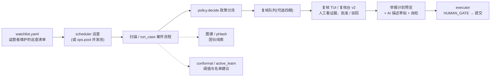

# NetSentinel V3 平台化运营手册(PLATFORM)

V3 的主题是"从感知到智能体平台":识别链之上,再叠一层**平台治理**——双人四眼、声明式政策、站点关联图谱、并发扫描池与自适应调度、证据签名、复核 TUI 与复核台 v2。本手册面向**运营者**,回答"每天怎么用、怎么配、怎么不出事"。

> 模块状态:四眼 / 政策 / 图谱 / pHash / 重定向 / 帧采样(A43、A46–A50)代码已就位;法规检索、描述自检、门户适配器、证据签名、对抗基准、复核台 v2、TUI、池化、自适应调度(A51–A59)按 `CONTRACTS-V3.md` §3 交付,行为以契约为准。所有平台能力**默认关闭或零成本可选**,不开即回到 V2 行为。

配套阅读:智能体与模型编排见 [AGENT_GUIDE.md](AGENT_GUIDE.md);GLM 接入见 [VLM_GUIDE.md](VLM_GUIDE.md);REST 服务见 [API.md](API.md);部署见 [DEPLOY.md](DEPLOY.md)。

---

## 1. 运营全景:一天的工作流



人的位置始终在两处:**复核队列**(批准/驳回)与 **HUMAN_GATE**(真实提交前核对信息、上传证据、输入验证码)。平台组件只决定"什么东西以什么优先级送到人面前",不替人做决定。

---

## 2. 双人四眼复核(A50)

### 2.1 是什么

在 v1 人工复核队列(`ReviewQueue`,状态机 `pending → approved → submitted / rejected`)之上叠加一道**双人确认门**:`four_eyes_required: true` 时,单人的 approve 只留下第一审核人记录并进入"等待第二审核人"状态;只有**另一名不同**的审核人再次确认,条目才真正变为 approved。

实现是**组合而非修改**:`FourEyesQueue(db_path, required)` 内部持有 `ReviewQueue`(条目表 `entries` 归底层管理),自建 `approvals(entry_id, reviewer, acted_at)` 表记录每位审核人的确认痕迹(审计留痕,主键 `(entry_id, reviewer)` 双保险防同人重复)。

### 2.2 状态机

```
required = false:  pending --approve(任意一人)--> approved        (仍写 approvals 留痕)
required = true :  pending --approve(甲)--> awaiting_second      (条目保持 pending)
                   awaiting_second --approve(乙, 乙≠甲)--> approved
                   awaiting_second --approve(甲)--> ValueError("同一审核人不能二次确认")
                   任意 pending --reject--> rejected              (终态,直通底层,留痕保留)
```

关键 API:

| 调用 | 行为 |
| --- | --- |
| `approve(entry_id, reviewer)` | 见上表状态机;返回 `{"state": "approved"/"awaiting_second", "reviewers"/"first": ...}` |
| `second_approver(entry_id, reviewer)` | 第二审核人显式入口;尚无第一人记录时中文报错 |
| `status(entry_id)` | `{"state": none / awaiting_second / approved, "reviewers": [...], "required": bool}` |
| `add / list / get / summary / reject / mark_submitted` | 直通底层 `ReviewQueue` |

### 2.3 配置与接线

```yaml
four_eyes_required: true   # 默认 false(单人确认);true 时 CLI/TUI 走 FourEyesQueue
```

### 2.4 与 TUI / 仪表盘的关系

- **复核 TUI(A57)** 组合 `FourEyesQueue(required=cfg.four_eyes_required)`:两个运营者各自在 TUI 里 `approve <id> --reviewer 名字`,第一人看到"等待第二审核人",第二人看到"双人确认完成";同人二次确认直接中文报错;
- **复核台 v2(A56)** 提供四眼状态面板:哪些条目在 `awaiting_second`、第一审核人是谁,方便第二审核人认领;
- 与 `ReviewQueue` 共用同一个 SQLite 库文件(`db_path`),既有的 CLI `queue list/approve`、Streamlit 复核台(app.py)、REST 服务对同一批条目仍然可见——四眼只在 approve 这一动作上加强,不改变其他读写。

**纪律建议**:开启四眼后,两名审核人应互相独立得出结论(先各自看证据再交叉确认),不要"跟着第一人签字"。审核人姓名会永久留在 approvals 表与审计日志里。

---

## 3. 政策引擎(A49)

### 3.1 是什么

v1/v2 的分流逻辑(是否入列 / 是否提醒)散落在 orchestrator 的 if-else 里,调整流程必须改代码。政策引擎把"分流规则"抽成数据——运营者写 `policy.yaml`,引擎 `load_policy` 加载、`decide(report, rules)` 产出 `Decision(rule_name, action, note, matched)`。

### 3.2 policy.yaml 语法

复制 `netsentinel/policy/policy.example.yaml` 为 `policy.yaml`(`policy_path` 默认指向 `./policy.yaml`)。顶层为规则列表:

```yaml
- name: high_confidence_four_eyes      # 规则名,唯一,必填
  when:                                 # 匹配条件,AND 语义;省略 = 匹配一切
    verdict: [nsfw]                     # 判级列表:报告 verdict 在列表内才命中
    min_agg: 0.90                       # agg_nsw_prob >= 该值才命中
    min_url_risk: 0.70                  # intel["url"]["risk"] >= 该值才命中(字段存在才比较)
    needs_review: true                  # 与报告 needs_review 相等才命中
  action: four_eyes                     # queue | notify | ignore | four_eyes
  note: 高置信色情站点:进入四眼复核     # 中文备注,原样进入 Decision.note
```

匹配语义:

- **规则自上而下逐条评估,首条命中即生效——顺序即优先级**;`when` 内条件全部满足才算命中(AND);
- **字段存在才比较**:报告 `intel` 里没有 URL 风险分时,`min_url_risk` 视为不命中——宁可漏配也不凭空放大;
- **全部未命中 → 兜底 `Decision("fallback", "queue")`**:默认进人工复核,不会漏审;
- **文件缺失 / 不传 rules → 内置默认政策**(单条 queue-all,全部进人工复核);
- **非法值在加载时即被拒绝**(未知 action、未知条件键、非法 verdict 等),不会带病运行;PyYAML 为惰性依赖,未安装且需要解析 yaml 时给出中文安装提示。

### 3.3 四个动作的语义

| action | 语义 |
| --- | --- |
| `queue` | 进入人工复核队列,由人工拍板是否举报 |
| `notify` | 仅发送待复核提醒(webhook),不自动执行任何提交动作 |
| `ignore` | 仅记录、不再重复提醒;**已进入人工复核队列的条目不受影响** |
| `four_eyes` | 在人工复核之上追加第二审核人(四眼原则),两人齐批才可继续 |

**红线(V3 红线 11)**:任何 action 都**不能跳过 HUMAN_GATE 与人工确认**。引擎不存在"自动提交"语义;`four_eyes` 只增审批;所有兜底方向(queue / fallback / 默认政策)一律回到人工复核。政策与流程只能把审批变多,不能变少。

示例文件中的三条规则演示了优先级的实际影响:`clean_log_only`(clean 仅记录)排在 `url_risk_notify`(URL 风险 ≥0.70 提醒)之后,于是"clean 但 URL 风险高"的报告会先被提醒规则命中——若要"clean 一律仅记录",把该规则挪到最前即可。

### 3.4 与复核台 v2 的关系

复核台 v2 的政策模拟器(`policy_preview(report, rules)`)可在不改生产政策的情况下预演"这份报告会命中哪条规则、走哪个动作",是调整 policy.yaml 前的沙盘。

---

## 4. 站点关联图谱与 pHash:团伙发现工作流(A43 / A46 / A47 / A48)

执法视角下,同一伙违法站点往往**复用同一批图片素材、同一套页面模板**,或在站点之间**互相导流(重定向)**。V3 把这些"共同痕迹"沉淀为两张本地库:

- **感知哈希库**(`PhashRegistry`,默认 `data/phash.db`):`phash(path)` 对图片做 64bit 感知哈希(灰度 32x32 → 手写 DCT 8x8 低频 → 中位阈值;Pillow 缺失退化 aHash),`hamming(a, b)` 计算汉明距离——**同一张图换站重传(重新编码/缩放)哈希几乎不变**;`register(image_sha256, phash_hex, site_url, verdict_tag)` 登记,`find_similar(phash_hex, max_distance=8)` 全表近重复检索,`stats()` 看库规模。
- **站点关联图谱**(`EvidenceGraph`,默认 `data/graph.db`):节点三类(`site` / `image` sha256 / `template` simhash),边四类(`shared_image` 共享图片 / `phash_near` 近重复 / `shared_template` 共享模板 / `redirect` 重定向);`link_shared_images()` / `link_templates()` 把"同一素材出现在多个站点"归并为站点间边,**权重 = 共享素材的 Jaccard 相似度**,重跑幂等并清掉已不成立的陈旧边。

### 4.1 标准工作流:scan → register → link → related_sites

```python
from netsentinel.intel.graph import EvidenceGraph
from netsentinel.intel.phash import PhashRegistry, phash

graph = EvidenceGraph(cfg.graph_db)
registry = PhashRegistry(cfg.phash_db)

# ① scan:对每个站点跑扫描(或 run_case),得到报告与证据图片
# ② register:登记素材(图片哈希 + 感知哈希 + 模板指纹)
for page in report.pages:
    graph.add_site(page.url)
    for img in page.image_evidences:
        graph.add_image(img.sha256, page.url)
        registry.register(img.sha256, phash(img.path), page.url, report.verdict.value)
#    (模板指纹:对页面 HTML/文本做 simhash 后 add_template(simhash, url))

# ③ link:归并共同痕迹(幂等,可每轮扫描后统一跑)
graph.link_shared_images()
graph.link_templates()

# ④ related_sites:查某站点的关联团伙(BFS,depth=1 只看直接关联)
for hit in graph.related_sites("https://bad.example/", depth=2):
    print(hit["site"], hit["via"], hit["weight"])   # via=[shared_image, redirect]...
```

`related_sites` 返回 `[{"site", "via"(边种类去重列表), "weight"(路径上最强一跳)}]`,按权重降序;`export_json()` 整图导出(复核台 v2 的关联站点表即消费它);`stats()` 给节点/边计数。

### 4.2 重定向追踪(A47)

`trace_redirects(url, cfg, *, fetch=None) -> list[str]` 把重定向链逐跳展开(含起点):每跳至多一次不跟随的 HEAD(取 3xx 的 Location)+ 至多一次页面抓取(识别 `<meta http-equiv="refresh">` 与顶层 `location.href=/location.replace(`);跳数 ≤ `redirect_max_hops`(默认 5),重复 URL(环路)立即截断;HEAD/抓取走 `allow_network` 闸门(默认仅本机)。到达的每个新 URL 可写入注入的图谱对象(`graph=` 参数),沉淀为 `redirect` 边。短链、跳板域名、多级 302 由此现形。

### 4.3 动图与视频帧(A48)

`sample_frames(media_path, cfg, out_dir)` 把动图变成可评分的静帧证据:GIF 用 Pillow 均匀采样 ≤ `video_max_frames`(默认 6)帧,命名 `<原stem>_frameNN.png`(保留原文件名关键词,stub 离线桩与证据链路继续可用),每帧回填 sha256/宽高;MP4/MOV/MKV/WEBM 不捆绑解码器,返回空列表并提示 ffmpeg 抽帧工作流(`ffmpeg -i in.mp4 -vf fps=1/N` 抽帧落盘后重扫)。损坏文件、缺 Pillow 一律返回空,**不阻断**主扫描。

### 4.4 红线与纪律(V3 红线 12)

- **图谱与哈希库仅存本地**:phash/graph 数据库不得外发;近重复比对**只对运营者自己采集的证据进行**;
- **关联是线索,不是扩表许可**:`related_sites` 查出的站点是否加入 watchlist、是否立案,由人决定;扫描池与调度器都**不会**因为图谱关联自动扩大扫描范围;
- 两库均为线程安全 sqlite(可在扫描池/调度器多线程中共用),库文件损坏时告警重建——丢的只是历史关联,重扫即可补回(安全方向失效)。

---

## 5. 并发扫描池与自适应调度(A58 / A59)

### 5.1 并发扫描池:`ops/pool.py`

`run_pool(cfg, items, *, run_scan=None, workers=2, sleep=time.sleep) -> dict` 用 `ThreadPoolExecutor` 并发处理一批 URL:

- **绝不扩大扫描范围**:只扫 `items` 列表内的项,不多一个;
- **全局礼貌间隔**:每项处理完 sleep `1 + rand` 秒(可注入 sleep 便于测试),叠加 `fetch_delay_s` 的请求级间隔,不给目标站压力;
- **site_memory 去重**:注入 `SiteMemory` 后,指纹未变且未过 TTL(默认 72h)的站点直接跳过;
- **失败隔离**:单项失败继续下一项,不拖垮整批;
- 返回汇总 `{"done", "failed", "skipped", "results": {url: verdict}}`。

`workers` 建议 2~4:并发上限受目标站承受度与 VLM 预算双重约束,不是越大越快。进程池版本在 Windows 下的 spawn 注意事项见模块 docstring。

### 5.2 自适应重扫:`ops/adaptive.py`

对同一站点的历史指纹序列(`site_memory` 的指纹即现成输入)算**波动率**并给出重扫间隔建议:

- `volatility(history) -> float`:指纹变化频率,0~1;
- `suggest_interval_hours(history, base_h)`:波动高(≥0.5)→ `base/2`(常换内容的站盯紧点);波动低(≤0.1 且已有 ≥3 期)→ `base*2`(稳定站省点钱);其余 → `base`;结果钳制在 **[6, 720] 小时**;历史不足时返回 base;
- `next_run(schedule, interval_h) -> datetime`:结合既有排期算下次运行时刻。

`adaptive_base_interval_h`(默认 72)是基准间隔。纯函数、无 IO。

### 5.3 与巡查调度(A39)的配合及 watchlist 纪律

v2 的 `scheduler` 提供 watchlist 驱动的巡查:`watchlist.yaml`(`WatchItem(url, note, enabled)`)→ `run_once`(site_memory 去重 → `run_scan` → needs_review 时 webhook 通知,项间带抖动 sleep)→ `--loop --interval-min` 常驻。V3 的池化与自适应在此之上提供两档增强:批量大时用 `run_pool` 并发,长跑时用 `suggest_interval_hours` 按站点个性化间隔。

**watchlist 纪律**(运营红线):

1. watchlist 只放**运营者自己负责核实的 URL**;从图谱 `related_sites` 发现的新站点,须经人工评估后再手动加入;
2. `enabled: false` 是暂停而非删除,留档可追溯;
3. 巡查频率服从礼貌原则:间隔建议来自 `adaptive`,不要手工压到下限 6 小时以下去"盯"一个站——重扫密集既不礼貌也烧预算;
4. 巡查产出的 `pending` 条目要当日消化,不要让复核队列积压成"没人看的名单"。

---

## 6. 证据签名(A54)

证据包是举报材料的公信力载体。`security/bundle_sign.py` 的 `BundleSigner` 给证据包的 manifest 上**HMAC-SHA256 签名链**:

- **密钥来源**:环境变量 `NETSENTINEL_SIGN_KEY`,或 `data/.signkey` 文件(不存在时自动生成,并尝试收紧权限 0600 / Windows icacls);
- `sign_manifest(bundle_dir) -> str`:对 manifest.json 的文件清单**排序后**逐文件 HMAC 链式签名,签名写入 `manifest["signature"]`;
- `verify(bundle_dir) -> (bool, 中文说明)`:校验签名;任一文件被篡改/替换即检出;密钥缺失且未能生成时返回 `(False, 提示)`。

### 6.1 轮换与迁移注意

- **轮换(rotate)**:更换 `NETSENTINEL_SIGN_KEY`(或删除 `.signkey` 触发生成新钥)后,**旧签名全部失效**——`verify` 对旧包会报不匹配。轮换策略二选一:① 轮换前把仍需举证的历史包重签一遍;② 保留旧钥的 `.signkey` 副本,离线验旧包。轮换后应在审计日志里记一条轮换事件,注明新钥生效时间;
- **迁移注意**:`data/.signkey` 是私密材料——迁移机器/目录时随数据一起走,但**绝不能**进 git(确认 `.gitignore` 覆盖 `data/`)、绝不能打进发给第三方的证据 zip;备份密钥与备份证据包分开存放;多人共用环境建议用环境变量而非共享密钥文件,并配合四眼复核留痕 accountability。

---

## 7. TUI 与复核台 v2 的日常操作流(A57 / A56)

### 7.1 复核 TUI(`netsentinel/cli/review_tui.py`)

纯标准库交互式终端(无 curses、无第三方依赖),`python -m netsentinel.cli.review_tui` 启动:

- **列表与徽章**:`list` 列出待复核条目,ANSI 颜色徽章标识判级(🔴 nsfw / 🟡 suspect / 🟢 clean 类比);
- **批准**:`approve <id> --reviewer 名字`——批准前显示条目摘要、证据路径,并要求回答人工确认问题 **"我已人工核实(Y/N)"**(答 N 不批准;这一问是"看过证据"的显式留痕,不可跳过);
- **驳回**:`reject <id> --note 原因`;建议顺手向 `ReviewFeedback` 记一条(见 [AGENT_GUIDE.md](AGENT_GUIDE.md) §8),喂给主动学习;
- **退出**:`quit`;
- **四眼组合**:TUI 组合 `FourEyesQueue(required=cfg.four_eyes_required)`,`four_eyes_required: true` 时第一人批准后条目停在 `awaiting_second`,第二人再 `approve` 才放行。

### 7.2 复核台 v2(`webui/dashboard.py`)

独立于 v1 复核台(`webui/app.py`,不动它),Streamlit 惰性导入。纯逻辑层(`trend_rows` 趋势聚合、`agreement_matrix` 模型两两一致率、`graph_rows` 图谱表格化、`policy_preview` 政策模拟)+ 展示层(趋势柱图、模型一致性热力表、关联站点表、政策模拟器、**四眼状态面板**)。适合班长/复盘视角;单条目批准仍建议在 TUI 或 v1 复核台完成(带"我已人工核实"确认问句的路径)。

### 7.3 推荐的日常节奏

1. **晨间**:看 scheduler 夜间巡查结果(或 webhook 通知);TUI `list` 过一遍新 `pending`;
2. **复核**:每条看证据图 + `intel` 解释(URL/文本风险、融合贡献、案件侦查轮次);确信违规 → `approve`(四眼开启时等第二人);误报 → `reject --note` 并记录反馈;
3. **团伙视角**:复核台 v2 看关联站点表 / `related_sites`,决定是否把关联站加入 watchlist;
4. **提交**:approved 条目生成举报计划(`submit --dry-run` 先预览)——门户适配器按 yaml 定义装配步骤,描述草稿经 critic 自检修订后**仍须人工通读修改**;真实提交时 HUMAN_GATE 停下,人工核对、上传证据 zip、输入验证码;
5. **周度**:跑共形校准报告与主动学习建议(见 [AGENT_GUIDE.md](AGENT_GUIDE.md) §8–9),评估是否调阈值;`verify` 抽查证据包签名;复盘 `agreement_matrix` 找模型分歧重灾区。

### 7.4 提交前的最后三道闸(A52 / A53 / executor)

- **描述自检(A52)**:`critique_description(draft, facts, cfg)` 对 AI 草拟的举报描述做 GLM 逐句核对(离线回退规则版:数值与事实清单不一致、出现"大量/极其/遍布/全部"类夸张词、超 240 字),返回问题列表,空 = 通过;
- **门户适配器(A53)**:`portals/12377.yaml` / `portals/shdf.yaml` 把门户入口、分类取值、表单选择器外置为数据(`load_portal_def` → `PortalDef` → `build_plan_from_def` 生成步骤序列),未知字段拒绝加载,**验证码选择器只允许出现在 HUMAN_GATE 步骤**(把 captcha 放进 fill 会在加载校验时被拒)——门户表单结构变化时改 yaml 不改代码;
- **executor**:执行计划,HUMAN_GATE 处等待人工,频控(`submit_min_interval_s` ≥60s、`submit_max_per_day` ≤5)强制生效,全程审计。

---

## 8. 法规检索与类别建议(A51)

`intel/regulation.py` + `docs/regulations/*.md`(≥3 个中文文件:12377 举报分类与受理范围——政治类 / 暴恐类 / 诈骗类 / 色情类 / 低俗类 / 赌博类 / 侵权类 / 谣言类 / 其他类;扫黄打非受理范围;相关法律条文标题清单——《网络安全法》《未成年人保护法》《出版管理条例》《互联网信息服务管理办法》的条目级摘要,**只写标题与适用要点,不杜撰条文细节**)。

- `RegulationIndex(corpus_dir).search(query, top_k=3)`:中文 2-gram 分词 + BM25-lite 纯 Python 检索,返回 `[{file, title, snippet}]`;
- `suggest_category(report) -> {"category", "basis"}`:依据报告特征建议 12377 举报类别并给出检索依据。

用途:复核时快速核对"这个站该报哪一类、依据什么";写举报描述时引用法规条目**标题级**依据。法规内容更新只改 markdown 文件,不改代码。

---

## 9. 运营质量:基准与对抗鲁棒性(A55 / benchmarks)

- **离线基准**(v2 `benchmarks/run_benchmark.py`):stub 分类器在标注语料上的混淆矩阵、precision/recall、PR 曲线与最优阈值建议(`benchmarks/out/report.md`);
- **对抗鲁棒性基准**(V3 `benchmarks/adversarial.py`):对语料图生成四类扰动变体(高斯模糊 k=3、8x8 马赛克、25% 中央遮挡、JPEG q=30),输出"原始 vs 扰动"的分数矩阵与下降统计(中文报告 + json),CLI `--corpus --out --classifier`。**注意报告中的说明:stub 按文件名打分,对视觉扰动"免疫"是桩特性;生产模型(nudenet/clip/glm/cascade)会体现真实退化**——这个基准的价值在接入真实分类器后评估识别链对规避手法(模糊/遮挡/低质量重编码)的稳健度;
- 建议节奏:换模型、调阈值、升级提示词后各跑一次,下降异常再排查。

---

## 10. 运营红线对照表

| 红线 | 条目 | 在平台组件中的落点 |
| --- | --- | --- |
| V3-11 | 政策与流程不得削弱人工门 | 政策引擎无自动提交语义;四眼只增审批;TUI 批准前强制"我已人工核实"确认问句 |
| V3-12 | 图谱与哈希库仅存本地 | phash/graph 模块零网络行为;比对仅对自采证据 |
| V3-13 | 级联与智能体共享同一预算 | 见 [AGENT_GUIDE.md](AGENT_GUIDE.md) §10 |
| V3-14 | 统计担保要诚实 | 共形报告固定随行前提与免责 |
| V1-1/2 | 绝不自动识别验证码;提交前必须人工确认 | 门户适配器加载校验:captcha 选择器只能出现在 HUMAN_GATE |
| V1-3 | 绝不访问真实门户(开发测试) | 政策模拟/计划预览均不驱动浏览器 |
| V1-4 | `allow_network=False` 默认 | 重定向追踪、池化抓取均走同一闸门 |
| V1-5 | 提交频控强制 | executor 侧不变 |
| V2-6/8 | VLM 数据出境显式同意;提示注入防御 | 智能体/critic 等新调用点全部沿用 |

---

## 11. 相关文档

- [AGENT_GUIDE.md](AGENT_GUIDE.md) —— 案件智能体、级联路由、主动学习、共形预测
- [UPGRADE_V3.md](UPGRADE_V3.md) —— V3 模块总览、数据流、配置速查
- [README_V3.md](README_V3.md) —— V3 能力速览
- [USAGE.md](USAGE.md) / [DEPLOY.md](DEPLOY.md) / [API.md](API.md) —— 使用 / 部署 / REST 参考
- [../CONTRACTS-V3.md](../CONTRACTS-V3.md) —— 契约原文(冲突时以契约为准)
