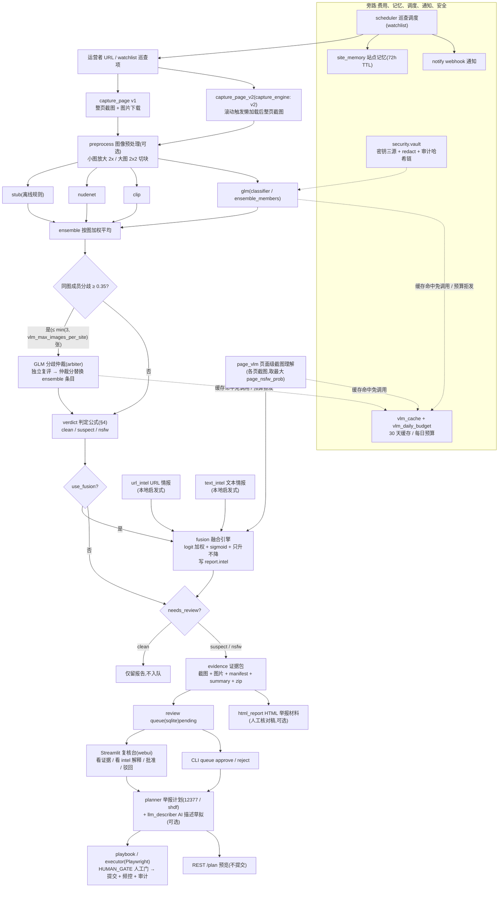

# NetSentinel V2 升级总览(UPGRADE_V2)

V2 在 v1(20 模块 A01–A20,291 项测试全绿)之上并行新增 20 个模块(A21–A40),核心是接入 GLM 视觉大模型并把"多源可解释证据 + 人工复核"的框架补齐为产品级闭环。本文是总览:动机、模块一览、新数据流、与 v1 的兼容性、性能与成本预期、后续路线。增量契约以 `CONTRACTS-V2.md` 为准(与 `CONTRACTS.md` v1 共同生效);接入细节见 [VLM_GUIDE.md](VLM_GUIDE.md),部署见 [DEPLOY.md](DEPLOY.md)。

---

## 1. 动机:从规则到 VLM 的范式升级

v1 的识别链是"本地小模型规则":stub(文件名规则,测试专用)、nudenet(标签加权)、clip(图文分类),再加权集成。它解决了可离线、可审计的初筛,但有三类先天短板:

1. **语义盲区**:只能看"图里有什么",看不懂"页面在干什么"——横幅位、播放器、弹窗这些版式语义与站点性质强相关,却完全没被利用;
2. **分歧无裁判**:多模型对同一张图打分悬殊时(卡通 / 艺术裸体 / 性感但正常的重灾区),v1 只能机械加权平均,没有第三方复核机制;
3. **证据单源**:URL 混淆特征、中文关键词与诱导短语、base64 混淆块等旁证信息全部丢弃,判定不可解释。

V2 的答案不是"用大模型替换判定",而是**范式升级为"多源可解释证据 → 融合 → 人工拍板"**:

- **GLM 视觉大模型(`glm-5.3-flash`,回退 `glm-4.5v-flash` / `glm-4v-flash`,OpenAI 兼容接口 `open.bigmodel.cn/api/paas/v4`)作为三个新特征分量进入体系**:图片级评分、分歧仲裁、页面级截图理解;外加举报描述草拟;
- **融合引擎**把图像分(主证据)+ 页面级 VLM + URL 情报 + 文本情报做 logit 融合,**只升不降**——辅助证据只能把站点推向更强的复核倾向,不能洗白图像判定;
- **安全范式同步升级**:数据出境显式同意(`vlm_online` 默认关)、提示注入防御(只提取 JSON 数值)、费用治理(缓存 + 每日预算)、密钥与审计哈希链(vault)——V2 在 v1 五条红线之上追加五条新红线(见 `CONTRACTS-V2.md` §0);
- **运营形态补齐**:Streamlit 复核台、REST 服务、webhook 通知、watchlist 巡查调度、站点记忆、HTML 举报材料、基准测试,让"初筛 → 复核 → 举报"成为可持续运营的日常流程,而非一次性脚本。

不变的是底线:**VLM 结果只是特征,不是判官;最终判定与举报仍须人工确认。**

---

## 2. A21–A40 模块职责一览

| 编号 | 模块 | 一句话职责 |
| --- | --- | --- |
| A21 | `netsentinel/vision/glm_adapter.py` | GLM 客户端(OpenAI 兼容 /chat/completions,纯标准库)+ 注册名 `"glm"` 的图片分类器,含模型回退链与离线安全态 `VlmOfflineError` |
| A22 | `netsentinel/vision/vlm_prompts.py` | 四类中文提示词(图片评分 / 页面截图 / 仲裁 / 描述草拟)、容错 JSON 解析、字段校验与分段校准(纯函数) |
| A23 | `netsentinel/vision/vlm_cache.py` | VLM 结果 sqlite 缓存(键 = 模型 + 提示词版本 + 图片 sha256,30 天 TTL)+ 每日预算闸门 `VlmBudgetExceeded` |
| A24 | `netsentinel/vision/page_vlm.py` | 整页截图交 GLM 做页面级理解:`page_nsfw_prob` + 版式元素列表(横幅 / 播放器 / 弹窗等) |
| A25 | `netsentinel/vision/arbiter.py` | 多模型同图分歧(≥0.35)仲裁:GLM 独立复评,仲裁分替换 ensemble 条目 |
| A26 | `netsentinel/vision/preprocess.py` | 图像预处理派生变体:小图放大 2x(LANCZOS)、大图 2x2 切块,提升弱模型识别 |
| A27 | `netsentinel/intel/url_intel.py` | URL 静态情报(punycode / 可疑 TLD / 子域深度 / IP 直连等纯本地启发式)→ risk + 中文解释 |
| A28 | `netsentinel/intel/text_intel.py` | 页面文本情报(≥30 个中文色情关键词、诱导短语、base64/hex 混淆块、关键词密度)→ risk + 中文解释 |
| A29 | `netsentinel/decision/fusion.py` | logit 特征融合引擎(W = {image 2.2, page_vlm 1.2, url 0.35, text 0.45},bias −2.0;只升不降;写 `report.intel`) |
| A30 | `webui/app.py` + `webui/README.md` | Streamlit 人工复核台:看证据、看 intel 解释、批准 / 驳回、举报计划预览(绝不自动提交) |
| A31 | `service/app.py` | FastAPI REST 服务(仅本机无鉴权):异步 scan 任务、队列查询 / 批准 / 驳回、计划预览(不执行提交) |
| A32 | `netsentinel/notify/hub.py` | 待复核 webhook 通知:钉钉 / 飞书 / 企微 / 通用 JSON 载荷,10s 超时失败不抛 |
| A33 | `netsentinel/intel/site_memory.py` | 站点指纹记忆(页面 URL + 图片 sha256 聚合指纹,默认 72h TTL):未变站点免重复扫描 |
| A34 | `netsentinel/report/html_report.py` | 单文件 HTML 举报材料("人工核对稿"):分数表 + 内嵌证据缩略图 + intel 解释 + 签名栏 |
| A35 | `netsentinel/crawler/capture_v2.py` | 采集 v2:鼠标滚动(≤6 轮)触发懒加载 → 图片数量稳定 → 回顶整页截图;退化路径同 v1 |
| A36 | `netsentinel/submit/llm_describer.py` | AI 举报描述草拟(≤240 字,事实性):离线回退确定性中文模板,声明须人工核实 |
| A37 | `benchmarks/run_benchmark.py` + `corpus/` | 离线基准:stub 于标注语料的混淆矩阵、precision/recall、PR 曲线(0.05–0.95)与最优阈值建议 |
| A38 | `netsentinel/security/vault.py` | 密钥三源解析(cfg / 环境变量 / `~/.netsentinel/glm_key`)、敏感信息递归打码 `redact`、审计哈希链 `AuditChain` |
| A39 | `netsentinel/ops/scheduler.py` + `watchlist.example.yaml` | 巡查调度:watchlist + 站点记忆去重 + 待复核通知 + 抖动间隔,`--once` / `--loop --interval-min` |
| A40 | `docs/VLM_GUIDE.md` 等 4 篇 | 本轮文档:VLM 接入指南、REST 参考、部署手册、升级总览 |

新增 `Config` 字段(与 v1 键并存,见 `contracts.py`):`glm_api_key / glm_base_url / glm_model / glm_models_fallback / vlm_online / vlm_max_images_per_site / vlm_cache_db / vlm_daily_budget / capture_engine / use_fusion / notify_webhook / watchlist_path / service_host / service_port`;`SiteReport` 新增 `intel: dict`(`as_dict()` 非空才输出,向后兼容)。

---

## 3. 新数据流总览

文字走读(与图对应):

1. **采集**:v1 `capture_page` 或 v2 `capture_page_v2`(`capture_engine: v2`)产出每页 `PageSample`(整页截图 + 图片 + 文本提示);
2. **图像集**:可选 `preprocess` 派生变体后,`ensemble_members` 各成员(stub / nudenet / clip / glm)逐图打分 → `ensemble` 加权平均;
3. **分歧仲裁**:同图成员分 max-min ≥ 0.35 的图(按分歧度取前 `min(3, vlm_max_images_per_site)` 张)交 GLM 独立复评,仲裁分(`model="vlm-arbiter"`)替换该图 ensemble 条目;离线 / 预算尽原样放行;
4. **判定**:`verdict` 按 v1 判定公式产出三档结论(公式未动);
5. **融合**:`use_fusion: true` 时叠加 `url_intel` + `text_intel` + 各页截图 `page_vlm`(取最大 `page_nsfw_prob`),logit 融合 + sigmoid,按"只升不降"更新 verdict / needs_review 并把全部解释写入 `report.intel`;
6. **复核**:非 clean 生成证据包入队(同 v1);可另出 HTML 举报材料;
7. **人机拍板**:复核台(webui)或 CLI 审阅证据与 intel 解释后 approve / reject;approved 条目生成举报计划(可配 AI 描述草拟),经 executor / playbook 在 **HUMAN_GATE 人工门**后提交;
8. **旁路**:`vlm_cache` + `vlm_daily_budget` 管费用;`site_memory` 让巡查跳过未变站点;`scheduler` 驱动周期巡查并在 needs_review 时经 `notify` 推送;`security.vault` 收口密钥并给审计日志上哈希链。

---

## 4. 与 v1 的兼容性

- **v1 模块一行未动**:A01–A20 的全部文件、`contracts.py` 既有字段、判定公式、`SELECTORS`、步骤序列、队列状态机、五条红线全部原样生效;`CONTRACTS.md` 与 `CONTRACTS-V2.md` 共同生效。
- **新能力默认关闭或零成本可选**(默认值即 v1 行为):

| 开关 | 默认 | 不开启时 |
| --- | --- | --- |
| `vlm_online` | `false` | GLM 链路完全离线,无任何图像外发,`page_vlm` 返回缺分 |
| `classifier` / `ensemble_members` | `stub` / `[stub]` | 识别链与 v1 默认一致,无 VLM 调用 |
| `capture_engine` | `v1` | 采集走 v1 `capture_page` |
| `notify_webhook` | 空 | 通知关闭(`notify` 返回 False) |
| `watchlist_path` | `watchlist.yaml` | 仅 scheduler 使用,不用则无影响 |
| `use_fusion` | `true` | 见下注 |

> 注:`use_fusion` 默认 `true`,但**离线时融合是零风险纯本地行为**——`page_vlm` 无分发(按 0.5 中性、权重减半),url/text 情报是本地 stdlib 启发式,融合又"只升不降";若要字节级复刻 v1 判定输出,设 `use_fusion: false` 即可。
>
> **接线说明**(CONTRACTS-V2 §4,由项目负责人在集成阶段收口,代理不改编排):`classifier: glm` 或 `ensemble_members: [stub, glm]` 即启用 GLM;`capture_engine: v2` 切换采集;`use_fusion: true` 时 assess 后调 fusion 并在 needs_review 时 notify。
>
> **CLI / 数据兼容**:v1 三个子命令(`scan / queue / submit`)用法不变;`SiteReport.intel` 为新增字段且 `as_dict()` 非空才输出,旧消费者无感;v1 队列 / 证据包 / 审计日志继续可用(审计旧行无哈希字段,`AuditChain.verify` 会跳过并报告"旧格式 N 行")。

---

## 5. 性能与成本预期

### 5.1 每站点 VLM 调用上限(默认配置)

| 分量 | 每站上限(默认值) | 依据 |
| --- | --- | --- |
| 图片级评分(`glm` 成员) | ≤ 8 次 | `vlm_max_images_per_site=8` 封顶送审图数 |
| 分歧仲裁 | ≤ 3 次 | `min(3, vlm_max_images_per_site)`,且仅分歧 ≥0.35 的图 |
| 页面级截图理解 | ≤ 5 次 | 每页 1 次 × `max_pages=5` |
| **合计上界** | **≤ 16 次 / 站** | 三者全开、全未命中缓存的最坏情况 |

对照闸门:`vlm_daily_budget=200` → **最坏情况下每日至少支撑 200 ÷ 16 ≈ 12 个站点的全量 VLM 巡查**;实际形态通常远低于上界(纯 `[stub, glm]` + 仲裁 ≈ 11 次/站;不开 page_vlm 则 ≤ 8~11 次/站)。

### 5.2 缓存命中率的影响

- 缓存键 = 模型名 + `PROMPT_VERSION` + 图片 sha256,**30 天 TTL**:同一图片在 30 天内重复扫描(同站重扫、跨站镜像图)零成本、零预算消耗;
- `site_memory`(72h)在缓存之前就把"未变化站点"整站跳过,连采集都省了——两级去重叠加后,稳定巡查清单的边际成本趋近于"新增 / 变化内容"的识别费;
- 提示词升级会使旧缓存整批失效,升级后首轮巡查会出现一次预算高峰,属预期(见 [VLM_GUIDE.md](VLM_GUIDE.md) §5)。

### 5.3 时延预期

单次 VLM 调用超时上限 60s(网络错误自动重试 1 次;`temperature=0.1` 求稳定输出);本地分量(ensemble 判定 / url_intel / text_intel / fusion)为毫秒级纯计算。整站扫描的墙钟时间主要由采集(`fetch_delay_s=1.0` 礼貌间隔)与图片下载决定,开 GLM 后按"送审图数 × 单次调用秒级时延"线性增加。

### 5.4 本地基线

`benchmarks/`(A37)提供 stub 分类器在 30 张标注语料(12 nsfw_hi / 6 nsfw_mid / 12 normal)上的混淆矩阵、precision/recall、PR 曲线与最优阈值建议(`benchmarks/out/report.md` + `report.json`,`--make-corpus` 重建语料),作为阈值调优与后续模型对比的离线基线。注意 stub 仅按文件名规则打分,基线只覆盖"规则链路",不能外推到 nudenet / clip / glm。

---

## 6. 后续路线

1. **多租户**:面向多个运营者 / 团队的隔离——独立队列与证据目录、按租户的密钥与预算(vault 扩展为多密钥保险库)、审计链分租户校验;复核台与服务端引入鉴权与操作员身份留痕。
2. **模型 AB**:并行跑两套模型配置(如 `glm-5.3-flash` vs `nudenet+clip`)对同批站点出对比报告,依托 `benchmarks` 框架扩展为线上分流评测,用真实复核结论(approve / reject 备注)回填,持续校准 `calibrate` 锚点表与融合权重。
3. **跨模态哈希库**:把图片 sha256、页面指纹(site_memory 已有雏形)、文本混淆块哈希统一为跨模态指纹库,实现"见过的违规素材秒级先验"——新站点命中已知指纹直接给出高置信线索,同时为缓存命中率和跨站关联分析加成。

配套事项:真实门户表单结构的人工核验(v1 路线图遗留)、阈值与提示词版本的持续调优、审计与证据的数据治理自动化(定期 `AuditChain.verify` + 证据清理,见 [DEPLOY.md](DEPLOY.md) §8)。

---

## 7. 相关文档

- [VLM_GUIDE.md](VLM_GUIDE.md) —— GLM 接入权威指南(密钥 / 合规 / 费用 / 提示词 / 故障排查)
- [API.md](API.md) —— REST 服务端点参考
- [DEPLOY.md](DEPLOY.md) —— 部署、自启、容器、升级与监控
- [USAGE.md](USAGE.md) / [ARCHITECTURE.md](ARCHITECTURE.md) / [ETHICS.md](ETHICS.md) —— v1 使用手册 / 架构 / 伦理红线(V2 继续适用)
- [../CONTRACTS.md](../CONTRACTS.md) / [../CONTRACTS-V2.md](../CONTRACTS-V2.md) —— 契约原文(冲突时以契约为准)
