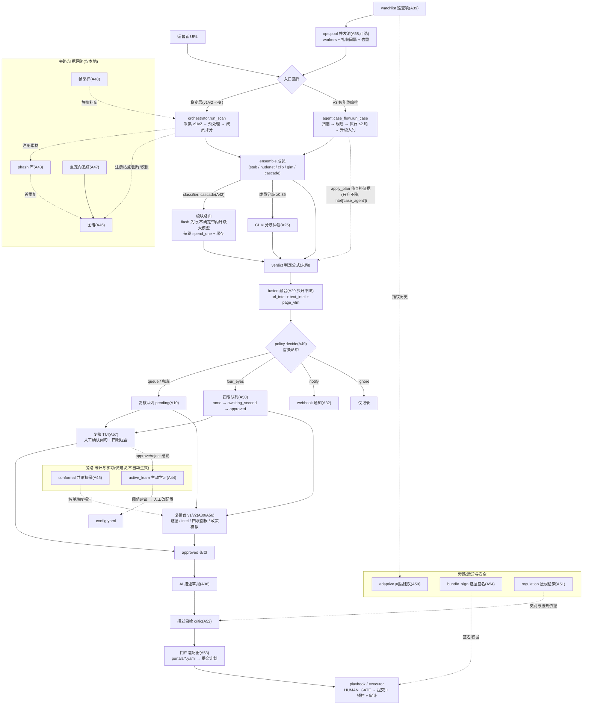

# NetSentinel V3 升级总览(UPGRADE_V3)

V3 在 v1(20 模块 A01–A20)+ v2(20 模块 A21–A40,740 测试全绿)之上并行新增 20 个模块(A41–A60),主题是**从"感知"到"智能体平台"**:让 GLM 从"打分器"升级为"办案侦探"(案件智能体),让识别链学会"省着用大模型"(级联路由),让名单质量有"可核查的统计担保"(共形预测),让证据从"单站点"连成"团伙网络"(pHash / 图谱 / 重定向),让系统从"脚本集合"长成"有纪律的运营平台"(四眼 / 政策 / RAG / 签名 / 门户适配器 / 鲁棒性基准 / 仪表盘 / TUI / 池化 / 自适应调度)。本文是总览;增量契约以 `CONTRACTS-V3.md` 为准(与 v1/v2 契约共同生效)。

> 集成状态(2026-10-01):A41–A50 代码已就位,全套测试 1024 通过 / 1 跳过;A51–A59 按契约交付中,其行为描述以 `CONTRACTS-V3.md` §3 为准。接线(CONTRACTS-V3 §4)由项目负责人在集成期收口。

---

## 1. 动机:V2 之后还缺什么

V2 交付了"多源可解释证据 → 融合 → 人工拍板"的闭环,但五类问题留给了 V3:

1. **看什么由代码写死**:每张图逐张送审,预算花在大量"看一眼就知道"的图上,而真正可疑的边缘样本得不到更多关注;
2. **单一 flash 模型的边缘判定不稳**:性感但正常 / 卡通 / 艺术裸体这类样本,flash 与大模型的判断差距显著,却没人决定"什么时候该请大模型";
3. **"名单精度 95%"无法兑现也无法证伪**:阈值拍脑袋定,复核结论没有反哺机制;
4. **证据是孤岛**:同一批违规素材在 A、B、C 三个站重传,系统每次都当新案子看;
5. **运营散装**:分流规则写死在代码里、单人签字即可提交高价值举报、门户表单一变就得改代码、没有终端友好的复核工具。

V3 的答案:智能体(规划侦查)、级联(不确定才升级)、共形(诚实担保)、主动学习(结论反哺)、图谱与 pHash(团伙发现)、四眼与政策与签名与适配器(平台治理)。**不变的是底线:机器永不替代人工门,建议永不自动生效,VLM 分永远只是特征。**

---

## 2. A41–A60 模块职责一览

| 编号 | 模块 | 一句话职责 |
| --- | --- | --- |
| A41 | `netsentinel/agent/case_agent.py` + `case_flow.py` | 案件智能体:GLM 阅读报告摘要规划侦查动作(假设 + ≤5 动作 + 置信度),执行后只升不降;`run_case` 编排"扫描 → 规划 → 执行(≤2 轮)→ 升级入列" |
| A42 | `netsentinel/vision/cascade.py` | VLM 级联路由分类器(注册名 `cascade`):flash 先行,校准分落入不确定带 `[0.15, 0.85]` 才升级大模型,每跳独立走缓存与预算 |
| A43 | `netsentinel/intel/phash.py` | 感知哈希库:`phash`(DCT 64bit,PIL 缺失退化 aHash)/ `hamming` / `PhashRegistry`(近重复登记与检索,仅存本地) |
| A44 | `netsentinel/intel/active_learn.py` | 主动学习:`ReviewFeedback` 收集复核结论 → 三条阈值**建议**(样本 <20 返回空);`rank_for_vlm` 边缘优先的预算内送审排序 |
| A45 | `netsentinel/decision/conformal.py` | 共形预测:人工核验校准集上拟合"名单精度 ≥ 目标"的阈值,担保随行前提与降级(n<30 不背书) |
| A46 | `netsentinel/intel/graph.py` | 站点关联图谱 `EvidenceGraph`:共享图片 / 模板 / 重定向沉淀为站点边(Jaccard 权重),`related_sites` BFS 查团伙 |
| A47 | `netsentinel/crawler/redirect.py` | 重定向链追踪:HEAD 3xx / meta refresh / 顶层 JS 逐跳展开,≤5 跳、环路截断,可写入图谱 |
| A48 | `netsentinel/vision/video_frames.py` | 视频 / GIF 帧采样:GIF 均匀采 ≤6 帧,容器格式给 ffmpeg 工作流指引,帧证据接入评分链路 |
| A49 | `netsentinel/policy/engine.py` + `policy.example.yaml` | 声明式政策引擎:YAML 规则(首条命中、AND 条件)四动作分流(queue/notify/ignore/four_eyes),兜底必回人工复核 |
| A50 | `netsentinel/decision/four_eyes.py` | 四眼复核队列:组合 `ReviewQueue`,双人不同审核人齐批才 approved,approvals 表留痕,同人拦截 |
| A51 | `netsentinel/intel/regulation.py` + `docs/regulations/*.md` | 法规检索(RAG):中文 2-gram BM25-lite 索引 12377 分类 / 扫黄打非受理 / 法条标题清单,`suggest_category` 给举报类别建议 |
| A52 | `netsentinel/submit/describer_critic.py` | 举报描述自检:GLM 逐句核对草稿与事实清单(离线回退规则版:数值不一致 / 夸张词 / 超 240 字) |
| A53 | `netsentinel/submit/portal_defs.py` + `portals/12377.yaml` + `portals/shdf.yaml` | 门户适配器:门户入口 / 分类值 / 选择器外置 yaml,`build_plan_from_def` 生成提交计划;captcha 只许出现在 HUMAN_GATE |
| A54 | `netsentinel/security/bundle_sign.py` | 证据签名:`BundleSigner` 对 manifest 文件清单做 HMAC-SHA256 链签名与校验,密钥走环境变量或 `data/.signkey` |
| A55 | `benchmarks/adversarial.py` | 对抗鲁棒性基准:四类扰动变体(模糊 / 马赛克 / 中央遮挡 / JPEG q=30)× 分类器分数下降统计,中文报告 + json |
| A56 | `webui/dashboard.py` | 复核台 v2:纯函数层(趋势 / 模型一致率 / 图谱表格化 / 政策模拟)+ Streamlit 图表与四眼状态面板,不动 v1 app.py |
| A57 | `netsentinel/cli/review_tui.py` | 复核 TUI:纯标准库终端(颜色徽章,list/approve/reject/quit),批准前强制"我已人工核实(Y/N)",组合四眼队列 |
| A58 | `netsentinel/ops/pool.py` | 并发扫描池:`ThreadPoolExecutor` + 全局礼貌间隔 + site_memory 去重 + 失败隔离,绝不扩大扫描范围 |
| A59 | `netsentinel/ops/adaptive.py` | 自适应重扫:`volatility`(指纹变化率)→ 间隔建议(高波动减半 / 低稳定加倍,钳制 [6, 720] 小时),纯函数 |
| A60 | `docs/AGENT_GUIDE.md` 等 4 篇 | 本轮文档:智能体指南 / 平台手册 / 升级总览 / V3 速览 |

新增 `Config` 字段(已在 `contracts.py` 落地,禁改):`case_agent_model / vlm_cascade / vlm_escalate_above / vlm_escalate_below / phash_db / graph_db / four_eyes_required / policy_path / redirect_max_hops / video_max_frames / conformal_target_precision / adaptive_base_interval_h`(速查见 §6)。

---

## 3. 新数据流总览



文字走读(与图对应):

1. **入口**:单个 URL 走稳定层 `run_scan` 或 V3 智能体入口 `run_case`;批量巡查走 `ops.pool`(并发 + 礼貌间隔 + 去重)后进入同一入口;watchlist 由 v2 `scheduler` 驱动,间隔可用 `adaptive` 按站点波动率个性化;
2. **识别**:ensemble 成员逐图打分——`classifier: cascade` 时成员内部先 flash 后按需升级(每跳独立扣预算);多成员分歧 ≥0.35 交 GLM 仲裁;`run_case` 路径上,案件智能体在扫描后规划侦查动作(复扫页面 / 复核图片 / 追加抽样),新增证据只升不降;
3. **判定与融合**:判定公式(v1 §4)未动;`use_fusion` 叠加 URL / 文本 / 页面级 VLM 特征,只升不降;
4. **政策分流**:`policy.decide` 按运营者 YAML 首条命中分流——queue(入列)、four_eyes(入列并要求双人)、notify(仅提醒)、ignore(仅记录);兜底与缺省政策一律回人工复核;
5. **复核**:TUI 与复核台(v1 看单条证据,v2 加趋势 / 模型一致性 / 图谱 / 政策模拟 / 四眼面板);`four_eyes_required` 时两人齐批才 approved;驳回结论喂给主动学习;
6. **提交**:approved 条目 AI 草拟描述 → critic 自检(法规检索提供类别与法规依据)→ 门户适配器按 yaml 生成计划 → executor 在 **HUMAN_GATE** 人工核对与输入验证码后提交,频控与审计不变;证据包可经 `bundle_sign` 签名验真;
7. **旁路**:phash / 图谱 / 重定向只在本地沉淀团伙线索;conformal 与 active_learn 的产出以"建议"呈现(benchmarks 与复核台),不自动改生产阈值。

---

## 4. 三轮演进:v1 规则 → v2 感知 → v3 智能体与平台

| | v1(A01–A20)规则与证据链 | v2(A21–A40)GLM 感知与融合 | v3(A41–A60)智能体与平台 |
| --- | --- | --- | --- |
| 识别范式 | 本地小模型规则(stub / nudenet / clip)+ 加权集成 | GLM 三特征分量(图片 / 页面 / 仲裁)+ logit 融合,只升不降 | 模型**规划**侦查(案件智能体)+ 级联路由(不确定才升级)+ 帧采样补盲 |
| 判定质量依据 | 阈值经验设定 | 基准测试(stub 离线语料) | **共形担保**(校准集经验精度)+ 主动学习(复核结论反哺建议)+ 对抗鲁棒性基准 |
| 证据形态 | 单站点截图 + 图片 + manifest | + intel 可解释特征 + HTML 举报材料 | + **跨站点团伙网络**(pHash 近重复 / 共享模板 / 重定向图谱)+ 证据签名 |
| 运营形态 | CLI 三命令 + 人工队列 | 复核台 / REST / webhook / watchlist 巡查 | + 四眼双人复核 / 声明式政策 / 法规 RAG / 门户适配器 / TUI / 复核台 v2 / 并发池 / 自适应间隔 |
| 安全治理 | 五条红线(人工门 / 验证码 / 频控 / 网络闸门 / 测试零外呼) | + 五条(数据出境同意 / VLM 只是特征 / 注入防御 / 预算缓存 / 测试零外呼) | + 五条(政策不削弱人工门 / 图谱哈希仅本地 / 预算一本账 / 担保要诚实 / 测试零外呼),累计 15 条 |
| 人的角色 | 逐条人工复核 + 人工门 | 同左,intel 辅助判断 | 同左,政策与四眼让高价值条目**更多人**看,统计建议让阈值调整有据 |

一条主线贯穿三轮:**每一轮加的"智能",都用来把更准的证据送到人面前,而不是替人做决定。**

---

## 5. 与 v1 / v2 的兼容性

- **v1/v2 模块一行未动**:A01–A40 全部文件、`contracts.py` 既有字段、判定公式、`SELECTORS` 与步骤序列、队列状态机、既有红线原样生效;三份契约共同生效,冲突时以 newer 契约为准;
- **V3 能力全部默认关闭或零成本可选**(默认值即 V2 行为):

| 开关 / 字段 | 默认 | 不开启时 |
| --- | --- | --- |
| `case_agent_model` | `""` | 案件智能体不另行选模;`vlm_online: false` 时规划整体离线降级,`run_case` ≈ `run_scan` + 一条 intel 记录 |
| `classifier` | `stub` | 不含 `cascade` 成员,级联完全不参与;`vlm_cascade` 字段仅是说明性开关 |
| `four_eyes_required` | `false` | approve 单人确认,与 v1/v2 行为一致 |
| `policy_path` | `policy.yaml` | 文件缺失 → 内置默认政策(单条 queue-all),等价于既有"needs_review 即入列" |
| `phash_db` / `graph_db` | 路径字段 | 只有显式调用对应模块才建库,主流程零感知 |
| `redirect_max_hops` / `video_max_frames` / `conformal_target_precision` / `adaptive_base_interval_h` | 参数默认 | 对应模块不被调用时无任何效果 |

- **CLI / 数据兼容**:`scan / queue / submit` 三命令用法不变(V3 智能体编排经 `netsentinel.agent.case_flow.run_case` Python API 进入);`SiteReport.intel` 新增 `case_agent` 键;复核队列 `entries` 表不动(四眼的 `approvals` 是同库新表,旧库直接可用);审计日志新增 `"case"` 事件类型,`AuditChain.verify` 对旧行为不变;
- **接线**(CONTRACTS-V3 §4,由项目负责人集成期收口):`classifier: cascade` 即启用级联;`four_eyes_required: true` 时 CLI/TUI 走 `FourEyesQueue`;`run_scan` 不变;conformal / active_learn 产出只以建议形式呈现。

---

## 6. 配置速查表(V3 新字段全列)

键名与 `netsentinel/contracts.py::Config` 字段一一对应(v1/v2 字段见 `config.example.yaml` 与 [UPGRADE_V2.md](UPGRADE_V2.md)):

| 字段 | 默认值 | 说明 |
| --- | --- | --- |
| `case_agent_model` | `""` | 案件智能体规划与级联升级使用的模型;空 = 跟随 `glm_model` |
| `vlm_cascade` | `false` | 级联**说明性**开关;级联真正生效以 `classifier: cascade` 为准(避免双开关互锁) |
| `vlm_escalate_above` | `0.85` | 级联不确定带上端(闭区间,含端点);flash 校准分落在带**内**才升级 |
| `vlm_escalate_below` | `0.15` | 级联不确定带下端(闭区间,含端点) |
| `phash_db` | `data/phash.db` | 感知哈希库路径(仅存本地,红线 12) |
| `graph_db` | `data/graph.db` | 站点关联图谱路径(仅存本地,红线 12) |
| `four_eyes_required` | `false` | 双人四眼复核:提交级条目须两名不同审核人批准 |
| `policy_path` | `policy.yaml` | 声明式政策文件(缺失时内置 queue-all 默认政策) |
| `redirect_max_hops` | `5` | 重定向链最大跳数(环路检测之外的第二道闸) |
| `video_max_frames` | `6` | 视频 / GIF 每站最多采样帧数 |
| `conformal_target_precision` | `0.95` | 共形预测目标精度(须在 (0.5, 1) 开区间) |
| `adaptive_base_interval_h` | `72` | 自适应重扫基准间隔(小时;建议钳制在 [6, 720]) |

常用组合示例:

```yaml
# 全默认 = V2 行为(V3 完全静默)

# 开级联 + 案件智能体(需 vlm_online: true 与密钥)
classifier: cascade
case_agent_model: "glm-4.5v-flash"   # 留空则升级模型取回退链第一个非 flash

# 平台治理
four_eyes_required: true
policy_path: "policy.yaml"
```

---

## 7. 测试与验收

- 测试规则延续 v1/v2:**零外呼、零真实门户、零真实 VLM 调用**(mock 传输层;`importorskip` 可选依赖;本地服务仅 127.0.0.1;只写 tmp_path);
- 每模块配套 `tests/test_<module>.py`(A41–A60 契约 §2 文件清单);当前仓库全套 **1024 passed / 1 skipped**(2026-10-01 实测,A01–A50 就位时点);
- 验收口径:契约 §3 的签名与安全语义逐条有测试(如级联预算、四眼同人拦截、政策非法 action 拒载、共形小样本降级、TUI 脚本化双人流程)。

---

## 8. 后续路线(建议)

1. **图谱反哺巡查**:把 `related_sites` 的高权重关联站作为"建议新增 watchlist 项"呈现给人(仍不自动扩表);
2. **校准自动化**:复核结论自动落 `ReviewFeedback`,共形报告定期重拟合,跟踪数据漂移;
3. **多门户适配器**:门户表单人工核验后沉淀更多 `portals/*.yaml`,复用 A53 加载校验;
4. **级联带自适应**:不确定带端点随 active_learn 的边缘样本分布定期给出调整建议。

---

## 9. 相关文档

- [README_V3.md](README_V3.md) —— 面向新读者的 V3 能力速览与快速上手
- [AGENT_GUIDE.md](AGENT_GUIDE.md) —— 案件智能体 / 级联 / 主动学习 / 共形预测权威指南
- [PLATFORM.md](PLATFORM.md) —— 四眼 / 政策 / 图谱 / 池化 / 签名 / TUI 运营手册
- [VLM_GUIDE.md](VLM_GUIDE.md) / [API.md](API.md) / [DEPLOY.md](DEPLOY.md) —— GLM 接入 / REST / 部署
- [UPGRADE_V2.md](UPGRADE_V2.md) / [USAGE.md](USAGE.md) / [ARCHITECTURE.md](ARCHITECTURE.md) / [ETHICS.md](ETHICS.md) —— V2 总览与 v1 手册
- [../CONTRACTS.md](../CONTRACTS.md) / [../CONTRACTS-V2.md](../CONTRACTS-V2.md) / [../CONTRACTS-V3.md](../CONTRACTS-V3.md) —— 契约原文(冲突时以契约为准)
