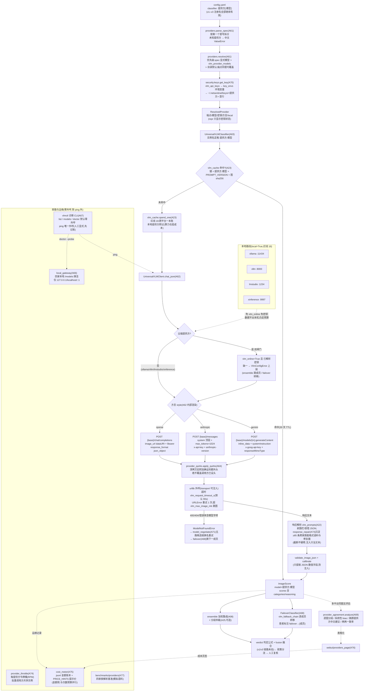

# NetSentinel V4 升级总览(UPGRADE_V4)

V4 在 v1(20 模块 A01–A20)+ v2(20 模块 A21–A40)+ v3(20 模块 A41–A60,1255 测试全绿)之上并行新增最后 20 个模块(A61–A80),主题是**全平台视觉模型统一接入**:任何提供方的视觉模型都能用 `classifier: 提供方:模型` 一套语法、一套代码接入——20 家提供方归一到三种 API 方言(openai / anthropic / gemini),一本预算账,一把诊断螺丝刀。本文是总览;增量契约以 `CONTRACTS-V4.md` 为准(与 v1/V2/V3 契约共同生效)。

> 集成状态(2026-10-01):A61–A79 代码与文档已全部交付;本文落稿时实跑全套测试 **1740 项(1737 通过 / 1 失败 / 2 跳过,77 个测试文件)**。唯一失败项 `tests/test_failover.py::test_default_builder_missing_multi_provider_raises_chinese` 是 A68 针对"multi_provider 尚未就位"场景的模拟测试,与"全部模块已就位"的收尾现实冲突的测试隔离问题(实际抛出的是正确的中文配置类汇总错误),不影响生产行为,由对应代理收尾。接线(CONTRACTS-V4 §5)已由项目负责人完成:`classifier_base.get_classifier` 对未注册名称自动转交 `multi_provider.build_classifier`,orchestrator 零改动。

---

## 1. 动机:V3 之后还缺什么

V3 让识别链"会用大脑"(GLM 三特征 + 案件智能体 + 级联路由),但整条 VLM 能力仍然系在**一家平台**上,五类问题留给了 V4:

1. **单平台绑定**:v2/v3 的一切 VLM 能力(图片评分、仲裁、页面理解、案件规划)都走 `glm_adapter`(智谱 GLM)——GLM 限额、故障、调价或模型改名时,整个感知层没有 Plan B;
2. **方言壁垒**:换一家平台等于重写一套客户端。OpenAI、Anthropic、Gemini 三种 API 方言的请求形态(system 位置、传图块、鉴权头、JSON 模式)与响应形态各不相同,更别说各平台的小怪癖(围栏包裹、截断、思考字段、接入点 ID);
3. **模型名漂移**:各平台模型名迭代极快,"模型不存在"(404/400)是高频故障,此前没有自动换名协商机制;
4. **响应脏格式**:20 家返回的"JSON"五花八门——围栏、前后客套话、单引号、尾逗号、Python 字面量、中文引号包键、截断——v2 的解析器只按 GLM 风格调校;
5. **运营盲区**:配了哪些平台、本地推理网关活着没有、哪家模型系统性偏松偏严、跨平台调用花了多少钱,此前没有统一视图与统一诊断工具。

V4 的答案是一组"统一件":**统一目录**(`providers`,20 家权威清单)+ **统一传输层**(`vlm_client`,三方言一套客户端)+ **统一分类器**(`multi_provider`,任何提供方一个类)+ **统一账本**(`vlm_cache` 次数预算跨平台一本账,`cost_meter` 金额侧提示价口径)+ **统一诊断**(`vlmctl` 的 list/models/ping/doctor)+ **统一质检**(`provider_agreement` 的跨平台一致性分析)。本地路线(ollama / vllm / lmstudio / xinference)数据不出本机,是"隐私优先"运营者的正式选项。

不变的是底线:**默认零外呼;机器永不替代人工门;VLM 分永远只是特征,不是判官。**

---

## 2. A61–A80 模块职责一览

| 编号 | 模块 | 一句话职责 | 关键 API |
| --- | --- | --- | --- |
| A61 | `netsentinel/vision/providers.py` | 20 家提供方权威目录(端点/方言/默认模型/密钥环境变量/本地标记)与 `提供方:模型` 语法解析、三级优先级 resolve | `ProviderSpec` / `PROVIDERS` / `parse_spec()` / `resolve()` / `is_local()` |
| A62 | `netsentinel/vision/vlm_client.py` | 统一传输层:三种 API 方言一套客户端,云端双闸门(vlm_online + 密钥)、超时重试、模型不存在识别 | `UniversalVLMClient.chat_json()` / `VlmConfigError` / `ModelNotFoundError` / `encode_image()` |
| A63 | `netsentinel/vision/multi_provider.py` | 统一分类器与构建入口(未注册名自动转交);缓存 → 记账 → 外呼 → 校验校准全链路 | `build_classifier()` / `UniversalVLMClassifier`(注册名 `vlm`) |
| A64 | `netsentinel/vision/provider_quirks.py` | 平台特化层:仅收录官方文档确证的附加头/模型别名/响应怪癖,不杜撰 | `QUIRKS` / `apply_quirks()` / `quirk_notes()` |
| A65 | `netsentinel/vision/model_catalog.py` | 模型目录与档位推荐(cheap/balanced/flagship/local/free 五标签,提示值) | `MODELS` / `suggest()` / `validate_model()` / `search()` |
| A66 | `netsentinel/vision/local_gateway.py` | 本地推理网关探活:四家本地服务的 `/models` 发现与健康检查(仅本机回环) | `probe()` / `is_local()` / `local_status()` |
| A67 | `netsentinel/vision/vlmctl.py` | 诊断 CLI:list(配了没)/ models(有哪些)/ ping(通不通,唯一外呼)/ doctor(全身体检) | `main()`;`python -m netsentinel.vision.vlmctl` |
| A68 | `netsentinel/vision/failover.py` | 跨平台故障转移路由(注册名 `failover`):链上逐成员尝试,配置错跳过、失败转移 | `FailoverClassifier` / `cfg.vlm_fallback_chain` |
| A69 | `netsentinel/vision/provider_agreement.py` | 跨平台一致性分析:谁偏松、谁偏严、哪张图争议大(多平台 ensemble 的质检仪) | `provider_of()` / `analyze()` |
| A70 | `netsentinel/security/keys.py` | 多平台密钥环:三来源优先级解析、文件方式写入与权限收紧、布尔化体检、打码 | `get_key()` / `set_key()` / `configured()` / `redact_keys()` |
| A71 | `netsentinel/vision/model_negotiate.py` | 模型名协商回退:`ModelNotFoundError` 时按五路候选链换名重试,成功进程内定格 | `negotiate()` / `candidate_chain()` |
| A72 | `netsentinel/vision/prompt_dialects.py` | 三方言请求/响应的纯函数渲染(与 A62 逐字段同构的参考实现,供对照与扩展) | `CAPS` / `build_request()` / `parse_response()` |
| A73 | `netsentinel/vision/response_repair.py` | 跨家族 JSON 修复语料(≥85 条,四族均衡)与修复器;截断不硬修返回 None | `CORPUS` / `repair()` / `run_corpus()` |
| A74 | `netsentinel/vision/provider_throttle.py` | 每提供方令牌桶限速(RPM 意识,容量 2 突发),时钟可注入离线可测 | `ProviderThrottle` / `acquire()` / `try_acquire()` / `state()` |
| A75 | `netsentinel/vision/cost_meter.py` | 成本计量:`PRICE_HINTS` 提示价(元/千次,以账单为准)+ jsonl 金额账本 | `CostMeter.estimate()/record()/summary()` / `PRICE_HINTS` |
| A76 | `webui/providers_page.py` | 复核台提供方面板(独立入口):总表/本地网关/一致性/成本四页签,ping 须人工显式 | `provider_rows()` / `ping_row()` / `agreement_rows()` / `cost_rows()` |
| A77 | `benchmarks/providers.py` | 跨平台响应解析基准(模拟语料零外呼):四家族成功率/合规率/平均修复深度 | `run()` / `FIXTURES`;`python benchmarks/providers.py` |
| A78 | `tests/test_multi_provider_e2e.py` + `scripts/demo_multi_provider.py` | 全目录逐提供方端到端(mock)+ 中文零外呼演示(目录/三平台对比/failover/一致性/成本) | `python scripts/demo_multi_provider.py` |
| A79 | `docs/PROVIDERS.md` + `docs/MULTI_PROVIDER.md` | 提供方权威总览(20 家逐节)与使用指南(语法/密钥/ensemble/failover/vlmctl/红线) | — |
| A80 | `docs/UPGRADE_V4.md` + `CHANGELOG.md` + `docs/PROVIDER_SETUP.md` | 本文(升级总览)+ 四轮演进总账 + 每平台密钥获取指引 | — |

新增 `Config` 字段(已在 `contracts.py` 落地,禁改):`vlm_provider` / `vlm_api_keys` / `vlm_provider_base_urls` / `vlm_provider_models` / `vlm_fallback_chain` / `vlm_request_timeout_s` / `vlm_max_image_mb`(速查见 §6)。

---

## 3. 新数据流总览



文字走读(与图对应):

1. **入口与解析**:配置写 `classifier: 提供方` 或 `提供方:模型`(v1–v3 注册名如 `stub` / `glm` / `cascade` 全部继续有效,未注册名称才转交 `multi_provider.build_classifier`);`parse_spec` 按第一个冒号拆分(openrouter 的 `:free` 后缀不受影响),`resolve` 按三级优先级取端点/模型(显式模型 > `vlm_provider_models` > 目录默认),密钥统一经 `security.keys.get_key`(配置项 → 环境变量 → 密钥环文件);
2. **记账前置**:每次真实外呼前必过 `vlm_cache.spend_one`——**跨平台共用一本预算账**(红线 19),failover 第二跳、ensemble 第二成员、协商换名重试各记各的;本地提供方免闸门免密钥但照常记账;`cost_meter` 是金额侧的互补账本(提示价口径,以账单为准),供复核台面板与演示记录;
3. **三方言传输**:`UniversalVLMClient` 把 20 家归一到 openai / anthropic / gemini 三种形态;`provider_quirks` 在发送前深拷贝并附加**官方文档确证**的额外头(绝不覆盖已有头);超时 `vlm_request_timeout_s`、URLError 重试 1 次、单图超 `vlm_max_image_mb` 跳图;云端双闸门(vlm_online + 密钥)缺一即 `VlmConfigError` 上抛;
4. **失败两条出路**:`ModelNotFoundError` → `model_negotiate` 按五路候选链(当前名 → 配置覆盖 → 目录默认 → 低价推荐 → 平台别名)换名重试,成功进程内定格(零额外外呼);成员级失败/配置错 → `FailoverClassifier` 沿 `vlm_fallback_chain` 转移到下一家,胜者标注 `failover→{成员}`;
5. **响应侧**:解析走 v2 的 `vlm_prompts` 容错口径,`response_repair` 把 20 家脏格式沉淀为 ≥85 条跨家族语料与修复器(截断返回 None、注入只当文本),`benchmarks/providers` 用模拟语料量化四家族解析成功率——真实平台差异以 `vlmctl ping` 人工诊断为准;校验校准后产出 `ImageScore`,进入 v1 未动的 ensemble → verdict → fusion → 政策 → 人工复核主链;
6. **质检与运维旁路**:多平台同图互评后 `provider_agreement.analyze` 给出逐图分歧、系统性 bias 与离群提供方中文处置建议;`vlmctl` 四命令覆盖全部诊断(`ping` 是唯一外呼动作且须人工触发、先记账);`local_gateway` 只探本机回环;`provider_throttle` 是独立令牌桶(批量调用方共享,尚未默认接入主管道,见 §8)。

---

## 4. 四轮演进总叙事:v1 规则 → v2 感知 → v3 智能体 → v4 统一网关(共 80 模块)

| | v1(A01–A20)规则与证据链 | v2(A21–A40)GLM 感知与融合 | v3(A41–A60)智能体与平台 | v4(A61–A80)全平台统一网关 |
| --- | --- | --- | --- | --- |
| 识别范式 | 本地小模型规则(stub/nudenet/clip)+ 加权集成 | GLM 三特征分量(图片/页面/仲裁)+ logit 融合,只升不降 | 模型规划侦查(案件智能体)+ 级联路由 + 帧采样补盲 | **任何提供方的视觉模型**统一接入:三方言一套客户端、跨平台 ensemble 与 failover |
| 平台面 | 无外部模型依赖(纯离线) | 单平台(智谱 GLM) | 同左(能力深化) | **20 家提供方**(16 云 + 4 本地),模型目录/方言/密钥/账本/诊断全部统一 |
| 判定质量依据 | 阈值经验设定 | 离线基准测试 | 共形担保 + 主动学习 + 对抗鲁棒性基准 | + **跨平台一致性分析**(谁偏松谁偏严)+ 跨家族响应解析基准 |
| 证据形态 | 单站点截图 + 图片 + manifest | + intel 可解释特征 + HTML 举报材料 | + 跨站点团伙网络 + 证据签名 | 同左(证据层未动;V4 动的是"看图的眼睛") |
| 运营形态 | CLI 三命令 + 人工队列 | 复核台 / REST / webhook / watchlist | + 四眼 / 政策 / 法规 RAG / TUI / 并发池 / 自适应 | + **vlmctl 诊断 CLI** / 提供方面板 / 成本计量 / 限速桶 |
| 安全治理 | 红线 1–5(人工门/验证码/频控/网络闸门/测试零外呼) | + 红线 6–10(出境同意/VLM 只是特征/注入防御/预算缓存/测试零外呼) | + 红线 11–15(政策不削弱人工门/图谱仅本地/预算一本账/担保诚实/测试零外呼) | + **红线 16–20**(本地豁免仍须显式选择/密钥不入日志/提示值须核验/跨平台一本账/ping 唯一外呼),累计 20 条 |
| 测试规模 | 291 | 740 | 1255 | 1740(实测) |
| 人的角色 | 逐条人工复核 + 人工门 | 同左,intel 辅助判断 | 同左,统计建议让阈值调整有据 | 同左,跨平台一致性与成本视图让"信哪家模型"有据 |

一条主线贯穿四轮:**每一轮加的"智能",都用来把更准的证据送到人面前,而不是替人做决定。**v1 解决"看得见"(规则证据链),v2 解决"看得懂"(语义感知),v3 解决"会办案"(智能体与平台治理),v4 解决"信得过、换得起"(多平台互证、故障转移、成本透明)——80 个模块,人工门一次都没松动过。

---

## 5. 与 v1 / v2 / v3 的兼容性

- **v1–v3 分类器名称全部有效**:`stub` / `nudenet` / `clip` / `glm` / `cascade` 等注册名照旧;`classifier_base.get_classifier` 只对**未注册**的名称转交 `multi_provider.build_classifier`(即"新增能力,不改旧名");`classifier: glm` 兼具 v2 注册名与目录提供方名双重身份,行为不变;
- **V4 字段全部可选、默认即 V3/V2 行为**:

| 开关 / 字段 | 默认 | 不配置时 |
| --- | --- | --- |
| `vlm_provider` | `glm` | `classifier: vlm` 泛型入口按此解析,与 v2/v3 的 GLM 路径一致 |
| `vlm_api_keys` / `vlm_provider_base_urls` / `vlm_provider_models` | 空字典 | 不覆盖任何目录提示值,端点/模型用目录默认 |
| `vlm_fallback_chain` | `[]` | `failover` 分类器不激活(空链会中文报错提示);主流程零感知 |
| `vlm_request_timeout_s` / `vlm_max_image_mb` | `90` / `8` | 仅参数默认;不启用任何新外呼 |
| `classifier` | `stub` | 默认仍是离线桩,V4 一切网关能力静默待命 |

- **主链零改动**:`orchestrator` / 判定公式 / `SELECTORS` 与步骤序列 / 队列状态机 / 四眼与政策引擎均未动(`ensemble_members` 本就支持任意成员名,`"openai:gpt-4o-mini"` 可直接混编);数据库、审计日志、证据包格式不变;
- **红线叠加**:V4 红线 16–20 叠加在既有 15 条之上,四份契约共同生效,冲突时以 newer 契约为准;
- **接线**(CONTRACTS-V4 §5,已由项目负责人完成):`classifier_base` spec 转交;`vlmctl` 为独立 CLI;A63 的 `vlm` 泛型注册接 `cfg.vlm_provider`。

---

## 6. 配置速查表(V4 新字段全列)

键名与 `netsentinel/contracts.py::Config` 字段一一对应(v1–v3 字段见 `config.example.yaml` 与 [UPGRADE_V2.md](UPGRADE_V2.md) / [UPGRADE_V3.md](UPGRADE_V3.md)):

| 字段 | 默认值 | 说明 |
| --- | --- | --- |
| `vlm_provider` | `glm` | 默认提供方:`classifier: vlm` 泛型入口使用;支持 `openai:gpt-4o-mini` 写法 |
| `vlm_api_keys` | `{}` | 提供方 → 密钥(优先级最高);**勿提交入库**,推荐环境变量或密钥环文件 |
| `vlm_provider_base_urls` | `{}` | 提供方 → 端点覆盖(私有化部署/代理/域名更新场景,如 minimax 旧域名) |
| `vlm_provider_models` | `{}` | 提供方 → 默认模型覆盖(红线 18:目录模型名均为提示值,以此覆盖为准) |
| `vlm_fallback_chain` | `[]` | 故障转移链,如 `[glm:glm-5.3-flash, openai:gpt-4o-mini, ollama:llava]` |
| `vlm_request_timeout_s` | `90` | 跨平台 VLM 单次请求超时(秒) |
| `vlm_max_image_mb` | `8` | 送审单图大小上限(兆字节),超限跳图并告警,不整体失败 |

常用组合示例(YAML 中含冒号的值必须加引号):

```yaml
# 全默认 = V3 行为(V4 完全静默,classifier 仍为 stub)

# 单平台切换:qwen 目录默认模型(qwen-vl-max)
classifier: qwen
vlm_online: true            # 云端提供方双闸门之一(另一个是密钥)

# 显式指定模型 + 密钥用环境变量(推荐):
#   export NETSENTINEL_OPENAI_API_KEY=sk-...
classifier: "openai:gpt-4o-mini"

# 本地隐私路线:免 vlm_online、免密钥,数据不出本机(仍走预算)
classifier: "ollama:llava"

# 跨平台 ensemble:多平台同图互评(一家偏严一家偏松,人工看得见)
ensemble_members: [stub, "openai:gpt-4o-mini", "qwen:qwen-vl-max"]

# 故障转移:GLM 挂了切 OpenAI,再挂切本地
classifier: failover
vlm_fallback_chain: ["glm:glm-5.3-flash", "openai:gpt-4o-mini", "ollama:llava"]

# 目录提示值覆盖(端点或模型名与官方现行不符时)
vlm_provider_base_urls: {minimax: "https://api.minimax.cn/v1"}
vlm_provider_models: {openai: gpt-4.1-mini}
```

---

## 7. 测试与验收

- 测试规则延续 v1–v3:**零外呼、零真实门户、零真实 VLM 调用**(mock 传输层;`importorskip` 可选依赖;本地服务仅 127.0.0.1;只写 tmp_path);`ping` 仅在 mock 传输层上测试;
- 本文落稿时实跑(2026-10-01,根目录 `python -m pytest tests/ -q`):**77 个测试文件、1740 项 —— 1737 通过 / 1 失败 / 2 跳过**;唯一失败项为 A68 的"未就位场景"模拟测试与收尾现实的隔离冲突(见篇首集成状态注),登记在案由对应代理修复;
- 验收口径:契约 §4 逐条有测试——三方言请求/响应形态逐字段断言(A62/A72)、云端双闸门与本地豁免(A62)、跨平台一本账含 failover 第二跳(A63/A68)、密钥三来源优先级与打码(A70)、协商链与进程内定格(A71)、语料修复通过率 ≥95% 与截断返回 None(A73)、限速桶时钟注入(A74)、记账与无价格返回 None(A75)、20 家逐提供方端到端 mock(A78)、vlmctl 四子命令 mock(A67)。

---

## 8. 后续路线(建议)

1. **限速桶接入主管道**:`provider_throttle` 目前是独立工具,可由 orchestrator 批量路径(ops.pool)按提供方共享一个实例,大流量跨平台扫描前自动节流;
2. **协商与诊断联动**:`vlmctl ping` 报 `ModelNotFoundError` 时,顺手提示 `model_catalog.suggest` 的候选与 `vlm_provider_models` 覆盖写法;
3. **价格提示核验流程**:为 `PRICE_HINTS` 建立定期人工核验清单(每季度对官方定价页核对一次),并把 `cost_meter.summary` 纳入运营周报;
4. **一致性报告接入 dashboard**:把 `provider_agreement.analyze` 的逐图分歧与 bias 趋势加进 v3 复核台仪表盘,跟踪平台方模型换代引起的系统性漂移。

---

## 9. 相关文档

- [PROVIDERS.md](PROVIDERS.md) —— 20 家提供方权威总览(端点/方言/默认模型/密钥环境变量/每平台注意事项)
- [MULTI_PROVIDER.md](MULTI_PROVIDER.md) —— 使用指南(classifier 语法/密钥三途径/ensemble/failover/vlmctl/限速与成本/红线 16–20)
- [PROVIDER_SETUP.md](PROVIDER_SETUP.md) —— 每平台密钥获取与本地四家安装启动指引(本文同轮 A80 交付)
- [CHANGELOG.md](../CHANGELOG.md) —— 四轮演进总账(v1→v4 模块/字段/红线/测试数)
- [VLM_GUIDE.md](VLM_GUIDE.md) / [AGENT_GUIDE.md](AGENT_GUIDE.md) / [PLATFORM.md](PLATFORM.md) —— V2 GLM 深入 / V3 智能体与平台手册
- [UPGRADE_V3.md](UPGRADE_V3.md) / [UPGRADE_V2.md](UPGRADE_V2.md) —— 前两轮升级总览
- [../CONTRACTS.md](../CONTRACTS.md) / [../CONTRACTS-V2.md](../CONTRACTS-V2.md) / [../CONTRACTS-V3.md](../CONTRACTS-V3.md) / [../CONTRACTS-V4.md](../CONTRACTS-V4.md) —— 契约原文(冲突时以契约为准)
