# NetSentinel V6/V6.5 升级总览 —— 批量案件流水线 + 搜索引擎线索发现

> V6(A103–A122,20 代理):大批量筛选 → 归纳同一名称 → 依次批量举报;
> V6.5(负责人直研):搜索引擎线索发现层——**优先 Yandex、自定义关键词**。

## 一、V6 批量案件流水线

### 模块一览(A103–A122)

| 编号 | 模块 | 职责 |
| --- | --- | --- |
| A103 | intel/canonical.py | 可注册域归一("同一名称"判定地基) |
| A104 | intel/case_group.py | 案件分组引擎(基础组) |
| A105 | intel/group_linker.py | 团伙并组(union-find) |
| A106 | decision/dedup_policy.py | 去重策略与"主站+镜像"举报文本 |
| A107 | ops/bulk_intake.py | TXT/CSV/YAML 批量导入与扫描规划 |
| A108 | ops/batch_scan.py | 并发扫描 → 归组 → 入列编排 |
| A109 | evidence/merge_bundles.py | 多站证据包合并(sha 去重) |
| A110 | decision/batch_review.py | 逐组人工声明(红线 25 收口) |
| A111 | cli/batch_tui.py | 批量复核 TUI(声明/预览/演练) |
| A112 | submit/batch_submit.py | 批量顺序提交引擎(红线 24/26 收口) |
| A113 | submit/batch_state.py | 批次状态与断点续批 |
| A114 | report/batch_report.py | 批量结案 HTML 报告 |
| A115 | webui/groups_page.py | 分组复核页面(不含提交) |
| A116 | intel/name_suggest.py | 案件命名(确定性+GLM 增强) |
| A117 | intel/group_stats.py | 分组战况统计/CSV/复现线索 |
| A118 | benchmarks/grouping_bench.py | 分组质量基准(purity/completeness) |
| A119 | batchflow.py | 总流程 CLI(--input/--resume/--exec) |
| A120 | scripts/demo_batch_flow.py | 十步离线演示 |
| A121 | docs/BATCH_GUIDE.md + GROUPING.md | 工作流与归纳规则权威文档 |
| A122 | 本文档 | 升级总览 |

### 数据流

```mermaid
flowchart LR
  A[bulk_intake 导入/规划] --> B[pool 并发扫描]
  B --> C[case_group 可注册域归组]
  C --> D[group_linker 团伙并组]
  D --> E[merge_bundles 合并证据包]
  E --> F[ReviewQueue '组:名']
  F --> G[BatchReview 逐组人工声明]
  G --> H[ready_entries 批量队列]
  H --> I[BatchState 批次]
  I --> J[run_batch 逐条:频控→plan→人工门]
  J --> K[batch_report 结案]
```



### 新增红线 24–26(执行位置)

- **24 批量=顺序编排,逐条人工门**:A112 `run_batch` 中 `auto_confirm=False` 为唯一字面量(静态扫描测试锁定);
- **25 逐组声明留痕**:A110 `attest()` 强制声明含"人工核实",sqlite+审计双落痕;
- **26 频控不放宽**:config 校验 `batch_item_interval_s >= submit_min_interval_s`(1~50 条/批上限)。

## 二、V6.5 线索发现层(优先 Yandex,自定义关键词)

| 模块 | 职责 |
| --- | --- |
| discovery/engines.py | 引擎协议/注册表/Mock |
| discovery/yandex.py | **Yandex 官方 XML API(优先)**:user/key 鉴权,XML 解析,离线/缺凭据即拒 |
| discovery/searxng.py | SearXNG(自托管备选,JSON API) |
| discovery/keywords.py | 自定义关键词装载(txt/yaml/内联)+ `{kw}` 模板展开 |
| discovery/pipeline.py | discover(缓存 TTL/限速/预算/canonical 去重/排除域)+ write_leads + CLI |

**新增红线 27/28**:发现即线索(必须走完整 扫描→复核→声明→举报 流程,发现不构成处置依据);关键词零内置 + `discovery_online` 默认关(零外呼),查询间隔 ≥1s、单轮线索 ≤500 由配置强制。

**用法**:
```
python -m netsentinel.discovery --keywords-file 词表.txt --engine yandex --out leads.txt
python -m netsentinel.batchflow --input leads.txt        # 进入 V6 批量流水线
```
Yandex 需官方 XML API 凭据(`yandex_xml_user/key` 或环境变量 `NETSENTINEL_YANDEX_USER/KEY`);无凭据时可用自托管 SearXNG。详见 docs/DISCOVERY.md。

## 三、兼容性与演进全景

- V6/V6.5 全部为新增模块与新增 Config 字段,V1–V5 单站流程零变化;
- 测试规模:V5 收官 2220 → **V6+V6.5 后 2984+**(含分组/声明/批量/发现全部离线用例);
- 七轮演进:V1 规则证据链 → V2 GLM 感知 → V3 智能体平台 → V4 全平台网关 → V5 工程提升 → **V6 批量流水线 → V6.5 线索发现**;红线累计 **28 条**。
