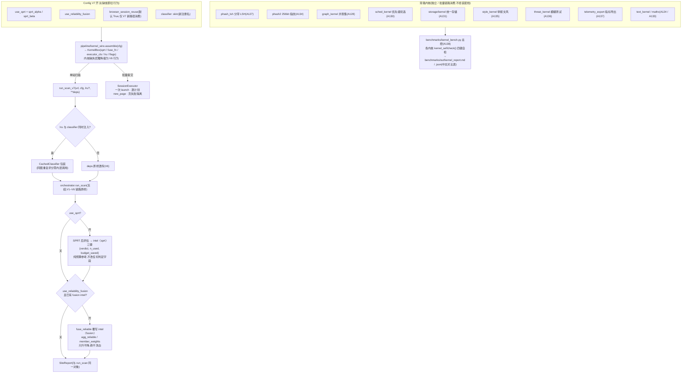

# NetSentinel V7 升级总览 —— 全部内核世界性进化(A123–A142)

> 前六轮后全仓 2790 测试全绿(V6.1 收官口径)。V7 主题:对**八大核心引擎**
> 做代际升级——识别 / 语言 / 决策 / 融合 / 检索 / 图谱 / 执行 / 调度各引入
> 一个新内核,另配存储 / 缓存 / 推理底座 / 指纹 / 文风 / 模糊测试 / 指标
> 导出七类配套内核。每个新内核附**离线可复现微基准**(kernelbench),
> 全部默认关闭 / 开关化,旧调用方零感知。

## 一、V7 主题与动机:算法换代,不是又一次工程打磨

V5 的"工程提升"是**算法一字不动、实现全面加固**(WAL、批量接口、断路器、
遥测打点);V6/V6.5 在功能面上补齐"批量流水线"与"线索发现"。V7 回答的是
另一个问题:**把算法本身换掉**——旧机制与新内核是两代算法的关系,而不是
同一算法的快慢两档。例如:

- 图像评分从"每张都送模型"升级为"LRU 记忆 + SPRT 序贯早停"(证据够了就收手);
- 图像融合从"ensemble 等权"升级为"按提供方历史准确度(Brier 反比)加权";
- 指纹近邻从"全表汉明扫描"升级为"分带 LSH 亚线性候选";
- 团伙归并从"查询时重算连通分量"升级为"增量并查集 O(α) + O(1) 分量缓存";
- 批量提交从"每计划冷启动浏览器"升级为"一会话一次 launch、逐计划 new_page"。

三条 V7 新红线(《CONTRACTS-V7.md》§0,累计第 29–31 条)贯穿全部内核:

- **29 零 API 破坏**:新内核全部为新增文件 / 新增 keyword-only 参数 / 新增
  注册名;既有模块(含 A01–A122 全部文件)一律不改;开关默认值 = 旧行为。
- **30 学习型内核零外呼**:可靠性加权、文本 n-gram 等只从运营者本地反馈
  (review_queue 决策、reliability.jsonl)与内置合成语料学习;绝不联网取数、
  绝不调用 VLM 训练。
- **31 基准可复现**:每个新内核至少一个 `test_v7_bench_*` 用例,以**操作
  计数 / 复杂度断言**(循环次数、调用次数、表扫描行数)或确定性构造数据
  上的精确结果证明代差;禁止依赖墙钟的脆弱断言。

## 二、工号一览(A123–A142)

| 编号 | 内核 | 一句话 | 关键 API |
| --- | --- | --- | --- |
| A123 | vision/heuristic_kernel.py | 识别内核·肤色启发式:YCbCr 肤色占比 + 粗网格最大连通块 + 边缘密度,零模型零外呼粗筛(PIL 可选,缺失走 stdlib zlib PNG 解码) | `SkinHeuristicClassifier`(注册名 "skin")、`read_png_rgb`、`kernel_selfcheck` |
| A124 | intel/text_kernel.py | 语言内核·字符 2/3-gram TF-IDF:与 text_intel 词表命中式并存的学习型文本风险,对未收录变体表述同样敏感 | `TextKernel(seed_pos, seed_neg).score(html_or_text) -> {"risk","cos_pos","cos_neg"}` |
| A125 | decision/sprt.py | 决策内核·Wald 序贯检验:逐张送审逐张检验,证据偏 NSFW/CLEAN 立即停审省配额 | `SPRT(alpha, beta)`、`.update/.decide_sequence`、`next_images(candidates, cfg)` |
| A126 | decision/reliability.py + fusion_reliable.py | 融合内核·可靠性加权:Brier 反比权重(ε 平滑,好坏话语权 ≤21:1),图像侧按提供方加权、只升不降 | `ReliabilityTracker(jsonl).record/.weights`、`fuse_reliable(report,…,tracker=)` |
| A127 | intel/phash_lsh.py | 检索内核·分带 LSH:64bit 指纹切带分桶,任一带命中即候选再精确汉明过滤,d < bands 保证不漏 | `LSHIndex(bands).insert/query/build_from`、`compare_calls` |
| A128 | intel/graph_kernel.py | 图谱内核·增量并查集:路径压缩 + 按秩合并 O(α),分量惰性缓存 O(1),邻接表 BFS 邻域 | `UnionFindKernel().union/.find/.components/.related`、`ingest_edges` |
| A129 | submit/executor_session.py | 执行内核·会话复用:首个计划启动浏览器保留 context,后续仅 new_page;复用 executor_playwright 步语义与人工门 | `SessionExecutor(cfg, *, launcher=None).run(plan, *, auto_confirm=False, dry_run=None)`、`close()` |
| A130 | ops/sched_kernel.py | 调度内核·优先级预算:波动度/URL 风险/陈旧度三因子加权(0.45/0.35/0.20),预算内性价比背包 | `priority(item)`、`select_round(items, budget, *, min_interval=1.0)` |
| A131 | storage/kernel.py(+ storage/__init__.py) | 存储内核·统一 SQLite 底座:WAL + busy_timeout 与全仓一致,版本化迁移幂等、CRUD 助手防注入,打开既有库零迁移 | `SQLiteKernel(path).migrate/.repo/.execute/.query/.vacuum_if_needed` |
| A132 | vision/cache2.py | 缓存内核·双层记忆:线程安全 LRU 包装任意 NsfwClassifier,同图重复评分零内层调用(capacity≤0 直通) | `MemoLRU(capacity=256)`、`CachedClassifier(inner, lru)`、`hit_stats()` |
| A133 | mathx.py(包根) | 推理内核·张量微库:纯 stdlib 数值原语,供各学习型内核统一口径,零 IO 纯函数 | `dot/matmul/softmax/sigmoid/standardize/clamp`、`matmul_ops` |
| A134 | vision/phash2.py | 指纹内核 v2:32x32 灰度分 4 个 16x16 象限独立 DCT,4 块 × 64bit = **256bit**(契约"4×16bit"与总长矛盾,实施按 256bit 修正),含空间布局信息 | `phash256(path)`、`hamming_hex`、`to64`(64bit 生态近似视图) |
| A135 | submit/style_kernel.py | 风格内核·举报文本:长度/数值存在性/夸张词/法言法语四维打分 + 不动事实的轻量改写(与 A52 critic 分工:critic 查事实、style 管文风) | `style_score(text) -> {"len_ok","has_facts","no_hype","formality","total"}`、`polish(text)` |
| A136 | security/threat_kernel.py | 安全内核·模糊测试:超长/控制字符/深嵌套/坏编码用例(各 ≥30 变体)砸向五个关键内核入口,允许集外异常即违规 | `fuzz_url/fuzz_html/fuzz_yaml/fuzz_json`、`smoke`、`run_suite`、`main` |
| A137 | telemetry_export.py(包根) | 观测内核·指标导出:telemetry 快照 → Prometheus exposition 文本(counter→_total,计时器四序列标 gauge),往返零失真 | `to_prometheus(snapshot)`、`diff_snaps`、`render_metrics`、`parse_prometheus` |
| A138 | benchmarks/kernel_bench.py | 内核基准总控:统一收割各内核 `kernel_selfcheck()`,产出中文对比报告;任一未通过/未就位退出码 2 | `collect/run/main(--out)`,`benchmarks/out/kernel_report.md/json` |
| A139 | pipeline/kernel_wire.py | 内核装配线:按开关装配 KernelBox;`run_scan_v7` 是冻结 orchestrator 的外层包装(orchestrator 一字不改),开关全关 = V6 原样 | `assemble(cfg) -> KernelBox`、`run_scan_v7(url, cfg, *, lru=None, **deps)`、`wrap_classifier` |
| A140 | scripts/demo_kernel_evolution.py | 内核演练场(离线):skin 对比表、SPRT 早停、LSH 计数、launch 1 次、优先级轮选、Prometheus 片段、可靠性对比,七节演示 | `python scripts/demo_kernel_evolution.py`(退出码 0/2/1) |
| A141 | docs/KERNEL_EVOLUTION.md | 内核进化白皮书:八内核一章(进化前后/算法/开关/bench 数字/局限)+ 总对比表 + 开关矩阵 + 调优指南 | — |
| A142 | docs/UPGRADE_V7.md | 本文:V7 总览、装配线数据流、八轮演进全景、兼容性声明、配置速查 | — |

## 三、装配线与数据流



要点:

- **装配不改内核链路**:`assemble` 只做"选哪个内核、选哪套开关"的装配决策;
  `run_scan_v7` 内部透传 `orchestrator.run_scan(url, cfg, **deps)`,orchestrator
  与全部既有模块一字不改;返回的是**同一个 SiteReport 对象**。
- **SPRT 是省钱演算,不是判定**:`intel["sprt"]` 三键仅供"下一轮该送审几张"
  的预算参考;开启后报告的 verdict / needs_review / agg_nsw_prob 与关闭时
  完全一致(测试断言锁定)。
- **可靠性融合只升不降**:verdict 档位与 needs_review 单向恒真,报得离谱的
  提供方被降权,但绝不能把图像已判 NSFW/SUSPECT 的站点洗成 CLEAN;反馈
  文件 `data_dir/reliability.jsonl` 缺失时成员等权 = 旧行为。
- **降级语义**:任一内核惰性导入失败 → 对应开关回退关闭态(V6 行为)、
  `flags` 记 False、中文告警,扫描主流程绝不中断。

**代差速览**(kernelbench 口径,操作计数 / 确定性结果,2026-10-02 实跑
`python benchmarks/kernel_bench.py` 的 kernel_report 真实输出):

| 内核 | 指标 | 新内核 | 旧基线 |
| --- | --- | --- | --- |
| skin(A123) | 合成肤色图 vs 风景/文本图均值差 | 0.9702 | >0.2 即达标 |
| text_kernel(A124) | 构造正负语料排序 AUC | 1.0 | ≥0.9 |
| sprt(A125) | 20 张强 clean 序列送审张数 | **2** | 20(省 90%) |
| reliability(A126) | 好平台话语权(喂 20 条本地反馈后) | 0.9545 | 等权 0.5 |
| phash_lsh(A127) | 单查询比较次数 / 全表 | 0.001(约 1 次 / 1005 次) | 1.0(全表扫描) |
| graph_kernel(A128) | 2000 次 connected 的父指针跳转总数 | 3981 | 4,000,000(朴素口径) |
| sched_kernel(A130) | 10 项预算 4 精确选中前 4 | 4/4(单遍打分 10 次) | 旧巡查按列表原序 |
| storage(A131) | 二次打开的用户 DDL 执行数 | **0** | 首次迁移 2 条 |
| mathx(A133) | 64×64×64 matmul 乘加计数 | 262144 | == 理论值 m·k·n |
| phash2(A134) | 同图最大距 < 异图最小距的裕量 | 108 bit | >0 即可分 |
| style_kernel(A135) | polish 后夸张词命中 | 0 | 改写前 7 |
| threat_kernel(A136) | 全量模糊矩阵新发现违规 | 0 | 0(允许集外即违规) |
| telemetry_export(A137) | 导出→解析往返恢复率 | 1.0(122 指标逐对相等) | 1.0 |

配套测试口径:全仓共 **23 个 `test_v7_bench_*`** 用例(15 个内核测试文件
+ test_kernel_wire 2 个 + test_kernel_bench 1 个),另有 executor_session
(3 plan → launch 1 次 / new_page 3 次)与 cache2(重复评分内层调用 5→1)
的代差断言分别锁定在各自测试文件中,故 kernel_bench 注册表将其标注
"未就位(无 kernel_selfcheck)"属预期行为。

## 四、八轮演进全景

| 轮次 | 主题 | 工号 | 新增模块/文件 | 测试(收官) | 红线累计 |
| --- | --- | --- | --- | --- | --- |
| V1 | 规则证据链(单站扫描→证据包→人工确认举报) | A01–A20 | 20 模块 | 291 | 5(1–5) |
| V2 | GLM 感知(VLM 适配/离线回退/通知/报告) | A21–A40 | 20 模块 | 740 | 10(6–10) |
| V3 | 智能体平台(案件编排/级联路由/共形预测/证据网络/政策治理) | A41–A60 | 20 模块 | 1255 | 15(11–15) |
| V4 | 全平台视觉模型统一接入(`classifier: 提供方:模型`) | A61–A80 | 20 模块 | 1738 | 20(16–20) |
| V5 | 工程提升(性能/健壮/观测/质量四线,零新功能) | A81–A102 | 22 组升级(约 85 源文件全覆盖) | 2220 | 23(21–23) |
| V6 | 批量案件流水线(导入→归组→声明→逐条提交→结案) | A103–A122 | 20 模块 | 2790*(V6.1 收官,含 V6.5) | 26(24–26) |
| V6.5 | 线索发现层(优先 Yandex,自定义关键词,负责人直研) | — | 5 模块(discovery:engines/yandex/searxng/keywords/pipeline) | 含于上行 | 28(27–28) |
| **V7** | **内核世界性进化(八引擎换代 + 配套内核 + 装配线/基准)** | A123–A142 | 20 个代码文件(16 内核 + storage 包 init + kernel_bench + kernel_wire)+ 演示脚本 + 17 个测试文件 + 2 篇文档 | **3321 通过 + 2 跳过**(本文撰写时实测;终数以负责人终跑为准) | 31(29–31) |

\* 2790 为 CHANGELOG「V6.1」收官口径;V7 较其净增 531 个收集用例(2790+2 → 3321+2)。

## 五、兼容性声明

- **零 API 破坏(红线 29)**:V7 全部为**新增文件**(上表 20 个代码文件)、
  新增 keyword-only 参数(如 `next_images(..., max_send=)`)与一个新增注册名
  (`"skin"`);既有模块——含 A01–A122 全部文件与冻结的 orchestrator /
  contracts.py / telemetry.py——**一字不改**。Config 七个新字段由项目负责人
  按契约落地 `contracts.py` / `config.py`,其余代理禁改。
- **开关默认 = 旧行为**:`use_sprt` / `use_reliability_fusion` /
  `sched_priority` 默认 False;LRU 仅在调用方显式传 `lru` 时生效;
  `phash_lsh_bands=4` 只影响新 LSHIndex 构造,不触碰 PhashRegistry;
  `browser_session_reuse=True` 仅被装配线 / SessionExecutor 消费,V6 既有
  提交链路不读该开关。**开关全关时 `run_scan_v7` 与 `orchestrator.run_scan`
  逐参透传、报告对象原样返回、零 intel 侵入**
  (`test_run_scan_v7_all_off_is_pure_v6_passthrough` /
  `test_run_scan_v7_all_off_matches_run_scan_report` 断言锁定)。
- **学习型内核零外呼(红线 30)**:ReliabilityTracker 只消费运营者本地
  jsonl 反馈;TextKernel 只用内置合成样张与既有词表的只读织入;SPRT 纯
  离线数学。全程不联网、不调 VLM 训练。
- **既有数据零迁移**:SQLiteKernel 打开任意既有库(review_queue / phash /
  graph 等)不建版本表、不迁移、不改写;phash2 的 `to64` 只是近似视图,
  64bit 生态按原口径继续工作。
- **配置校验兜底**:`sprt_alpha`/`sprt_beta` 须在 (0, 0.5),
  `phash_lsh_bands` 须在 1~8,config 校验器抛中文错误。

## 六、配置速查(V7 新增字段,共 7 项)

| 字段 | 类型 / 默认 | 校验 | 作用 | 消费方 |
| --- | --- | --- | --- | --- |
| `use_sprt` | bool / False | — | 开启 SPRT 送审早停演算,写 `intel["sprt"]` 三键(不改判定);需校准概率,GLM calibrate 后近似满足,stub 不建议开 | kernel_wire.run_scan_v7 |
| `sprt_alpha` | float / 0.05 | (0, 0.5) | SPRT 第一类错误上限(上界 A=ln((1−β)/α),默认 ±ln19≈±2.944) | assemble → SPRT(α, β) |
| `sprt_beta` | float / 0.05 | (0, 0.5) | SPRT 第二类错误上限(下界 B=ln(β/(1−α))) | 同上 |
| `use_reliability_fusion` | bool / False | — | 融合改走 fuse_reliable:图像侧按提供方 Brier 反比加权,只升不降;反馈自动累积于 `data_dir/reliability.jsonl` | run_scan_v7 后处理 |
| `phash_lsh_bands` | int / 4 | 1~8 | 64bit 指纹分带数(默认 4 带×16bit,d<4 保证召回;调大召回升、候选多;类自身接受 1~64 供离线实验) | LSHIndex 构造(A127) |
| `browser_session_reuse` | bool / True | — | 批量提交复用一次浏览器会话(SessionExecutor);人工门语义不变,`auto_confirm` 恒默认 False | assemble → KernelBox.executor_cls |
| `sched_priority` | bool / False | — | 巡查由 watchlist 原序改为三因子优先级 + 预算轮选 | sched_kernel.select_round |

示例(`config.yaml`,全部可省略,省略即上表默认):

```yaml
# ---- V7 内核开关(缺省 = V6 行为) ----
use_sprt: true              # 需校准概率;stub 未校准不建议开
sprt_alpha: 0.05
sprt_beta: 0.05
use_reliability_fusion: true
phash_lsh_bands: 4          # 1~8
browser_session_reuse: true
sched_priority: false
# classifier: skin          # 启用 A123 离线肤色粗筛(见 §七)
```

## 七、快速上手

**1)装配线:assemble + run_scan_v7(单站,开关化包装)**

```python
from netsentinel.contracts import Config
from netsentinel.pipeline.kernel_wire import assemble, run_scan_v7
from netsentinel.vision.cache2 import MemoLRU

cfg = Config(use_sprt=True, use_reliability_fusion=True)  # 开关见 §六
box = assemble(cfg)        # KernelBox;flags = 实际生效快照(内核缺失自动降级)
box.lru = MemoLRU(256)     # 可选:同图重复评分零内层调用

report = run_scan_v7("https://example.invalid", cfg)
# 或注入依赖与缓存:run_scan_v7(url, cfg, lru=box.lru,
#                                classifier=..., fetch_page=..., capture=...)
# lru 仅与 classifier 依赖同时注入时才生效;返回同一 SiteReport 对象。
report.intel.get("sprt")   # {"verdict","n_used","budget_saved"}(use_sprt 开)
report.intel["fusion"]     # 可靠性加权覆写(含 agg_reliable / member_weights)
```

**2)识别内核:`classifier: skin`(零依赖离线粗筛)**

```yaml
classifier: skin    # SkinHeuristicClassifier,导入时自动注册
```

无需任何模型权重与网络:有 Pillow 可解任意格式,缺失时内置 stdlib zlib
PNG 读取器兜底。**局限须知晓**:沙滩/泳装/暖色调场景会误报,重滤镜/暗光
违规图可能漏报——仅作离线粗筛信号,须与文本/页面级证据融合后由人复核,
不得单独作为处置依据。

**3)内核基准总控:kernel_bench(一键收割全部内核自检)**

```
python benchmarks/kernel_bench.py --out benchmarks/out
```

产出 `benchmarks/out/kernel_report.md / kernel_report.json`(中文对比表:
内核/指标/值/基线/判定);任何内核未通过或未就位 → **退出码 2**,全部
就位且通过 → 0。2026-10-02 实跑:15 个注册内核 → 通过 13 · 未通过 0 ·
未就位 2(executor_session / cache2 无 kernel_selfcheck,代差断言在其
测试文件中,见 §三)。

延伸阅读:`docs/KERNEL_EVOLUTION.md`(A141 白皮书,八内核一章 + 开关矩阵
+ 调优指南)、`scripts/demo_kernel_evolution.py`(A140 离线演练场,退出码
0 = 成功)。
