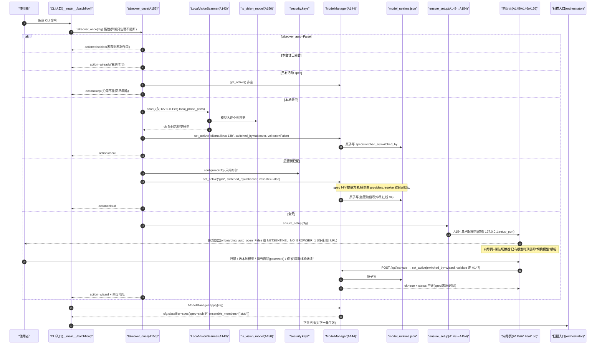
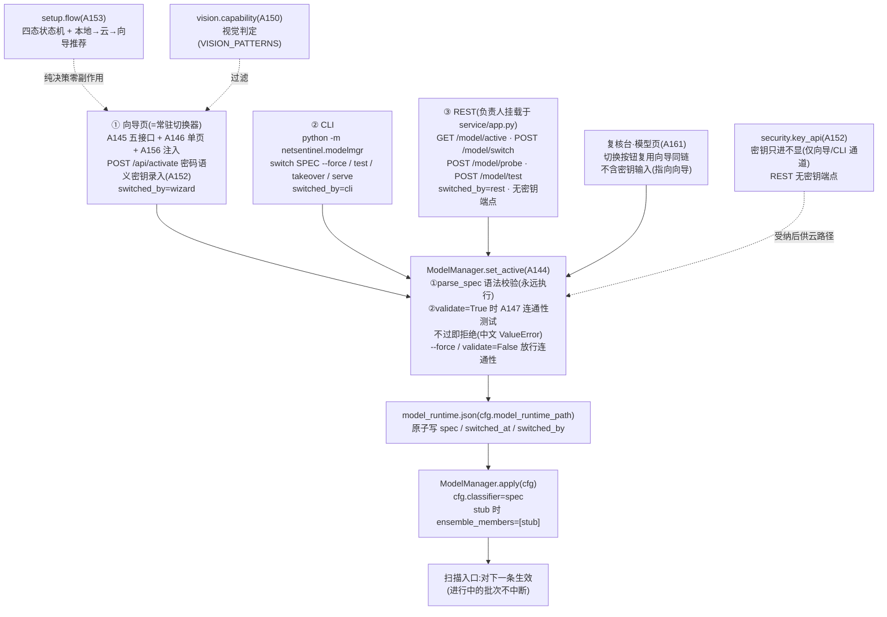

# NetSentinel V8 升级总览 —— 视觉模型自动接管 · 连接向导 · 手动切换(A143–A162)

> 七轮后全仓 3321 通过 + 2 跳过(V7 收官口径)。V8 主题:**让"装好即能用"
> 成立——首次运行自动探测并接管本机/云端视觉模型,全无模型时弹出自托管
> 连接向导,之后任何时刻都可经向导页 / CLI / REST 三入口一键切换。全部
> 新模块可选、惰性导入,旧调用方零感知;并行会话在 contracts.py 预置的
> 4 个 V8 字段(plugin_supervised_api / onboarding_auto_open /
> agents_max_workers / agent_task_db)一律保留不动(共存口径见 §四)。

## 一、V8 主题与动机:补上最后一块"开箱体验",而不是再加扫描能力

V1–V7 把规则证据链、GLM 感知、案件编排、多平台视觉接入、工程加固、
批量流水线、内核换代全部做完之后,一个新使用者的第一体验仍然是:装好
NetSentinel,运行第一条命令,得到的是"没有可用视觉模型"——必须先手编
`config.yaml` 的 `classifier: 提供方:模型`,知道 Ollama 装没装、密钥放哪、
spec 怎么写。V8 回答的是这个问题,三件事:

- **自动接管(takeover)**:首次运行任意 CLI 入口时,`pipeline.takeover.
  takeover_once(cfg)` 按四级优先级把"当前可用的视觉模型"接为活动模型:
  已有活动 spec → 沿用;本地回环探测命中视觉模型 → 接管本机;云密钥已配
  → 接管云目录默认模型;全无 → 拉起连接向导。会话幂等、绝不抛出。
- **连接向导(setup)**:纯标准库自托管(`http.server`,不依赖
  fastapi/streamlit)的中文单页,只绑 `127.0.0.1:{setup_port}`:状态卡 →
  【扫描本机服务】→ 本地模型逐项【启用】→ 云平台下拉(20 家)+ 密钥
  (password 语义)→【使用离线桩继续】(固定红字"离线桩,非模型判定")。
  **已有模型时,同一页面顶部即"切换模型"横幅——向导常驻即切换器**。
- **手动切换三入口**:向导页 / CLI `python -m netsentinel.modelmgr` /
  REST(`/model/*` 路由)。三入口最终都汇聚到同一份持久化状态
  `data/model_runtime.json`(`{"spec","switched_at","switched_by"}`),
  经 `ModelManager.apply(cfg)` 写入 `cfg.classifier` 后对下一条扫描生效。

三条 V8 新红线(《CONTRACTS-V8.md》§0,累计第 32–34 条)贯穿全部新模块:

- **32 本地探测仅限回环**:自动接管只探测 127.0.0.1 上
  `cfg.local_probe_ports` 指定端口的 OpenAI 兼容 `/v1/models`;绝不扫
  外网、绝不扫回环全端口段、不跟随重定向;探测动作仅发生在"首次初始化
  (takeover_once)"与"用户显式点击/命令"时。
- **33 密钥只进不显**:密钥输入为 password 语义,任何回显/日志一律掩码
  (前 4 位 + `****`);落盘仅经 `security.keys.set_key`;REST/页面响应
  绝不包含密钥本体;REST 路由**不提供任何写密钥端点**(降攻击面)。
- **34 接管不放宽既有纪律**:云端提供方仍受 vlm_online + 密钥双条件
  (红线 16)与 VLM 预算(红线 19);本地提供方豁免照旧;无任何模型时的
  stub 兜底必须在界面/输出中明示"离线桩,非模型判定"。

## 二、工号一览(A143–A162)

| 编号 | 模块 | 一句话 | 关键 API |
| --- | --- | --- | --- |
| A143 | vision/local_probe.py | 本地视觉服务探测:按端口逐个 GET 回环 `/v1/models`,清点视觉模型(过滤委托 A150;capability 缺席全保留并标 `unfiltered`) | `LocalVisionScanner(ports=None, *, timeout=1.5).scan() -> list[dict]`;`PORT_PROVIDERS`(11434→ollama、1234→lmstudio、8000→vllm、9997→xinference,其余→openai-compat) |
| A144 | vision/model_manager.py | 活动模型管理器:`model_runtime.json` 的读写/语法校验/热切换,原子写 + 线程锁,损坏 JSON 自动重建 | `ModelManager(path)`:`get_active()/status()/set_active(spec, *, switched_by="manual", validate=True, tester=None)/clear()/apply(cfg)` |
| A145 | netsentinel/setup/server.py(新子包) | 连接向导自托管服务:纯 stdlib `ThreadingHTTPServer`,仅绑 127.0.0.1,单页 + 五个 JSON 接口 | `SetupServer(cfg)`:`start(port=None, *, open_browser=False)/serve()/stop()`;`GET /`、`POST /api/{status, probe, activate, setkey, test}` |
| A146 | setup/page.py | 向导单文件中文页面(内联 CSS/JS、无外链、无框架),密钥框 password + autocomplete=new-password | `page_html() -> str`;`BUILTIN_PROVIDER_KEYS`(20 家目录键);`STUB_NOTE_TEXT`("离线桩,非模型判定") |
| A147 | vision/connectivity.py | 连通性测试唯一入口:本地仅 `/models` 清点(零评分外呼);云端仅 vlm_online+密钥双条件满足时发一次 1x1 PNG 评分 ping 并先记预算 | `test_connection(spec, cfg, *, transport=None, spend=None) -> {"ok","latency_ms","model","mode","error?"}` |
| A148 | modelmgr.py(包根) | 模型管理 CLI(手动切换三入口之二):status/probe/list/switch/test/takeover/serve,中文输出 | `python -m netsentinel.modelmgr <子命令>`;退出码 0/1/2;`switch SPEC [--force]`(switched_by=cli) |
| A149 | setup/trigger.py | 首启触发:三来源核查"是否已有可用模型",全无时才拉起向导并按三态决定弹不弹浏览器 | `has_any_model(cfg) -> bool`(活动 spec → 云密钥 → 本地扫描);`ensure_setup(cfg, *, open_browser=None, server_factory=None) -> str\|None` |
| A150 | vision/capability.py | 模型名视觉能力判定:纯名称形态匹配(≥18 条正则族,实配 26 条),宁缺勿滥 + 短 token 边界防误伤 | `is_vision_model(name) -> bool`;`filter_vision(models)`;`VISION_PATTERNS` |
| A151 | service/model_api.py | 模型管理 REST 路由(三入口之三):活动模型 API 化;fastapi 惰性;**不提供密钥端点** | `create_model_router(cfg=None) -> APIRouter`:`GET /model/active`、`POST /model/switch`(失败 409 中文)/`/model/probe`/`/model/test` |
| A152 | security/key_api.py | 密钥受纳关口:校验(非空/长度≥8/无空白控制符)→ 落盘(仅经 `keys.set_key`)→ 只回掩码 | `accept_key_input(provider, key, *, base=None) -> {"ok","masked","stored"}`;`masked(provider) -> str\|None` |
| A153 | setup/flow.py | 向导/接管共用的纯逻辑状态机与推荐路由(本地优先→云→向导),状态持久化 `setup_state.json` | `SetupState`(no_model/local_connected/cloud_connected/stub_only);`next_step/can_transition/recommend/persist/load` |
| A154 | setup/daemon.py | 向导常驻守护单例:进程内缓存 + 跨进程锁文件 `data/.setup.lock` 探活复用;端口被占 +1..+5 回退 | `ensure_setup_server(cfg, *, open_browser=None, factory=None) -> str\|None`;`stop_setup_server()` |
| A155 | pipeline/takeover.py | 首次运行自动接管:四级决策 kept→local→cloud→wizard,会话幂等,绝不抛出,每路径写审计 + 遥测 | `takeover_once(cfg, *, scanner=None, manager=None, ensure=None, tester=None) -> {"action","spec?","wizard?","detail"}`;`reset_session()` |
| A156 | setup/render.py | 向导页渲染注入:切换横幅 / 状态 JSON(`</script>` 转义防注入)/ 本机模型初始行,三处先转义再拼接 | `render_page(status: dict, active: str\|None, local_models: list) -> str`;`MAX_DEPTH=10` |
| A157 | tests/test_v8_e2e.py | 端到端:接管→向导→切换→密钥只进不显四条主链真模块直跑 + 红线 32/33/34 专项断言 | 23 用例(mock 回环 /v1/models、真 A143→A155 链) |
| A158 | scripts/demo_model_wizard.py | 离线演示:mock 本地服务(llava + qwen2.5vl + 1 文本模型)→自动接管→向导全流程→切 stub 警示,全程零外呼 | `python scripts/demo_model_wizard.py`(退出码 0/2/1;2026-10-02 实跑退出码 0) |
| A159 | docs/SETUP_GUIDE.md | 安装后接管与向导权威指南:红线 32–34 落点表、首启时序、页面逐区说明、端口/防火墙、故障排查 | — |
| A160 | docs/MODEL_SWITCH.md | 切换手册:model_runtime 机制、spec 语法、三入口对照表、validate 语义、视觉能力判定表 | — |
| A161 | webui/models_page.py | 复核台"模型"页(惰性 streamlit,纯逻辑层可离线测):横幅/本地服务表(切换按钮)/密钥掩码状态,不含密钥输入 | `model_rows(local_scan, active)`、`switch_banner(active)`、`key_status(cfg)`、`can_switch(spec)`、`render()` |
| A162 | docs/UPGRADE_V8.md | 本文:V8 总览、工号一览、首启时序与三入口 mermaid、并行字段共存、九轮演进、兼容性、配置速查、快速上手 | — |

配套测试:16 个 V8 测试文件(A143–A156 各一 + A157 端到端 + A161 模型页)
共 **648 个用例**(647 通过 + 1 条件跳过——本机未装 streamlit 的 UI 用例),
全仓终跑见 §五。

## 三、首启时序与三入口切换

### 3.1 首启时序(任意 CLI 入口首次运行)



要点:

- **接管不做二次探测(红线 32)**:本地路径 `validate=False`——服务与模型
  刚在扫描中被证实存在;云端路径接管阶段零外呼——vlm_online/密钥/预算
  纪律在真正调用时才生效(红线 34)。`takeover_once` 保留 `tester` 注入缝
  且当前策略下永不调用,测试据此断言"不触发连通测试"。
- **幂等两层**:会话内一次(模块级标记,二次调用返回 `already` 零副作用);
  跨会话不重复打扰(已有活动 spec → `kept` 直接沿用,零网络)。
- **`error` 不占会话名额**:兄弟模块缺席/异常收敛为 `{"action":"error",
  "detail":中文}`,允许兄弟落地后重试;`disabled` 同理。
- **`apply` 的边界**:无活动模型时不动 cfg;`spec=="stub"` 时
  `classifier="stub"` 且 `ensemble_members=["stub"]` 整套替换(红线 34);
  其余 spec 只写 `cfg.classifier`,不动集成成员。
- **接线状态(如实)**:契约 §4 要求入口首行插 `takeover_once(cfg)` 由
  **负责人完成**;本文撰写时点 `netsentinel/__main__.py` 与 `batchflow.py`
  尚未插入(全仓 grep 为空),接线前可用 `python -m netsentinel.modelmgr
  takeover` 手动触发同一决策(实测见 §八)。

### 3.2 三切换入口汇聚



要点:三入口(向导页 / CLI / REST)加复核台模型页(A161,复用向导链)全部
汇聚到 `ModelManager.set_active` → `model_runtime.json` → `apply(cfg)` →
`cfg.classifier`——**切换对进行中的批次不中断,下一条生效**;语法校验连
`--force` 也不放过(防手误写坏状态文件),只有连通性测试可跳过。向导守护
(A154)保证"进程内至多一个实例 + 跨进程至多一个监听端口",锁文件记录
实际端口,探活存活即复用、陈旧即重启。

## 四、与并行会话 V8 字段的共存说明(如实)

contracts.py 的 V8 字段分两组(均为 config.py 已知字段):

```python
# ---- V8:插件化 / 视觉模型引导与切换 / 多开 Agent ----(并行会话预置,冻结)
plugin_supervised_api: bool = True
onboarding_auto_open: bool = True
agents_max_workers: int = 4
agent_task_db: str = "data/agent_tasks.db"

# ---- V8(本会话追加):视觉模型自动接管与连接向导 ----
takeover_auto: bool = True
local_probe_ports: list = field(default_factory=lambda: ["11434", "1234", "8000", "9997"])
setup_port: int = 8766
model_runtime_path: str = "data/model_runtime.json"
```

共存口径(以代码为准,不臆造):

- **plugin_supervised_api / agents_max_workers / agent_task_db**:由并行
  工作流预留(插件托管 API / 多开 Agent 并发与任务账本),**本轮 A143–A162
  的接管/向导/切换代码不读取这三个字段的行为**;全仓测试亦无任何用例消费
  它们(实测 grep 为空)。其行为由并行会话的交付物定义,本文不作承诺。
- **onboarding_auto_open**:唯一被本轮消费的并行字段——但只用于**向导弹窗
  决策**:A149 `ensure_setup` 与 A154 `ensure_setup_server` 的弹窗三态
  **调用参数 > 环境变量 `NETSENTINEL_NO_BROWSER` > 配置
  `onboarding_auto_open`(缺省 True)**;不弹时仅打印向导 URL。契约 §1
  "弹窗开关沿用并行会话的 onboarding_auto_open"即指此。
- 两组字段互不覆盖、默认值互不影响;`agents_max_workers` 的范围校验
  (1~16)由 config 校验器统一兜底(并行会话登记),本轮字段校验见 §六。

## 五、九轮演进全景

| 轮次 | 主题 | 工号 | 新增模块/文件 | 测试(收官) | 红线累计 |
| --- | --- | --- | --- | --- | --- |
| V1 | 规则证据链(单站扫描→证据包→人工确认举报) | A01–A20 | 20 模块 | 291 | 5(1–5) |
| V2 | GLM 感知(VLM 适配/离线回退/通知/报告) | A21–A40 | 20 模块 | 740 | 10(6–10) |
| V3 | 智能体平台(案件编排/级联路由/共形预测/证据网络/政策治理) | A41–A60 | 20 模块 | 1255 | 15(11–15) |
| V4 | 全平台视觉模型统一接入(`classifier: 提供方:模型`) | A61–A80 | 20 模块 | 1738 | 20(16–20) |
| V5 | 工程提升(性能/健壮/观测/质量四线,零新功能) | A81–A102 | 22 组升级(约 85 源文件全覆盖) | 2220 | 23(21–23) |
| V6 | 批量案件流水线(导入→归组→声明→逐条提交→结案) | A103–A122 | 20 模块 | 2790*(V6.1 收官,含 V6.5) | 26(24–26) |
| V6.5 | 线索发现层(优先 Yandex,自定义关键词,负责人直研) | — | 5 模块(discovery) | 含于上行 | 28(27–28) |
| V7 | 内核世界性进化(八引擎换代 + 配套内核 + 装配线/基准) | A123–A142 | 20 个代码文件 + 演示脚本 + 17 个测试文件 + 2 篇文档 | 3321 通过 + 2 跳过 | 31(29–31) |
| **V8** | **视觉模型自动接管 · 连接向导 · 手动切换(开箱即用)** | **A143–A162** | 15 个代码文件(14 模块 + setup 子包 `__init__.py`)+ 演示脚本 + 16 个测试文件 + 3 篇文档(SETUP_GUIDE / MODEL_SWITCH / 本文)+ 模型页 | **3968 通过 + 3 跳过**(2026-10-02 实测全绿,退出码 0;较 V7 收官净增 647 通过;终数以负责人终跑为准) | 34(32–34) |

\* 2790 为 CHANGELOG「V6.1」收官口径。V8 终跑说明:本环境 pytest 不输出
文字汇总行,以进度标记计数(3968 通过 + 3 跳过;3 跳过 = V7 收官的 2 个
环境相关跳过 + 1 个本机未装 streamlit 的模型页 UI 用例)。

## 六、兼容性声明

- **零 API 破坏**:V8 全部为**新增文件**(上表 15 个代码文件,含新子包
  `netsentinel/setup/`);不新增/修改任何既有函数签名;既有模块与文档
  一字不改。contracts.py 仅由两组 V8 字段追加(并行会话 4 个 + 本轮 4 个,
  均已登记 config.py 已知字段);冻结的 contracts.py / telemetry.py /
  conftest.py / 既有模块,代理一律未动。
- **新模块全部可选**:兄弟模块一律惰性导入(顶层只 import 标准库与冻结
  模块),缺席时按"该来源无"降级或收敛为中文 `error`/503,主流程绝不崩;
  `takeover_once` 绝不抛出(异常只告警),满足契约 §4"惰性,异常只告警
  不阻断"的接线要求。fastapi(A151)与 streamlit(A161)均为可选依赖,
  缺失时对应入口给中文提示。
- **入口接线由负责人完成(契约 §4)**:`netsentinel/__main__.py` 与
  `batchflow.py` 首行插 `takeover_once(cfg)`(惰性)、`service/app.py` 挂载
  `create_model_router(cfg)`(一行接线)。本文撰写时点两者**均未接线**
  (实测 grep 为空)——模块就绪、只差收口;接线前手动入口
  `python -m netsentinel.modelmgr takeover / serve` 已可用(§八)。
- **既有数据零迁移**:V8 新增的运行时文件只有 `data/model_runtime.json`
  (活动模型)、`data/setup_state.json`(向导状态)、`data/.setup.lock`
  (向导端口锁)与既有审计流水的 `takeover` 事件;不触碰任何既有库表与
  配置文件。
- **配置校验兜底**:`agents_max_workers` 须在 1~16(并行会话登记,config
  校验器抛中文错误);`local_probe_ports` 为字符串端口列表(1–65535,非法
  端口由 A143 逐行中文报错且**零网络**);`setup_port` 为 int(被占时守护
  自动 +1..+5,全部用尽抛中文 RuntimeError)。未配置任何 V8 字段时,全部
  走默认值,行为即 §三时序。
- **CHANGELOG 由负责人收口**,本文不重复登记变更清单。

## 七、配置速查(V8 全部字段,共 8 项:并行 4 + 本轮 4)

| 字段 | 类型 / 默认 | 校验 | 作用 | 消费方 |
| --- | --- | --- | --- | --- |
| `plugin_supervised_api` | bool / True | — | 插件模式:自动拉起并托管本地 API 服务 | 并行会话预留(本轮代码不读取) |
| `onboarding_auto_open` | bool / True | — | 全无模型时是否自动弹浏览器打开向导;False → 只打印 URL | A149/A154 弹窗三态(参数 > `NETSENTINEL_NO_BROWSER` > 本字段) |
| `agents_max_workers` | int / 4 | 1~16 | 多开 Agent 最大并发 | 并行会话预留(本轮代码不读取) |
| `agent_task_db` | str / "data/agent_tasks.db" | — | 多开任务认领账本路径(防重复处理) | 并行会话预留(本轮代码不读取) |
| `takeover_auto` | bool / True | — | 首启自动接管总开关;False → `takeover_once` 直接返回 `disabled`(零探测零副作用,不占会话名额) | A155;A148 `takeover` 子命令同源 |
| `local_probe_ports` | list[str] / ["11434","1234","8000","9997"] | 端口 1–65535,非法零网络 | 本地探测端口表(仅 127.0.0.1,绝不扫段;端口→提供方映射见 A143) | A143/A147/A148/A149/A161 |
| `setup_port` | int / 8766 | int;被占自动 +1..+5 | 连接向导独立端口(纯 stdlib 自托管,仅绑 127.0.0.1) | A145/A154;A148 `serve --port` 可临时覆盖 |
| `model_runtime_path` | str / "data/model_runtime.json" | — | 活动模型持久化状态(热切换唯一事实源) | A144 及全部切换入口 |

环境变量:`NETSENTINEL_NO_BROWSER`(置非空值即不弹浏览器只打印向导 URL,
推荐固定设 `1`;生效范围:A149/A154/`modelmgr serve`/`SetupServer.start`)。

示例(`config.yaml`,全部可省略,省略即上表默认):

```yaml
# ---- V8:接管与向导(缺省即开箱即用) ----
takeover_auto: true
local_probe_ports: ["11434", "1234", "8000", "9997"]
setup_port: 8766
model_runtime_path: data/model_runtime.json
# ---- V8:并行会话字段(保留默认即可,见 §四) ----
plugin_supervised_api: true
onboarding_auto_open: true
agents_max_workers: 4
agent_task_db: data/agent_tasks.db
```

## 八、快速上手

**1)装后首跑会发生什么**(设计时序见 §3.1;实测 2026-10-02,本机
无本地视觉服务、无云密钥):

```
$ python -m netsentinel.modelmgr takeover     # 接线前手动触发同一决策
[modelmgr] 动作:wizard
[modelmgr] 已触发连接向导:http://127.0.0.1:8766/
[modelmgr] 详情:未发现可用视觉模型,已启动连接向导:http://127.0.0.1:8766/
```

- 本机装有 Ollama/LM Studio/vLLM/Xinference 且端口在
  `local_probe_ports` 内 → `动作:local`,活动模型自动接管为
  `ollama:llava:13b` 之类,随后扫描直接可用;
- 已配过任一云密钥 → `动作:cloud`,接管该提供方(模型取目录默认),
  实际外呼仍受 vlm_online + 密钥 + 预算三重纪律;
- 全无 → 向导弹出(或打印 URL);在向导里选本地模型 / 存云密钥 /
  或点"使用离线桩继续"(红字"离线桩,非模型判定")。

**2)随时看状态:`modelmgr status`**(实测输出):

```
$ python -m netsentinel.modelmgr status
[modelmgr] 活动模型:未设置(可运行 takeover 自动接管,或 switch SPEC 手动切换;全无模型时可用离线桩 stub)
[modelmgr] 云密钥:已配置 0/20 家(尚未配置任何云平台密钥;写密钥请走连接向导或 security.keys.set_key)
[modelmgr] 本地服务:未发现在线本地视觉服务(已探测端口 11434/1234/8000/9997,仅回环,红线 32)
```

**3)起向导(常驻切换器):`python -m netsentinel.modelmgr serve`**

打印向导地址(`http://127.0.0.1:8766/`,被占自动顺延 8767–8771)并按
弹窗三态决定是否自动开浏览器;`NETSENTINEL_NO_BROWSER=1` 只打印地址。
实测注意:serve 打印地址后即返回,向导服务寄居于唤起它的进程之内;进程
退出后 A154 依锁文件探活发现陈旧即自动重启——"常驻"由**锁文件 + 探活
复用**保证,地址以当次打印为准。页面上:未连接时是引导向导;已有模型时
顶部即"切换模型"横幅,同一套操作就是手动切换器。

**4)其余常用命令**:`probe`(本地扫描表)/ `list`(目录 + 本地发现)/
`switch ollama:llava`(默认做连通性测试,`--force` 跳过)/ `test [SPEC]`
(缺省测活动模型)/ `python -m netsentinel.modelmgr --help`。REST 入口
(`GET /model/active`、`POST /model/switch` 等)在负责人完成 §4 接线后
随 `service/app.py` 提供。

**5)离线演示闭环**(零外呼,仅本机回环):

```
$ python scripts/demo_model_wizard.py        # 2026-10-02 实跑退出码 0
…接管 llava:13b → 向导切 qwen2.5vl:7b → 切 stub(红字警示)…
 红线 32 自证: mock 共收到 8 笔请求,全部来自 127.0.0.1、全部为 GET 清点、零评分 POST
```

延伸阅读:`docs/SETUP_GUIDE.md`(A159,安装后权威指南)、
`docs/MODEL_SWITCH.md`(A160,切换手册与三入口对照表)、
`webui/models_page.py`(A161,复核台模型页)。
