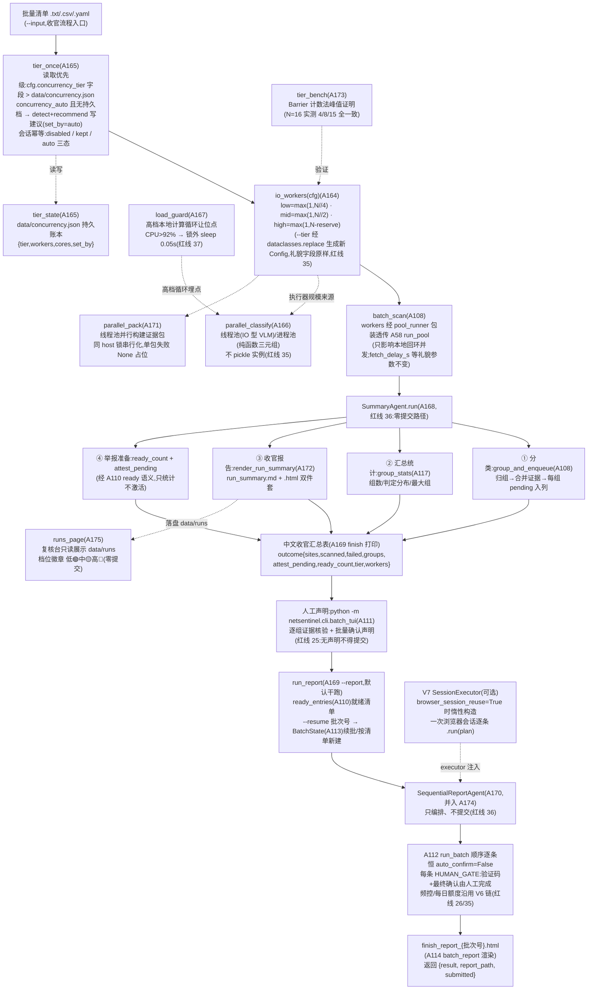

# NetSentinel V9 升级总览 —— CPU 自适应三档并发 · 收官汇总 · 结案代理依次举报(A163–A182)

> 八轮后全仓 3968 通过 + 3 跳过(V8 收官口径)。V9 主题:**让并发数跟着
> 本机 CPU 走、让批量跑完之后有一条收官闭环**——所有本地执行器(扫描池
> /并行分类/并行打包/进程池)的规模由同一条三档公式推导(省电/默认/极限
> 压榨,配置只表达意图不维护数字);批量扫描跑完后由结案代理
> (SummaryAgent)分类汇总、出收官报告、列出待声明组;声明完成后由顺序
> 举报代理(SequentialReportAgent)把已声明组逐条送入 V6 批量链——
> **逐组人工声明、每条 HUMAN_GATE、频控一概不放宽**,代理零提交权。
> 全部新模块可选、惰性导入,旧调用方零感知。

## 一、V9 主题与动机:并发自适应 + 收官闭环,而不是再加扫描能力

V1–V8 做完规则证据链、GLM 感知、案件编排、多平台视觉、工程加固、批量
流水线、内核换代与开箱体验之后,还剩两块体验缺口:

1. **并发数写死,大机跑不满、小机被拖死**。既有扫描池缺省
   `workers=2`:16 核工作站上批量扫描慢,2 核旧笔记本上高档参数又会把
   机器拖死。V9 的解法是**以本机核数为唯一变量**的三档换算
   (CONTRACTS-V9 §1 权威公式,`N = os.cpu_count()`,探测不到回退 2):

   | 档位 | 公式 | 定位 | N=4 | N=8 | N=16 | N=32 |
   | --- | --- | --- | --- | --- | --- | --- |
   | low(低·省电) | `max(1, N//4)` | 后台/省电 | 1 | 2 | 4 | 8 |
   | mid(中·默认) | `max(1, N//2)` | **默认档** | 2 | 4 | 8 | 16 |
   | high(高·压榨) | `max(1, N - cpu_reserve)` | 最大限度压榨本地计算 | 3 | 7 | 15 | 31 |

   进程池另加一道钳制:`cpu_workers = min(io_workers, cores)`——
   **进程池永不超过物理核数**。

2. **批量跑完之后"没有下文"**。batchflow 跑完只留一堆站点报告,运营者
   要自己拼汇总、自己数哪些组声明了、自己再起一条举报命令。V9 补上
   收官闭环:`finishflow`(独立 CLI,不改 batchflow)一条命令完成
   **档位初始化 → 并发扫描 → 结案代理汇总(分组/统计/收官报告/待声明
   组) → 打印中文收官汇总表**,声明完成后再以 `--report` 进入举报准备。

三条 V9 新红线(《CONTRACTS-V9.md》§0,累计第 35–37 条)贯穿全部新模块:

- **35 压榨边界**:高档并发只作用于**本地计算与本地回环 IO**(并行分类/
  并行打包/扫描池);对外网络的礼貌间隔(`fetch_delay_s`)、引擎限速、
  举报频控(红线 26)**一概不放宽**;进程池仅用于模块级纯函数的本地
  计算,不得 pickle 分类器实例/连接(并行分类进程模式只传
  `(分类器名, 图片路径, URL)` 纯字符串三元组,子进程内按名重构)。
- **36 结案代理无自主提交权**:SummaryAgent 只做分类汇总与举报**准备**
  (列待声明组);SequentialReportAgent 只编排 `run_batch`——逐组人工
  声明、每条 HUMAN_GATE、频控全部沿用 V6 链;代理源码不得出现
  `auto_confirm=True` 或绕过 attest 的路径(测试 A181 做源码静态断言)。
- **37 资源治理**:任一执行器 workers ≤ cpu 核数(注入显式值除外);
  CPU 过载让位保护(LoadGuard,利用率 > 0.92 让位 50ms)可中断;所有
  并行任务有总量与超时上限,线程池/进程池退出必关闭,失控不得留孤儿。

**量化验证(A173 tier_bench,2026-10-02 实跑,`benchmarks/out/tier_report.md`)**:
本机 N=16(来源 detect),Barrier 计数法实测并发峰值 low=4 / mid=8 /
high=15,与理论 workers **三档全部一致**;确定性计数、非墙钟,同参数
两次运行结论恒一致(红线 31)。

**离线全链演示(A179,2026-10-02 实跑退出码 0)**:
`NETSENTINEL_FAKE_CORES=4 python scripts/demo_tiers_finish.py` 中,
tier=high → `io_workers=3`,本地 2 站真扫描收官 `groups=2`、outcome
`workers=3`;自检表四项全过——扫描 workers=3 ≤ cores=4、礼貌/频控字段
mid↔high 完全一致、干跑 `submitted=0`、每条 `auto_confirm=False`。

## 二、工号一览(A163–A182)

| 编号 | 模块 | 一句话 | 关键 API |
| --- | --- | --- | --- |
| A163 | ops/cpu_profile.py | CPU 画像与三档换算底座(零外呼;psutil 惰性可选) | `detect() -> {"cores","arch","platform","psutil"}`;`tier_workers(tier, *, reserve=1, cores=None) -> int`(§1 公式);`recommend(profile)`(≤2 核→low;≤8→mid;>8→high,系统占用高降一档);`validate_tier(tier)`;环境变量 `NETSENTINEL_FAKE_CORES` 测试钩子 |
| A164 | ops/concurrency.py | 统一并发执行器工厂:io/cpu 两口径 + 线程/进程池上下文管理器(退出必关闭,红线 37) | `io_workers(cfg)`(=tier_workers);`cpu_workers(cfg)`(=min(io_workers, cores));`thread_pool(cfg, *, label)` / `process_pool(cfg, *, label)`(Windows spawn 兼容);tier 非法→中文 ValueError |
| A165 | ops/tier_state.py | 三档持久状态账本 + 会话一次性自动建议 | `TierState(path)`(data/concurrency.json,get/set `{"tier","workers","cores","set_by"}`,原子写);`resolve_tier(cfg)`(**读取优先级 cfg 字段 > 持久文件**);`tier_once(cfg)`(concurrency_auto 且无持久档→detect+recommend 写入 set_by="auto";会话幂等;disabled/kept/auto 三态) |
| A166 | vision/parallel_classify.py | 并行图像分类(保序,单条失败容错 0 分+error) | `classify_parallel(classifier, evidences, cfg, *, executor=None, use_processes=False) -> list[ImageScore]`;默认线程池(IO 型 VLM);进程模式经模块级纯函数 `_proc_classify((name, path, url))` 子进程内按名构造,**不 pickle 实例**(红线 35) |
| A167 | ops/load_guard.py | 进程 CPU 过载让位护栏(纯 stdlib,os.times() 差分) | `LoadGuard(interval_s=0.5)`:`should_throttle() -> bool`(利用率>0.92);`maybe_yield()`(True 时锁外 sleep 0.05s 并返回 True);times/clock/sleep 全可注入 |
| A168 | agent/summary_agent.py | 结案代理:分类汇总 + 收官报告 + 举报准备(**零提交路径**,红线 36) | `SummaryAgent.run(scan_result, cfg, *, grouper=None, stats_fn=None, …) -> SummaryOutcome{groups, report_md, report_html, ready_count, attest_pending, workers, tier, next_steps}`;四阶段:group_and_enqueue(A108)→group_stats(A117)→render_run_summary(A172)→待声明组统计(经 A110 ready 语义,只统计不激活);`summary_agent_enabled=False`→最小 outcome |
| A169 | finishflow.py(包根 CLI) | 收官入口(独立 CLI,不改 batchflow):档位→并发扫描→结案汇总→举报准备 | `finish(urls, cfg, *, scan=None, summary=None) -> dict`;`run_report(cfg, *, items=None, runner=None, dry_run=None, batch_id=None) -> dict`(默认干跑);`main(argv)`:`--input --config --tier low\|mid\|high --report [--resume 批次] [--dry-run\|--exec]`;返回码 0/2/3 |
| A170 | agent/sequential_report.py | 顺序举报代理:收官阶段批量举报**编排器**(**A174 已并入本行,编号保留**) | `SequentialReportAgent.run(items, cfg, *, executor=None, state=None, dry_run=None, on_item=None, batch_id=None) -> dict`;直接编排 A112 `run_batch`(**恒 auto_confirm=False**,调用时不传该参数);`browser_session_reuse` 时惰性构造 V7 `SessionExecutor` 逐条复用;`on_item` 逐条进度回调;结束经 A114 渲染 `finish_report_{batch_id}.html` |
| A171 | evidence/parallel_pack.py | 并行证据包构建(线程池 IO 型,单包失败 None 占位+中文 warning 计数) | `pack_all(reports, cfg, *, builder=None, executor=None) -> list[EvidenceBundle\|None]`(保序);host→锁字典串行化同 safe_host 构建(规避 A11 目录命名竞争),不同 host 真并发 |
| A172 | report/run_summary.py | 收官汇总报告渲染(MD+HTML 双件套,公文风内联 CSS) | `render_run_summary(stats, out_base) -> (md_path, html_path)`;stats 含 sites/scanned/failed/verdict_dist/groups/tier/workers/cost_est/budget_used/attest_pending/ready_count 等(鸭子容错);高档固定注记"本地计算全压榨;对外礼貌间隔与举报频控未放宽";结论段固定红线 36 声明句 |
| A173 | benchmarks/tier_bench.py | 三档并发基准:Barrier 计数法实测峰值 vs 理论 workers(零墙钟,红线 31) | `peak_concurrency(task_fn, n, workers, timeout_s) -> int`;`run(out_dir, cores) -> dict`(三档对照表 + `tier_report.md/.json`);CLI `python benchmarks/tier_bench.py --out --cores`,三档全一致→退出码 0 |
| A174 | —(并入 A170 行,编号保留) | — | — |
| A175 | webui/runs_page.py | 复核台"最近运行"页(纯逻辑层可离线测,streamlit 惰性) | `run_rows(summaries)`(批次/站点/判定分布/组数/档位徽章/就绪/时间);`tier_badge(tier)`(低🟢 中🟡 高🔴);`cpu_advice(profile)`;`advice_tier(profile)`;`dist_line(dist)`;数据只读 data/runs JSON,页面固定声明"汇总不触发任何提交" |
| A176 | tests/test_v9_e2e.py | 端到端:三档退化(cpu=2→high workers=1,env/monkeypatch 两路)→本地 2 站真扫描 finishflow(groups≥1、报告落盘、ready_count/attest_pending 正确)→run_report 干跑逐条;红线 35/36 断言 | 12 用例(2026-10-02 实跑全绿) |
| A177 | docs/CONCURRENCY.md | CPU 档位权威文档:检测机制/三档表(N 示例 4/8/16/32)/高档压榨边界(哪些被加速、哪些不变)/load_guard/与礼貌频控的区别/tier_bench 解读/调优/Windows 注意 | — |
| A178 | docs/FINISH_AGENT.md | 结案代理指南:两代理职责互斥表、红线 36 全文、全流程命令、与 V6 批量链关系图、进度回调与断点续报 | — |
| A179 | scripts/demo_tiers_finish.py | 离线演示:①detect+三档表 ②tier_bench 峰值证明 ③本地 2 站 tier=high 真扫描收官 ④依次举报干跑(注入应答) ⑤红线 35–37 自检表 | `NETSENTINEL_FAKE_CORES=4 python scripts/demo_tiers_finish.py`(2026-10-02 实跑退出码 0) |
| A180 | docs/UPGRADE_V9.md | 本文:V9 总览、工号一览、收官全流程 mermaid、十轮演进、兼容性、配置速查、快速上手 | — |
| A181 | tests/test_redline_v9.py | 红线专项(源码断言+行为断言双保险):35(池/抓取参数透传、tier 不影响 fetch_delay;进程负载纯字符串三元组)、36(两代理源码无 auto_confirm=True、无 attest 代答)、37(全档 workers≤cores、cpu_workers≤io_workers≤cores、高载真实 yield) | 16 个测试函数(参数化 48 用例,2026-10-02 实跑全绿) |
| A182 | —(预留:**由负责人收口 CHANGELOG 与接线**,编号保留) | — | — |

配套测试:14 个 V9 测试文件(A163–A173、A175 各一 + A176 端到端 +
A181 红线专项)共 **606 个用例**,实测 **605 通过 + 1 跳过**(跳过 =
本机未装 streamlit 的运行页 UI 用例,与 V8 模型页同款条件跳过)。
全仓终跑见 §四。

## 三、收官全流程(输入 → 扫描 → 汇总 → 人工声明 → 依次举报)



要点(以代码为准):

- **档位只在"本地并发规模"这一处生效**:`--tier` 覆盖经
  `dataclasses.replace` 生成**新** Config,`fetch_delay_s` /
  `submit_min_interval_s` / `submit_max_per_day` / `batch_item_interval_s`
  等礼貌与频控字段原样保留并原样透传(红线 35;A181 源码断言执行编排层
  不含这些字段的写路径,demo 实测 mid↔high 礼貌字段完全一致)。
- **SummaryAgent 全程只读**:分类阶段惰性复用 A108 链(归组→合并证据→
  pending 入列);举报准备只**统计** pending→approved 条目与未声明组名,
  库文件不存在直接返回零(不建库不建表),绝不写声明、绝不改条目状态;
  `next_steps` 固定三步中文指引(batch_tui 声明 → `--report` 先干跑 →
  `--exec` 仍逐条人工门)。
- **SequentialReportAgent 没有任何自主决定权**:调用 `run_batch` 时
  **不传** `auto_confirm` 参数(其函数缺省即 False),源码经 A181 静态
  断言不存在 `auto_confirm=True`;批次状态器由 finishflow 经
  `BatchState.bound(批次号)` 绑定,代理不建批、不声明、不触碰 A110
  复核队列;`on_item(index, total, item)` 在每条实际进入执行前触发
  (被暂停/频控挂起的条目不回调),回调异常只告警不中断。
- **干跑缺省**:举报准备模式 `dry_run` 缺省取 `cfg.dry_run_default`
  (默认 True);真实执行必须显式 `--exec`,且执行器内部仍是逐条
  HUMAN_GATE——验证码与最终确认永远由人工完成。

## 四、十轮演进全景

| 轮次 | 主题 | 工号 | 新增模块/文件 | 测试(收官) | 红线累计 |
| --- | --- | --- | --- | --- | --- |
| V1 | 规则证据链(单站扫描→证据包→人工确认举报) | A01–A20 | 20 模块 | 291 | 5(1–5) |
| V2 | GLM 感知(VLM 适配/离线回退/通知/报告) | A21–A40 | 20 模块 | 740 | 10(6–10) |
| V3 | 智能体平台(案件编排/级联路由/共形预测/证据网络/政策治理) | A41–A60 | 20 模块 | 1255 | 15(11–15) |
| V4 | 全平台视觉模型统一接入(`classifier: 提供方:模型`) | A61–A80 | 20 模块 | 1738 | 20(16–20) |
| V5 | 工程提升(性能/健壮/观测/质量四线,零新功能) | A81–A102 | 22 组升级(约 85 源文件全覆盖) | 2220 | 23(21–23) |
| V6 | 批量案件流水线(导入→归组→声明→逐条提交→结案) | A103–A122 | 20 模块 | 2790*(V6.1 收官,含 V6.5) | 26(24–26) |
| V6.5 | 线索发现层(优先 Yandex,自定义关键词,负责人直研) | — | 5 模块(discovery) | 含于上行 | 28(27–28) |
| V7 | 内核世界性进化(八引擎换代 + 配套内核 + 装配线/基准) | A123–A142 | 20 个代码文件 + 演示脚本 + 17 个测试文件 + 2 篇文档 | 3321 通过 + 2 跳过 | 31(29–31) |
| V8 | 视觉模型自动接管 · 连接向导 · 手动切换(开箱即用) | A143–A162 | 15 个代码文件 + 演示脚本 + 16 个测试文件 + 3 篇文档 + 模型页 | 3968 通过 + 3 跳过 | 34(32–34) |
| **V9** | **CPU 自适应三档并发 · 收官汇总 · 结案代理依次举报** | **A163–A182** | 12 个代码文件(11 模块 + tier_bench 基准)+ 演示脚本 + 14 个测试文件 + 3 篇文档(CONCURRENCY / FINISH_AGENT / 本文)+ 运行页 | **4573 通过 + 4 跳过**(2026-10-02 实测全绿,退出码 0;V9 净增 605 通过:606 新用例中 605 通过 + 1 跳过) | 37(35–37) |

\* 2790 为 CHANGELOG「V6.1」收官口径。V9 终跑说明:本环境 pytest 不输出
文字汇总行,以进度标记计数(4573 通过 + 4 跳过;4 跳过 = V8 收官的
2 个环境相关跳过 + 1 个 streamlit 模型页 UI 用例 + 1 个 streamlit
运行页 UI 用例);核对:V8 收官 3968+3=3971,加 V9 新增
594+12(e2e)=606,恰为 4577=4573+4。**终数以负责人终跑为准。**

## 五、兼容性声明

- **零 API 破坏**:V9 全部为**新增文件**(上表 12 个代码文件,含包根
  CLI `finishflow.py` 与基准 `benchmarks/tier_bench.py`);不新增/修改
  任何既有函数签名;冻结的 contracts.py / telemetry.py / conftest.py /
  既有模块与文档,代理一律未动。contracts.py 仅追加 4 个 V9 字段
  (§六,均已登记 config.py 已知字段与校验器)。
- **档位默认 mid,既有入口行为不变(如实)**:`concurrency_tier` 缺省
  `mid`。本文撰写时点 `ops/pool.py` 的 `run_pool` / 抓取池 workers 缺省
  仍为 `DEFAULT_WORKERS = 2`(实测源码未改)——契约 §3 的"缺省 2 → None
  (缺省时经 `ops.concurrency.io_workers(cfg)` 解析,显式传参不变)"接线
  **由负责人完成,尚未接线**;接线前既有入口(batchflow 等)行为逐字节
  不变。V9 收官入口 `finishflow` **不依赖该接线**:内部经
  `_pool_runner_with_workers` 包装把 `io_workers(cfg)` 算出的 workers
  显式透传给 `run_pool`,收官链已按档位并发生效(demo 实测
  tier=high → 扫描池 workers=3)。
- **新模块全部可选**:兄弟模块一律惰性导入(顶层只 import 标准库与
  冻结模块),缺席时按"该来源无"降级或收敛为中文 RuntimeError / error
  条目,主流程绝不崩。A164/A173 在 A163 缺席时按同一条 §1 公式**内置
  兜底**(结论恒一致);A168 在 A172 缺席时降级写内置最小 Markdown 汇总;
  `summary_agent_enabled=False` 时结案代理整体让位(最小 outcome);
  streamlit(A175 运行页)为可选依赖,缺失时纯逻辑层仍可离线测试、
  UI 入口给中文安装提示。
- **既有数据零迁移**:V9 新增的运行时文件只有 `data/concurrency.json`
  (三档持久账本,tier_once 首次自动建议时才创建)与收官产物
  (`run_summary.md/.html`、`data/runs` 汇总 JSON、
  `finish_report_{批次号}.html`);不触碰任何既有库表与配置文件。
- **workers 语义由负责人接线说明(契约 §3,如实)**:除上述 run_pool
  缺省接线外,`finishflow` 作为"批量跑完的收官入口"独立成军
  (不改 batchflow);CHANGELOG 的 V9 段与最终全仓终跑由 A182 负责人
  收口(本文撰写时点 CHANGELOG 尚无 V9 段,实测 grep 为空),本文不
  重复登记变更清单。

## 六、配置速查(V9 全部字段,共 4 项)

| 字段 | 类型 / 默认 | 校验 | 作用 | 消费方 |
| --- | --- | --- | --- | --- |
| `concurrency_tier` | str / "mid" | 必须为 low/mid/high(中文报错) | 并发档位(§1 公式换算 workers);**读取优先级:本字段 > data/concurrency.json** | A164/A165/A169/A166/A171/A173 |
| `concurrency_auto` | bool / False | — | 首次运行自动探测 CPU 并写入建议档位(仅持久档缺失时写,cfg 字段永远优先;会话幂等) | A165 `tier_once`;A169 `finish` 首步 |
| `cpu_reserve` | int / 1 | 0~64(中文报错) | 高档保留核心数(0=全核压榨);只影响 high 档 | A163/A164(经 `--tier`/cfg) |
| `summary_agent_enabled` | bool / True | — | 批量跑完由结案代理分类汇总并进入举报准备(仍全人工门);False → 最小 outcome | A168;A169 |

环境变量:`NETSENTINEL_FAKE_CORES`(正整数,A163 测试钩子,覆盖
`detect()` 核数,便于离线测试与演示;非法值一律忽略回退真实探测)。

示例(`config.yaml`,全部可省略,省略即上表默认;`config.example.yaml`
尚未列入 V9 字段,以 contracts.py 缺省为准):

```yaml
# ---- V9:CPU 自适应三档并发 + 收官汇总代理 ----
concurrency_tier: high      # low(省电) / mid(默认) / high(压榨本地计算)
concurrency_auto: false     # 首跑无持久档时自动探测并写建议档
cpu_reserve: 1              # 高档保留核心数(0=全核)
summary_agent_enabled: true # 批量跑完出收官汇总(举报仍全人工门)
```

## 七、快速上手

**1)看本机三档与峰值证明(detect + 三档换算 + tier_bench)**:

```
$ python benchmarks/tier_bench.py --out benchmarks/out      # 2026-10-02 实跑退出码 0
- 核数(cores):16(来源:detect)
| 档位 | 理论 workers | 实测峰值(Barrier) | 判定 |
| low(低·省电) | 4 | 4 | 一致 |
| mid(中·默认) | 8 | 8 | 一致 |
| high(高·压榨) | 15 | 15 | 一致 |
```

**2)收官流程(档位→并发扫描→结案汇总,一条命令)**:

```
$ python -m netsentinel.finishflow --input 批量清单.yaml --tier high
── 收官汇总(结案代理,批量流程收官)──
待声明组: N(batch_tui 逐组声明后方可进入批量举报,红线 25)
就绪条目: N(已声明组的待举报条目)
并发档位: high(worker W 个;礼貌间隔与举报频控不随档位放宽,红线 35)
```

随后按 `next_steps` 指引逐组声明:

```
$ python -m netsentinel.cli.batch_tui        # 逐组证据核验 + 批量确认声明(红线 25)
```

**3)举报准备(先干跑,再 --exec;每条仍逐条人工门)**:

```
$ python -m netsentinel.finishflow --report --resume 批次号 --dry-run
$ python -m netsentinel.finishflow --report --resume 批次号 --exec
# SequentialReportAgent 逐条编排 run_batch:每条 HUMAN_GATE(验证码+最终确认),
# 频控/每日额度沿用 V6 链;结束渲染 finish_report_{批次号}.html
```

离线全链演示(零外呼、零真实提交,含红线 35–37 自检表):

```
$ NETSENTINEL_FAKE_CORES=4 python scripts/demo_tiers_finish.py   # 2026-10-02 实跑退出码 0
```

延伸阅读:`docs/CONCURRENCY.md`(A177,档位权威文档)、
`docs/FINISH_AGENT.md`(A178,结案代理指南与两代理职责互斥表)、
`webui/runs_page.py`(A175,复核台"最近运行"只读页)。
