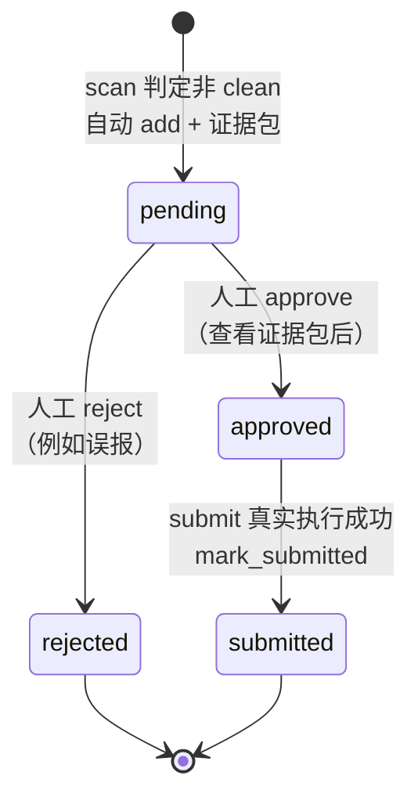

# NetSentinel 使用手册(USAGE)

本手册覆盖 CLI 完整参考、审核队列工作流、证据包结构、配置项说明与常见问题。所有行为以 `CONTRACTS.md` 与 `netsentinel/contracts.py` 为准;各子命令的具体旗标以 `netsentinel <子命令> --help` 实际输出为准(项目并行开发中)。

入口:安装后使用 `netsentinel` 命令(等价 `python -m netsentinel`),共三个子命令:`scan`、`queue`、`submit`。CLI 启动时先完成日志初始化(`setup_logging`),运行日志写入 `log_path`(默认 `data/logs/netsentinel.log`)。

---

## 1. CLI 完整参考

### 1.1 `netsentinel scan` —— 扫描判定

对单个 URL 做"链接发现 → 逐页抽样 → 图像识别 → 集成 → 判定"的完整流水线。

| 参数 | 必填 | 说明 |
| --- | --- | --- |
| `--url <URL>` | 是 | 待核查站点起点 URL |
| `--config <PATH>` | 否 | 配置文件路径;默认查找 `./config.yaml` |

示例:

```bash
# 使用默认 ./config.yaml
netsentinel scan --url "https://待核查站点.example/"

# 指定配置文件
netsentinel scan --url "https://待核查站点.example/" --config /path/to/config.yaml
```

行为说明(按编排契约):

1. `discover_links`:同 host BFS 发现页面(含起点,总数 ≤ `max_pages`)。
2. 逐页 `capture_page`:整页截图、下载图片(每页 ≤ `max_images_per_page` 张、单图 ≤ `max_image_mb` MB、Content-Type 须为 `image/*`,去重、sha256 落盘)、文本关键词提示(`text_hint_hits`)。
3. 对 `ensemble_members` 中的每个分类器执行 `classify_batch`,再 `ensemble_scores` 加权平均得到 `model="ensemble"` 的最终评分。
4. `assess` 按 §4 判定公式产出 `SiteReport`(三档 `clean / suspect / nsfw`)。
5. `needs_review`(即非 clean)时:自动 `build_bundle` 生成证据包,并 `queue.add` 写入审核队列,同时写审计日志(`audit_path`,JSONL)。

结果解读:`agg_nsw_prob` 为达标图片集合的最高集成分,`nsw_image_count` 为单图分 ≥ `prob_count_line` 的达标图数量,`verdict` 为三档判定,**`nsfw` 同样必须人工确认后才允许提交**。

### 1.2 `netsentinel queue` —— 审核队列

管理 sqlite 审核队列(库文件 `db_path`,默认 `data/review_queue.db`),中文输出。子动作:`list / show / approve / reject`。

| 子动作 | 参数 | 说明 |
| --- | --- | --- |
| `list` | 可选状态过滤 | 列出队列条目;状态取值 `pending / approved / rejected / submitted` |
| `show` | `--id <ID>` | 显示单条详情(判定、证据包路径、备注、时间戳) |
| `approve` | `--id <ID>`(可附备注) | 人工批准该条目进入可提交状态 |
| `reject` | `--id <ID>`(可附备注) | 人工否决该条目(例如复核证据后认定误报) |

示例:

```bash
netsentinel queue list                 # 全部条目
netsentinel queue list pending         # 只看待复核条目
netsentinel queue show --id 1          # 查看条目 1 详情
netsentinel queue approve --id 1       # 批准(复核证据包之后!)
netsentinel queue reject --id 2        # 否决误报
```

每条 `Entry` 包含:`id`、`site_url`、`verdict`、`status`、`evidence_zip`(证据包 zip 路径)、`created_at / updated_at`、`note`(复核备注)。

### 1.3 `netsentinel submit` —— 提交举报

把一条 **已批准(approved)** 的队列条目填写到举报门户表单。

| 参数 | 必填 | 说明 |
| --- | --- | --- |
| `--id <ID>` | 是 | 审核队列条目 id,状态必须为 `approved` |
| `--portal {12377,shdf}` | 是 | 举报渠道:`12377` = 中央网信办举报中心;`shdf` = 扫黄打非 |
| `--dry-run` | 否 | 强制干跑(不启浏览器,逐 Step 记录 notes,`submitted=False`) |
| `--exec` | 否 | 强制真实执行(驱动浏览器;`HUMAN_GATE` 处 `input()` 等待人工) |

> 未显式指定时,取配置 `dry_run_default`(默认 `true`,即默认干跑)。

示例:

```bash
# 先干跑:核对将执行的步骤序列与填写内容,不打开浏览器
netsentinel submit --id 1 --portal 12377 --dry-run

# 真实执行:headless 浏览器填表 → HUMAN_GATE 暂停等人工 → 点击提交
netsentinel submit --id 1 --portal shdf --exec
```

执行流程(编排契约):

1. 从队列 `get(id)`,校验状态必须为 `approved`,否则拒绝。
2. `RateLimiter.can_submit()` 频控检查:距上次提交 ≥ `submit_min_interval_s` 且当日次数 < `submit_max_per_day`,不满足则中止并给出原因。
3. 生成举报计划:`plan_12377`(category=`色情低俗信息`)或 `plan_shdf`(category=`淫秽色情类`);描述使用中文模板并明确声明"辅助系统初筛+人工核实"。
4. `execute` 执行计划:每步截图到 `out_dir`(默认 `data/runs/<时间戳>/`);异常时捕获并记录 `stopped_at`,`ok=False`。
5. 提交成功后:`queue.mark_submitted(id)` + 频控 `record()` + 审计日志。

两个门户的差异:

| | 12377 | shdf |
| --- | --- | --- |
| 入口 | `portal_12377_base`(默认 https://www.12377.cn ) | `portal_shdf_base`(默认 https://www.shdf.gov.cn ) |
| 信息类型 | 色情低俗信息 | 淫秽色情类 |

---

## 2. 审核队列工作流

原则:**机器只初筛,人来拍板**。任何条目不经人工 `approve` 都无法提交;`nsfw` 也不例外。



推荐操作节奏:

1. `scan` 后 `queue list pending` 逐条处理;
2. 打开条目 `evidence_zip` 指向的证据包,人工查看截图与图片(方法见 §3);
3. 认定属实 → `approve`;认定误报 → `reject` 并写备注;
4. `submit --dry-run` 核对步骤与文案;
5. `submit --exec` 真实提交,在 `HUMAN_GATE` 完成人工环节(见 §6.6)。

---

## 3. 证据包结构

证据包由 `evidence.packager.build_bundle` 生成,目录形如 `<evidence_dir>/<safe_host>_<时间戳>/`(默认 `data/evidence/` 下),内容:

```
<safe_host>_<ts>/
├── <页面整屏截图>.png        # 各抽样页面截图(browser capture)
├── <下载的受检图片>…          # sha256 已校验落盘的图片
├── manifest.json             # 站点报告全文 + 文件清单
├── summary.md                # 中文摘要
└── …                         # 同目录内容以 zipfile 打包为 .zip
```

- **manifest.json**:`SiteReport.as_dict()` 全文(site_url、pages、image_scores、agg_nsw_prob、nsw_image_count、verdict、needs_review、created_at)+ 文件清单(每文件含 sha256),供追溯与防篡改核对。
- **summary.md**:中文摘要,含 **Top10 图片分值表**(按 ensemble 分排序),是人工复核的第一入口。
- **zip**:`evidence_zip` 写入队列条目,提交时作为举报附件(在 `HUMAN_GATE` 由人工上传,见 §6.6)。

人工复核要点:看 Top10 高分图是否确属色情内容;核对 `text_hint_hits` 与页面截图是否相互印证;警惕图标/广告图误报(小于 `min_image_px` 的图已自动剔除,但仍需人工把关)。

---

## 4. 配置项逐条说明

复制 `config.example.yaml` 为 `config.yaml` 后按需修改;**键名与 `contracts.py::Config` 字段一一对应,未知键告警并忽略**。安全默认:`allow_network=false`、`dry_run_default=true`。

### 判定阈值

| 键 | 默认值 | 说明 |
| --- | --- | --- |
| `nsfw_threshold` | `0.90` | 单图 ensemble 分达到该值视为"达标色情图" |
| `review_threshold` | `0.50` | 站点聚合分达到该值即进入人工复核 |
| `prob_count_line` | `0.80` | 单图分 ≥ 该值计入达标图片数(nsw_image_count) |
| `min_nsw_images` | `3` | 达标图片数达到该值才可能判 NSFW |
| `min_image_px` | `200` | 宽高均小于该尺寸的图(图标等)不参与判定 |

### 抓取预算

| 键 | 默认值 | 说明 |
| --- | --- | --- |
| `max_pages` | `5` | 每站点最多抽样页面数 |
| `max_images_per_page` | `12` | 每页最多下载图片数 |
| `max_image_mb` | `8` | 单图大小上限(MB) |
| `fetch_timeout_s` | `15` | 单请求超时(秒) |
| `fetch_delay_s` | `1.0` | 相邻请求最小间隔(礼貌抓取) |
| `respect_robots` | `true` | 尊重目标站 robots |
| `allow_network` | `false` | `true` 时才允许访问外网(运营者显式开启;false 时仅放行 127.0.0.1/localhost) |

### 分类器

| 键 | 默认值 | 说明 |
| --- | --- | --- |
| `classifier` | `stub` | 主分类器名 |
| `ensemble_members` | `[stub]` | 成员列表;多个则做集成,如 `[nudenet, clip]` |

### 提交安全(红线,谨慎调整)

| 键 | 默认值 | 说明 |
| --- | --- | --- |
| `human_gate_required` | `true` | 强制人工门,**不可关闭** |
| `dry_run_default` | `true` | 默认干跑,不真正驱动浏览器提交 |
| `submit_min_interval_s` | `60` | 两次提交最小间隔(配置下限 30s) |
| `submit_max_per_day` | `5` | 每日最大提交数(配置范围 1–20) |

### 举报门户入口

| 键 | 默认值 | 说明 |
| --- | --- | --- |
| `portal_12377_base` | `https://www.12377.cn` | 12377 举报入口 |
| `portal_shdf_base` | `https://www.shdf.gov.cn` | 扫黄打非举报入口 |

### 路径

| 键 | 默认值 | 说明 |
| --- | --- | --- |
| `data_dir` | `data` | 数据根目录 |
| `evidence_dir` | `data/evidence` | 证据包目录 |
| `db_path` | `data/review_queue.db` | 审核队列 sqlite 库 |
| `audit_path` | `data/audit.jsonl` | JSONL 审计日志 |
| `log_path` | `data/logs/netsentinel.log` | 运行日志 |

### 配置校验规则(违反抛中文 `ValueError`)

- `0 < review_threshold <= nsfw_threshold <= 1`
- `prob_count_line <= nsfw_threshold`
- `submit_min_interval_s >= 30`
- `1 <= submit_max_per_day <= 20`
- `max_pages >= 1`

---

## 5. 标准步骤序列(submit 实际执行的内容)

planner 生成的步骤顺序固定(`SELECTORS` 见 `CONTRACTS.md` §3):

```
goto(举报入口) → wait(1s) → select(信息类型=category) → fill(举报链接)
→ fill(具体描述) → fill(举报人姓名) → fill(举报人电话)
→ screenshot(填写完成)
→ HUMAN_GATE(人工核对信息、上传证据包 zip 并输入验证码)
→ click(提交按钮) → wait(2s) → screenshot(提交结果)
```

附件 zip **不做自动上传**(v1 由人工门完成)。验证码输入框只出现在 `HUMAN_GATE` 上下文中,计划中**不存在任何自动填写验证码的步骤**。

---

## 6. 常见问题(FAQ)

### 6.1 提示 Playwright 浏览器未安装

现象:需要真浏览器的用例失败或截图缺失。解决:

```bash
python -m playwright install chromium
```

说明:未安装 playwright 包时,`capture_page` 自动退化为仅抓 HTML 解析图片链接(`screenshot_path` 留空),扫描仍可进行但没有整页截图证据。

### 6.2 提示 nudenet 未安装(ImportError 带安装提示)

解决二选一:

```bash
python -m pip install -e ".[vision]"     # 安装 NudeNet
```

或改用离线 stub:配置 `classifier: stub`、`ensemble_members: [stub]`(stub 仅按文件名规则打分,用于开发/测试,不适用于真实判定)。

### 6.3 访问外网被拒(`NetworkDisabledError`)

这是安全默认:`allow_network=false` 时除 `127.0.0.1` / `localhost` 外一律拒绝真实网络请求。确需扫描外部站点时,由运营者在 `config.yaml` 显式设置 `allow_network: true`。

### 6.4 提交被频控拦截

`RateLimiter.can_submit()` 返回失败与原因:距上次提交不足 `submit_min_interval_s`(默认 60s),或当日提交数已达 `submit_max_per_day`(默认 5)。处理:等待间隔满足或次日再试。频控是红线,不要试图绕过;不建议为提速调低限额。

### 6.5 `--dry-run` 与真实执行的差异

| | dry_run | 真实执行(--exec) |
| --- | --- | --- |
| 浏览器 | 不启动 | 启动(默认 headless) |
| 步骤 | 逐 Step 记 notes,`ok=True` | 真实 goto/select/fill/click,每步截图 |
| HUMAN_GATE | 记"干跑跳过" | `input()` 交互等待人工确认 |
| 结果 | `submitted=False` | 成功则 `submitted=True`,队列 `mark_submitted` |

### 6.6 HUMAN_GATE 暂停时,操作员该做什么

真实执行到人工门会停下等待,此时请完成四件事再回车继续:

1. **核对**屏幕/截图中已填信息:信息类型、举报链接、具体描述(含"辅助系统初筛+人工核实"声明)、举报人姓名与电话;
2. **上传附件**:在 `#report-file` 选择队列条目 `evidence_zip` 指向的证据包 zip(系统不自动上传);
3. **输入验证码**:在 `#report-captcha` 人工输入——系统绝不自动识别或代填;
4. 回车确认,系统继续执行 `click(提交)` 并截图存档提交结果。

测试环境可用 `auto_confirm=True`(记录"自动确认(测试)"),仅限本地 mock,**严禁用于真实门户**。

### 6.7 `submit` 报"条目状态不是 approved"

`run_submit` 要求队列条目必须先经人工 `approve`。请先 `queue show --id` 查看详情、复核证据包,再 `queue approve --id`。这是"人工确认后才可提交"红线的落地,无法跳过。

### 6.8 想本地演示/测试完整流程

使用本地 mock 门户(仅 127.0.0.1,见 `tests/mock_portals/`)与 stub 分类器,保持 `allow_network=false`、`dry_run_default=true`,即可离线跑通 scan → queue → submit 全流程;演示脚本见 `scripts/demo_stub_scan.py`。

---

## 7. 相关文档

- [ETHICS.md](ETHICS.md) —— 使用红线与法律提示(提交前必读)
- [ARCHITECTURE.md](ARCHITECTURE.md) —— 数据流时序、模块职责与契约机制
- [../CONTRACTS.md](../CONTRACTS.md) —— 团队契约 v1(接口与流程规范)
